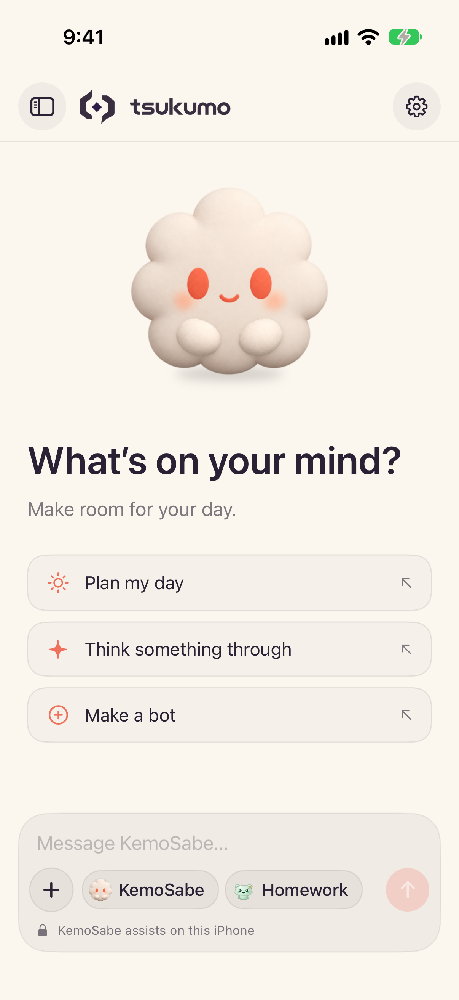
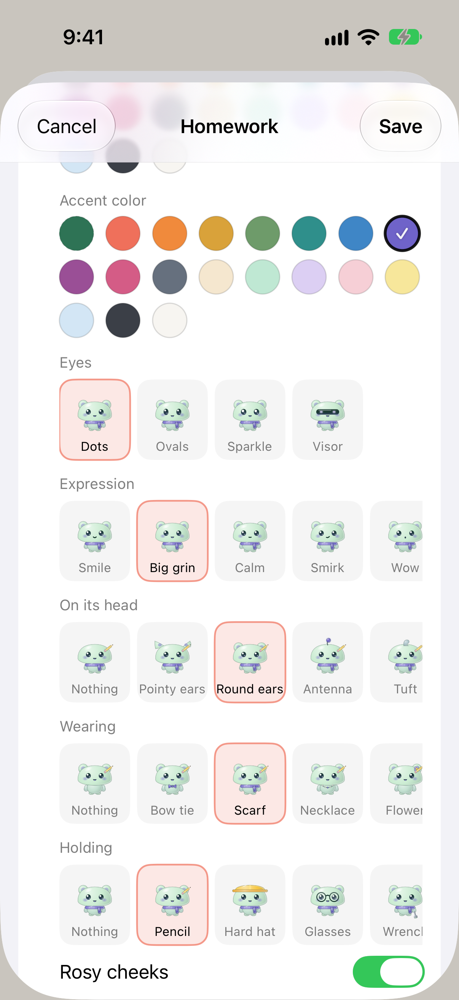

# Tsukumo

**All your AI bots in one place, with a guard on your device that keeps your personal life there.**

  <picture>
    <source media="(prefers-color-scheme: dark)" srcset="design/mac-preview/side-dock-dark.png">
    
  </picture>

Most of us now talk to more than one AI: Claude for one thing, an OpenAI model for another, Apple's on-device model for quick questions. Each lives in its own app, and the moment one of them needs something personal, like when you're free tonight, the usual answer is to hand it your calendar, your messages, or both.

Tsukumo puts your bots side by side and gives them a guard. Each bot is a little clay character with its own engine, model, job, and limits. Tag the ones you want in a message, or keep talking to the last one. When a bot needs something about you, it can't go looking through your data. It asks **KemoSabe**, the bot that lives on your device: KemoSabe reads there with Apple's on-device model and hands over only the answer, and only with your say-so.

## What it does

- **Your bots, together.** Make a bot by choosing what runs it: Apple's on-device model, or Claude or OpenAI with your own API key. It gets a fun name and a random character, and you can change both, down to its colors, expression, and what it's holding.
- **One chat or many.** Every bot has its own conversation, and Together puts them in one thread. Tag bots with a tap or `@name`; with no tag, the bot you last talked to answers.
- **KemoSabe, the guard.** Bots never read your calendar or reminders themselves. They ask KemoSabe. The first time a bot asks, you choose Allow always, Allow once, or Don't allow. A card in the chat shows what was shared and what stayed on your device. Anything you mark Device only is never read for a bot.
- **Your sources, your levels.** Turn on only the sources you want (Calendar and Reminders today), each at the privacy level you pick.
- **Activity.** One feed of what KemoSabe answered or refused, and what your bots did.
- **Your keys stay yours.** API keys are kept in the Keychain on that device only.

  <picture>
    <source media="(prefers-color-scheme: dark)" srcset="design/onboarding/iphone-5-chat-dark.png">
    
  </picture>
  &nbsp;&nbsp;
  <picture>
    <source media="(prefers-color-scheme: dark)" srcset="design/bot-customization/iphone-bot-editor-look-dark.png">
    
  </picture>

## Get it

| | What you get | How to get it |
|---|---|---|
| **Mac** | Tsukumo's Dock: a dock of your bots at the edge of the screen, from the menu bar | [Download Tsukumo's Dock](https://zlichtman.com/downloads/Tsukumo.dmg). Needs macOS 26, and a Mac with Apple Intelligence for KemoSabe. |
| **iPhone** | The Tsukumo app: the same bots in one chat | Coming soon. Needs iOS 26, and an iPhone with Apple Intelligence for KemoSabe. |

On the Mac, open Tsukumo and it walks you through a short first run: sign in or continue without an account, connect what you use, and pick your first bots. Then the dock appears beside your Dock. Click a bot to chat, right-click the dock for its options, and find everything else in Settings from the menu bar item.

## Build it yourself

Tsukumo is built in Swift on a shared package, TsukumoKit. How to build, test, and run it is in [DEVELOPMENT.md](DEVELOPMENT.md); how it's put together is in [docs/ARCHITECTURE.md](docs/ARCHITECTURE.md).

The code of the two apps that came before it (the Tsukumo coding harness for Mac and the KemoSabe iPhone app) is kept in [legacy/](legacy/README.md) for reference.
