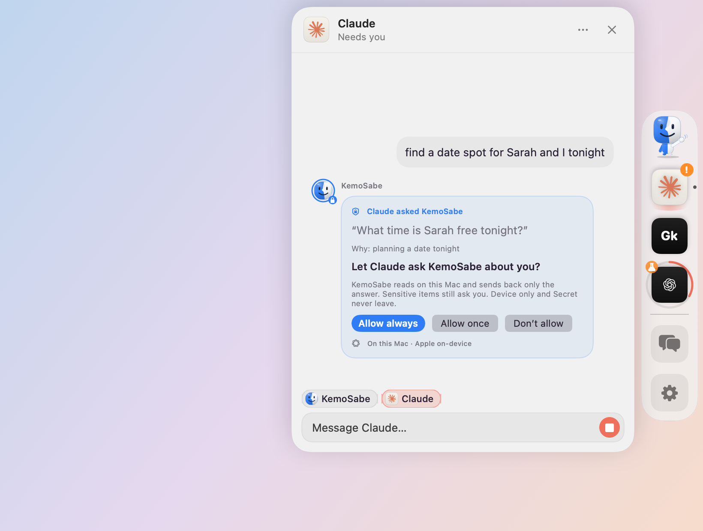
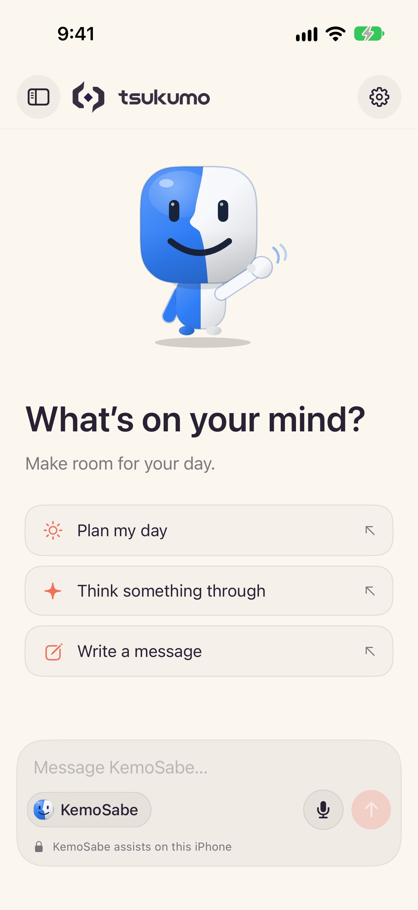
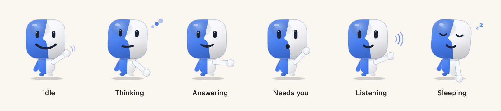

# Tsukumo

**All your AI bots in one place, with a guard on your device that keeps your personal life there.**

  <picture>
    <source media="(prefers-color-scheme: dark)" srcset="design/mac-preview/side-dock-dark.png">
    
  </picture>

Most of us now talk to more than one AI: Claude for one thing, an OpenAI model for another, Apple's on-device model for quick questions. Each lives in its own app, and the moment one of them needs something personal, like when you're free tonight, the usual answer is to hand it your calendar, your messages, or both.

Tsukumo puts the AI you already use side by side and gives it a guard. Bring in the bots you already have, like your ChatGPT dot or an agent such as Grok or OpenClaw, or make your own on Claude, OpenAI, Codex, or the other coding agents on your Mac, each wearing one of your Codex pets if you like. Tag the ones you want in a message, or keep talking to the last one. When a bot needs something about you, it can't go looking through your data. It asks **KemoSabe**, the bot that lives on your device: KemoSabe reads there with Apple's on-device model and hands over only the answer, and only with your say-so.

## What it does

- **Your bots.** Add a bot with the + on the dock. Bring in one you have: your ChatGPT dot (opened in Codex), Tsukumo's Claude bot, or an agent that signs in to KemoSabe, like Grok, OpenClaw, or Meta's Muse. Or make one: give it a name, a job, what it should know about how to work, and what it runs on (Claude or OpenAI with your own API key, or Claude Code, Codex, Cursor Agent, or Gemini CLI on your Mac with your own sign-in). Dress it up as one of your Codex pets, which acts out what it's doing, or hatch a new one in Codex.
- **One chat or many.** Every bot has its own conversation, and Together puts them in one thread. Tag bots with a tap or `@name`. With no tag, System One picks who answers: Laya on your device first, then a hosted decision model if you turn one on (Cloudflare's Clef-flash or Clef, Jev, or your own endpoint), and otherwise the bot you last talked to.
- **KemoSabe, the guard.** Bots never read your calendar, messages, or files themselves. They ask KemoSabe, a friendly cloud (or, if you like, a two-tone figure with a wave), in any of twenty-one palettes. The first time a bot asks, you choose Allow always, Allow once, or Don't allow. A card in the chat shows what was shared and what stayed on your device. Anything you mark Device only is never read for a bot.
- **Your sources, your levels.** Pick what KemoSabe may read from one searchable list: Calendar, Reminders, Contacts, Messages, Photos, files and folders you choose (as many as you like), Location and Music on iPhone, and any service with an MCP server as a connected account. Each is off until you turn it on, at the privacy level you pick.
- **Talk to them.** Click a bot in the dock (on iPhone, tap the microphone or hold a bot's chip) and say what you need; it answers out loud in its own voice. Speech is recognized and spoken on your device.
- **Coding bots that ask first.** A coding agent's bot works in its own folder or a project you pick. It's read only unless you allow more, and anything else it wants to do shows up in the chat for you to allow or not. It can open each file it edits in Xcode, Cursor, VS Code, or Zed.
- **Claude, working in the background.** On a Mac, bring in Tsukumo's own Claude bot. Give it a goal, now or on a schedule, and it works on your own Claude (Claude Code or your API key) while you do something else. Anything personal, it asks KemoSabe first, and its tile shows when it needs you or is done.
- **Every service asks first.** On a Mac, turn on the gateway and the services you use (Claude Code and Codex on your Mac, Meta's Muse paired from your phone, and Grok, ChatGPT, Claude, and OpenClaw through a public address) can ask KemoSabe for free/busy times, a contact, an answer, or a file, message, or photo you allow. Each signs in once and you approve what it asks. Its bot shows what it asked, what it was given, and what it sent you, with Revoke one click away.
- **Updates itself.** Tsukumo checks for new versions and installs them after confirming they're signed by its developer and notarized by Apple.
- **Activity.** One feed of what KemoSabe answered or refused, and what your bots did.
- **A dock that's yours.** On a Mac your bots live in a side dock beside macOS's own, with Settings one click away at its foot. Pick its style from drawn tiles, give it a color, size it, and tap where it sits, with a live preview of your own bots as you go.
- **Your keys stay yours.** API keys are kept in the Keychain on that device only.

  <picture>
    <source media="(prefers-color-scheme: dark)" srcset="design/onboarding/iphone-4-chat-dark.png">
    
  </picture>
  &nbsp;&nbsp;
  <picture>
    <source media="(prefers-color-scheme: dark)" srcset="design/mac-settings/mac-kemosabe-states-dark.png">
    
  </picture>

## Get it

| | What you get | How to get it |
|---|---|---|
| **Mac** | Tsukumo's Dock: a dock of your bots at the edge of the screen, from the menu bar | Not offered as a download right now; build it from `apps/macos`. Needs macOS 26, and a Mac with Apple Intelligence |
| **iPhone** | The Tsukumo app: the same bots in one chat | Coming soon. Needs iOS 26, and an iPhone with Apple Intelligence for KemoSabe. |

On the Mac, open Tsukumo and it walks you through a short first run: sign in or continue without an account, and connect what you use. Then the dock appears beside your Dock with KemoSabe. Click the + to bring in or make a bot, click a bot to talk to it, click the gear at the dock's foot for Settings, and connect more services in Settings, Bots.

## Build it yourself

Tsukumo is built in Swift on a shared package, TsukumoKit. How to build, test, and run it is in [DEVELOPMENT.md](DEVELOPMENT.md); how it's put together is in [docs/ARCHITECTURE.md](docs/ARCHITECTURE.md).

The code of the two apps that came before it (the Tsukumo coding harness for Mac and the KemoSabe iPhone app) is kept in [legacy/](legacy/README.md) for reference.
