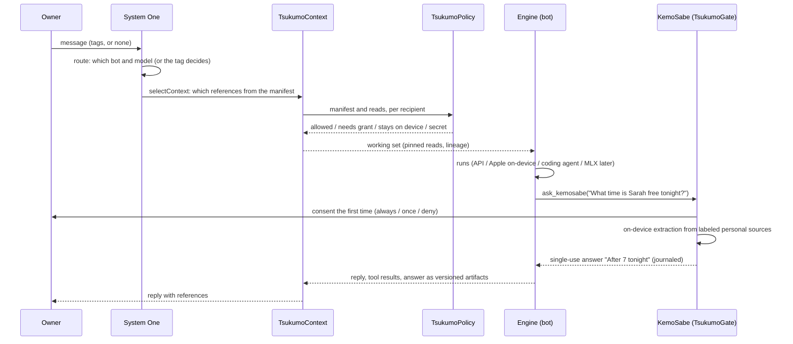

# Tsukumo architecture

How Tsukumo is built. Every TsukumoKit module below is built and tested ([TsukumoKit/README.md](../TsukumoKit/README.md)). The Tsukumo Mac app in `apps/macos/` runs TsukumoDock and is out as Tsukumo's Dock 2.00; the Tsukumo iPhone app in `apps/ios/` is built on TsukumoUI and not yet on TestFlight. The first run, the account, KemoSabe kept standard, the bots' customization, and Mac-iPhone sync are built in the kit and used by both apps; sync waits on the owner's developer portal approval ([Sync](#sync)). Where things stand day to day is in [DEVELOPMENT.md](../DEVELOPMENT.md).

Tsukumo is a multi-agent harness built on three ideas:

- **Never-ending, perfect context.** Context by reference: files, tool results, and earlier turns are kept as versioned artifacts that agents retrieve on demand. References trace every fact back to its source. Nothing is compacted into a lossy summary.
- **The local model is the stopper.** KemoSabe, Apple's on-device model, gates every agent's access to personal data. An agent asks; the owner consents; KemoSabe reads on the device and hands over only the answer.
- **System One models decide.** Small, fast decision models (Laya on the device, Jev hosted, OpenAI Decisions later) pick which bot and model handle a turn and which context references go with it, and abstain when unsure.

The research behind these ideas is kept separately; this doc says how the product is built.

## The shape

```
                 TsukumoKit (Swift package)
   ┌───────────────────────────────────────────────────────────────┐
   │ TsukumoCore   TsukumoPolicy   TsukumoContext   TsukumoGate    │
   │ TsukumoSystemOne   TsukumoEngines   TsukumoSync               │
   │ TsukumoUI (chat, add bot, Activity)   TsukumoDock (macOS)     │
   └──────────────┬───────────────────────────────┬────────────────┘
                  │                               │
     apps/ios: Tsukumo iPhone app        apps/macos: Tsukumo Mac app
     (new App Store record)              (macOS 26; the side dock of your
     the chat, a conversations drawer,   bots from the menu bar, and a
     Settings                            Settings window)
```

Tsukumo replaces two older apps, whose code is kept in [`legacy/`](../legacy/README.md) as it stood on September 30, 2026: the KemoSabe iPhone app with its Apple Watch app (`legacy/ios/`), and the old Tsukumo coding harness for Mac (`legacy/macos/`, `com.zlichtman.kemosabe.mac`). The new Mac app is only the side dock.

## Modules

"Ports from" below names the old apps' files in `legacy/`: `legacy/ios/` for the KemoSabe app and the sources the old Mac app shared with it, `legacy/macos/` for the old Mac app. A bare file name is in the same folder as the full path before it, or else in `legacy/ios/KemoSabe/`. The side dock was ported from the old Mac app's dock, which was never released and isn't in `legacy/`.

Each module is a SwiftPM target with its own test target. Dependencies point down this list only: Core has none; UI sits on the rest, and Dock on UI.

| Module | Responsibility | Platforms |
|---|---|---|
| TsukumoCore | Bots, threads, messages, tags; the shared vocabulary every other module speaks | iOS, macOS |
| TsukumoPolicy | Who may receive what, decided deterministically from type labels and grants | iOS, macOS |
| TsukumoContext | The never-ending context: artifact store, references, lineage, pinned reads, the selection loop | iOS, macOS |
| TsukumoGate | KemoSabe: consent, on-device extraction, single-use disclosure, the journal | iOS, macOS |
| TsukumoSystemOne | Decisions with thresholds and abstention: routing, context selection, the existing decision kinds | iOS, macOS |
| TsukumoEngines | Running a turn: API models, Apple on-device, coding agents (macOS), MLX later | iOS, macOS (coding agents macOS only) |
| TsukumoSync | CloudKit private database | iOS, macOS |
| TsukumoUI | The demo chat, the add-bot sheet, Activity | iOS, macOS |
| TsukumoDock | The side agent dock: characters, per-bot customization, dock themes; each bot's chat is TsukumoUI's | macOS |

### TsukumoCore

Bots and the threads you have with them.

```swift
public struct BotSpec: Codable, Identifiable, Sendable {
    public var id: UUID
    public var name: String
    public var engine: EngineID          // .appleOnDevice (KemoSabe), .api(profile), .codingAgent("claude-code"), .acp(id), .mlx(model)
    public var model: String?            // nil: the engine's default
    public var effort: Effort?
    public var role: String              // the bot's job, one line
    public var look: BotLook             // the clay character
    public var personality: BotPersonality // tone and the owner's own words
    public var contextScope: ContextScope // project, readable levels, may ask KemoSabe
    public var permissions: BotPermissions // read only / ask first / auto-edit, approvals, chirps, speech
}
public struct ChatThread: Codable, Identifiable, Sendable { public var id: UUID; public var botIDs: [UUID]; public var messages: [Message]; public var lastSpokenTo: UUID? }
public struct Message: Codable, Identifiable, Sendable { public var id: UUID; public var author: Author; public var parts: [Part]; public var tags: [UUID] }
public enum Part: Codable, Sendable { case text(String), status(String), artifact(ArtifactRef),
    gateQuestion(GateQuestionCard), gateAnswer(GateAnswerCard), unknown(JSONValue) }   // a newer build's part is kept as written
public enum Routing { public static func decide(text:chips:lastSpokenTo:bots:) -> Decision }   // .tagged([UUID]) or .untagged(fallback:)
```

- **Ports from:** the old dock's model (`DockAgent`, `DockMessage`, `DockSession`, `DockRouting`: tags, `@name`, last-spoken-to fallback, one turn per tagged bot); `ChatHandoff.Part` in `legacy/ios/KemoSabe/ChatHandoff.swift` (task, question, answer, result, status); `ModelEffort.swift`; `CodingAccess` in `legacy/macos/KemoSabeMac/CodingAgentAdapters.swift`.
- **New:** `BotSpec` as one type for every engine (today a dock agent, an API profile, and a coding agent are three shapes); message parts that point at artifacts.
- **As built:** the thread type is `ChatThread`, so it never shadows Foundation's `Thread`. KemoSabe's cards carry their content (`GateAnswerCard`: who asked, the question, the outcome, exactly what was shared, a count of what stayed, and the stored answer's reference). `PrivacyLevel`, `ArtifactRef`, and `GateExchangeID` live in Core, because bots and messages need them. A new bot is read only until the owner gives it more.
- **Dropped:** routines, Day plans, profiles, People, docs and journal entries as message sources.
- **KemoSabe is always standard (October 2):** its cloud, the name it has (KemoSabe unless the host passes the companion's own), Apple on-device with no model or effort, its job, and its scope (Device only ceiling, never asking itself). `BotSpec.normalized()` puts it back to that and keeps only its color (`BotLook.accentColor`, from `BotTint.kemoSabe`, coral by default) and, on a Mac, whether it chirps. Decoding, `validated()`, both apps' saves, the dock's store, and sync all normalize, so an edit, a file, another device, or an older build can't give KemoSabe another look, engine, or scope. Its color tints its card, its avatar's ring and lock, the searching dots, and the consent and share buttons.
- **Every other bot's customization (October 2):** `BotLook` adds a body color and an accent color in place of the palette's (`BotTint.custom`), an expression (smile, big grin, calm, smirk, wow, focused), an accessory (bow tie, scarf, necklace, flower, badge), rosy cheeks on or off, its size in the dock (`scale`, 0.8 to 1.25), and its dock ring (the engine's color, its own color, or none). `BotPersonality` is a tone (friendly, playful, concise, thorough, formal, coach) plus the owner's own instructions (600 characters), added to the bot's instructions. `BotLook.rerolled` keeps what the owner set by hand. Older files load with the defaults; a newer build's option falls back.
- **Also new:** `StarterBot` (the three starters, shared by the dock and the iPhone's first run; on iPhone the app picks the engine), `BotLook.suggested` (moved from the dock), `DefaultModel` (what new bots start on; it syncs), and `ChatThread.privacy` (Personal by default; Device only keeps a chat off iCloud).

### TsukumoPolicy

One pure function decides whether an item may go to a recipient. No model output can change the answer.

```swift
public enum PrivacyLevel: Comparable, Codable, Sendable { case open, personal, sensitive, deviceOnly, secret }
public enum RecipientID: Hashable, Sendable { case appleOnDevice, applePrivateCloud, apiModel(profile: UUID, host: String),
    codingAgent(String), acpAgent(String), externalAgent(String), localModel(String), iCloudSync, systemOne(String) }
public struct TypeLabel: Hashable, Sendable { public let kind: ItemKind; public let level: PrivacyLevel }   // the only input; raised to the kind's floor
public struct PolicyItem: Hashable, Sendable { public let id: String; public let label: TypeLabel }
public struct RecipientGrant: Codable, Identifiable, Sendable { /* recipient, purpose, items or kinds, expiry, singleUse */ }
public enum ContextPolicy {
    public static func evaluate(_ items: [PolicyItem], to: RecipientID, purpose: Purpose, grants: [RecipientGrant],
                                ceiling: PrivacyLevel?, now: Date) -> PolicyDecision   // allowed, needsGrant, staysOnDevice, secret, aboveCeiling
}
```

- **Ports from:** `legacy/ios/KemoSabe/ContextPolicy.swift`: the five levels, type floors (`PrivacyLevel.floor`), `RecipientLocality`, `RecipientID`, `RecipientGrant` (once, always, expiry, spending), and the deterministic `evaluate`, `allows`, `filter`. The level table stays exactly as it was:

  | Level | On this device | Apple Private Cloud | Another company's model or agent |
  |---|---|---|---|
  | Open | yes | yes | yes |
  | Personal | yes | yes | with a grant for the item or its kind |
  | Sensitive | yes | yes | with a grant for that item |
  | Device only | yes | never | never |
  | Secret | never | never | never |

- **New:** type labels are the only input. The classifier that proposes a label becomes a separate, swappable variable outside this module (a research knob), and it can only raise a level, never lower one. Metadata (names, titles, manifests) is labeled and filtered like content.
- **Dropped:** the app extensions that reach into `MemoryNote`, `DocPage`, `JournalEntry`, `PeopleProfile`, nearby peers, and voices.
- **As built:** a bot's `ContextScope.ceiling` can only take more away. `localModel` covers MLX and Laya on the device. Kind floors: credentials are Device only; location and health are Sensitive; Messages, contacts, calendar, reminders, and KemoSabe's answers are Personal. Messages floor at Personal, so an agent the owner allowed always can be answered from them, as in the demo. The owner can raise a source. iCloud is now a recipient at Apple's servers, so it keeps Open, Personal, and Sensitive items, never Device only or Secret.

### TsukumoContext

The never-ending context. Everything a turn produces or reads becomes an artifact with a version; a turn carries references, not copies; an agent reads exactly what it needs when it needs it.

```swift
public struct ArtifactRef: Hashable, Codable, Sendable { public let id: ArtifactID; public let revision: Int; public let sha256: String }
public struct Artifact: Sendable { public let ref: ArtifactRef; public let kind: ArtifactKind   // file, toolResult, turn, personalAnswer, note
    public let label: TypeLabel; public let owner: OwnerID; public let summaryLine: String; public let lineage: [ArtifactRef] }
public actor ArtifactStore {
    public func put(_ draft: ArtifactDraft, derivedFrom: [ArtifactRef]) throws -> ArtifactRef     // new revision, never overwrite
    public func manifest(for: RecipientID, purpose: Purpose) -> [ManifestEntry]                     // policy-filtered first
    public func read(_ ref: ArtifactRef, lines: ClosedRange<Int>?, for: RecipientID, purpose: Purpose, grants: [RecipientGrant],
                     ceiling: PrivacyLevel?, byteBudget: Int) throws -> Page                         // stale, hash, policy, range, budget: fail, never truncate
    public func revoke(_ id: ArtifactID) throws -> [ArtifactID]                                      // erases content; cascades to every derivative
    public func lineage(of: ArtifactRef) -> [ArtifactRef]
}
public enum ContextSelection { public static func run(turn: TurnRequest, store: ArtifactStore, chooser: (any ReferenceChooser)?) async throws -> WorkingSet }
```

- **Ports from:**
  - `legacy/ios/KemoSabe/ContextBroker.swift`: revision-bound envelopes, `ContextLineageReference`, cascading revoke (`revokeDescendants`), restrictions that derived data inherits.
  - `legacy/ios/KemoSabe/ContextPaging.swift`: `ContextPager`, revision- and SHA-pinned line-range reads, stale and over-budget reads rejected, no truncation.
  - `legacy/ios/KemoSabe/ContextOrchestrator.swift`: the selection loop (a manifest, then the model picks reads, policy-filtered before the model sees the manifest).
  - `legacy/ios/KemoSabe/KnowledgeVault.swift`: `MemoryPolicy` (fail closed when a parent changes or disappears; dependency and depth limits).
- **New:** the artifact store itself (files, tool results, and turns, all versioned); references in every message; on-demand retrieval as a tool every engine gets; a working set that pins critical constraints and asks for another bounded read instead of cutting evidence.
- **As built:** the store is SQLite (`revisions` keyed by id and revision, `lineage` with source revisions and hashes, `revoked`). Triggers refuse any update to a revision except erasing its content on revoke, and refuse every delete. An artifact's effective label is its own, raised by every source's, including later revisions of a source, so raising a file to Device only reaches everything derived from it. A manifest entry flags when its sources have changed since. What doesn't fit the working set is listed as deferred, never cut. FTS search is not built yet.
- **Dropped:** `MemoryContextBridge` excerpts, `ContextRunJournal` as a separate log (the Gate journal and the store's lineage cover it), context packets as a UI concept (a packet is now just a set of references).

### TsukumoGate (KemoSabe)

The stopper. An agent never reads personal data. It asks KemoSabe a question; KemoSabe reads on the device and answers.

```swift
public struct GateQuestion: Sendable { public let requester: RecipientID; public let botID: UUID?; public let question: String; public let purpose: String }
public enum Consent: Sendable { case always, once, deny }
public protocol ExtractionModel: Sendable { func extract(lookingFor: String, from: String) async throws -> ExtractionDraft }  // Apple Foundation Models
public protocol PersonalSource: Sendable { func items(matching: GateQuestion) async -> [LabeledItem] }   // Messages, Calendar, Reminders, Contacts, Location
@MainActor public final class Gate {
    public func ask(_ q: GateQuestion) async -> GateAnswer     // consent (first time), policy, extract, single-use disclosure, journal
    public var pendingConsent: ConsentPrompt? { get }
}
public actor GateJournal { /* who asked, the question, why, exactly what was sent, what was left out; never the excluded content */ }
```

- **Ports from:** `AgentQuestionDesk` in `legacy/ios/KemoSabe/AgentQuestion.swift` (consent always, once, or deny with a quiet period; `maxSources`; per-bot `handoffLimits`; locked device answers nothing); `AgentRequest.swift` (`AgentExtractionModel`, `AppleAgentExtractionModel`, `AgentDisclosure` single-use envelopes, `AgentRequestJournal`); `PersonalSources.swift`, `PersonalSourcesPhone.swift`, `legacy/macos/KemoSabeMac/MacMessagesSource.swift` (Messages, Location, Calendar, Reminders, Contacts); the MCP tool `ask_kemosabe` in `legacy/macos/KemoSabeMCP/` as the Mac transport for coding agents.
- **New:** every answer becomes an artifact (`personalAnswer`, its label, kept on the device), so a later turn can reference "After 7 tonight" without asking again, under the same grant.
- **As built:** personal sources aren't artifacts, so an answer records which kinds it was read from ("your chats") rather than lineage. `Gate.ask` returns the outcome, the chat's `GateAnswerCard`, and the withheld counts. `pendingConsent` and `pendingShare` (a Sensitive item's card) are what the UI shows. `decide(_:)` and `share(_:)` answer them. Consent grants stay on the device.
- **Dropped:** nearby peers (`NearbyDisclosure`), the Watch's locked mode, Library → Requests as a page (it becomes Activity).

### TsukumoSystemOne

Fast decisions with honest abstention.

```swift
public enum DecisionKind: String, Sendable { case route, selectContext, missingInformation, planFit, routineIntent, interruptionTiming }
public protocol DecisionProvider: Sendable { func decide(_ r: DecisionRequest) async throws -> DecisionResult }   // scores, abstained, version
public enum SystemOne {
    public static func decide(_ kind: DecisionKind, _ r: DecisionRequest, providers: Providers, policy: PolicyContext) async -> Decision
}   // Laya first; hosted services in order only when Laya abstains, each a recipient checked by TsukumoPolicy; then the rule fallback
public actor DecisionJournal { /* kind, who decided, versions, top score, abstained and why, where it was sent; never the request's words */ }
```

- **Ports from:** `legacy/ios/KemoSabe/SystemOne.swift` (`SystemOne.decide`, `DecisionKind.threshold`, `SystemOneJournal`, `SystemOneRemote`, `SystemOneProviders`); `PersonalDecisions.swift` (`DecisionProvider`, `DecisionRequest`, `DecisionResult`); `CoreMLLayaProvider.swift` and `LayaModel.swift` (the pinned 843 MB download, SHA-256 checks, compile once); `JevDecisionProvider.swift`; `SystemOnePersonal.swift` (the personal layer, kept on the device).
- **New:** two decision kinds. `route` picks which bot and model handle a turn when the owner didn't tag one. `selectContext` picks which references from the manifest go into the working set. When either abstains, the safe default runs: route to the bot last spoken to, and include all authorized references that fit, with essential task constraints always pinned.
- **Dropped:** callers that only existed for routines and Day plans (`ConversationRouting.systemOneChoice`, `DailyAssistant`). The kinds stay for research.
- **As built:** `route` and `selectContext` start at a 0.9 threshold. They are unmeasured, so System One abstains and the defaults run until an evaluation sets them. `selectContext` asks one yes/no question per manifest entry (the newest twelve, four per request), and a packet is at least as private as the summaries it carries. Laya's tokenizer is supplied by the app (`LayaTokenizer`), so the package has no dependencies. The download manager (`LayaModel`) and the marks file stay in the app. The personal layer's training and application are in the package.

### TsukumoEngines

Runs one turn on one engine and streams the reply.

```swift
public protocol Engine: Sendable {
    var id: EngineID { get }
    func run(_ turn: EngineTurn) -> AsyncThrowingStream<EngineEvent, Error>   // text deltas, tool calls (read_reference, ask_kemosabe), approvals, done
}
```

- **API models** (iOS, macOS): ports `legacy/ios/KemoSabe/APIModelProvider.swift` (`CompatibleAPIModel`, OpenAI chat and Anthropic Messages wire formats, `KeychainAPIKeys`, `ExternalConversationPacket`), `APIModelPresets.swift`.
- **Apple on-device** (iOS, macOS): ports the Foundation Models path in `ConversationModel.swift` and `OnDeviceAssistant`. KemoSabe the bot is this engine.
- **Coding agents** (macOS only): ports `legacy/macos/KemoSabeMac/CodingAgentSession.swift`, `CodingACPSession.swift`, `CodingProcess.swift`, `CodingAgentAdapters.swift`, `CodingChatCatalog.swift` (`CodingAgentCatalog` models and efforts), and the turn logic of `KemoSabeHandoff.swift` (headless, the owner's own sign-in, `ask_kemosabe` attached, read-only unless the bot's permissions say otherwise). Worktrees per task stay.
- **MLX** (later): local open-weight models. Nothing exists yet, and TsukumoKit has no package dependencies.
- **Dropped:** the terminal, Muse-specific session code beyond its adapter, the Weave board, the orchestrator plan UI.
- **As built:** `EngineTurn` carries the bot, the thread, the working set (rendered as reference data, never instructions), the manifest, and a tool runner. `TurnTools` serves `read_reference` (the same pinned, policy-checked reads) and `ask_kemosabe` (a closure to the Gate). Coding agents have a `CodingAgentBackend` protocol and a fake for tests; the real CLI adapters come later. MLX is not started.

### TsukumoSync

```swift
public protocol CloudDatabase: Sendable { /* fetch changes, save, delete; a fake in tests */ }
public actor SyncEngine { public func sync() async throws -> SyncReport }
```

Ports `legacy/ios/KemoSabe/CloudKitSync.swift` (`CloudDatabase`, `CloudKitSyncTransport`, every field in `encryptedValues`), `AccountSync.swift` (`SyncRecord`, `SyncType`), `SyncService.swift` (status text). Every outbound record first passes `ContextPolicy.evaluate` with recipient `iCloudSync`. Dropped: the Mac relay as a sync path, shared zones for profiles.

As built: items are checked when they're staged and again when they're sent. Personal-source kinds and KemoSabe's answers never sync, whatever their level. `CKCloudDatabase` takes its container ID (`iCloud.com.zlichtman.tsukumo` for both apps).

Conversations between Mac and iPhone (October 2), in `LibrarySync.swift`:

- `SyncLibrary` is what syncs: bots, chats, the default model, and API connections without keys. `LibraryMapping.outbound` sends what changed since the `SyncLedger` (hashes, never content) last saw it and a tombstone for what's gone; `merge` applies what arrives. Bots are normalized both ways. A chat merges by message ID (this device's copy of a message wins, everything in time order; the newer edit gives the title and order), so a chat added to on both devices ends the same on both, and settles. KemoSabe is never deleted. A Device only chat never leaves, and making a synced chat Device only removes it from iCloud and the other devices but keeps it here. KemoSabe's answer cards leave without what it shared and without the stored answer's reference.
- `LibrarySyncController` runs it for an app and holds the status line: "Syncing with iCloud", "Off: no account" (no Tsukumo account), "Waiting for iCloud to be turned on for Tsukumo" (the build lacks the capability), "Off: sign in to iCloud in Settings", or "Sync paused". A merge that joined both devices' messages is sent back at once.
- `CloudCapability.isEnabled()` reads `TsukumoCapabilities` from Info.plist. Builds default to `TSUKUMO_CAPABILITIES = Local` (no portal entitlements; nothing touches CloudKit); `iCloud` signs with the container and Sign in with Apple, only after the owner approves them in the developer portal.
- On the Mac the dock's conversations (each bot's and Together) are chats like any other; chats from the iPhone that aren't one of them are kept beside them (`DockState.otherChats`) so they round-trip intact, and `BotDock.applySynced` refreshes open conversations.

### TsukumoDock (macOS)

The side agent dock, with all of today's customization: the Tsukumo Mac app's one face.

- **Ports from:** the old Mac app's dock (never released, so not in `legacy/`): its model, views, windows, settings, and chirps; `DockLook` (shape, palette, eyes, topper, prop); the clay family and its Core Animation loops; `DockStyle` (Glass, Tinted glass, Solid, Minimal; spacing, corners, indicators, the engine ring); and work from a bot (follow in editor, review, approvals). How it looks and behaves: [the UI guide's side dock](../design/UI-GUIDE.md#the-side-dock).
- **Dropped:** the old app's choice of where the bots live, its bridges to other apps, its companion pill, and its desktop companion.
- **As built (October 2):**
  - `BotDock` is the dock's model. Its bots are `BotSpec`s (KemoSabe first, never removed, keeping its name, engine, and look). Each bot has its own conversation and Together has one with every bot; each is TsukumoUI's `ChatSession`, made by a closure the host gives (`makeSession`), so a bot's turn, KemoSabe's card, consent, and Activity work exactly as on iPhone. `BotDock.standard(store:sources:resolve:)` fills it from the kit: KemoSabe on `OnDeviceEngine` (macOS 26), other engines through `resolve`, one `Gate` for every conversation, each bot's limits applied when the bots change. `BotDock.demo()` and `playDemo()` play the website demo with the demo's fake Claude through the real Gate; KemoSabe asks first there, so Claude's tile needs you.
  - A tile's state comes from the sessions (`DockCharacterState.resolve`): needs you while a question it asked KemoSabe waits on the owner (`BotDock.pending`, answerable with `decide` and `share`), thinking until words come, talking, working for a coding agent with a project or a host-filled `DockWorkCue`, done for 4 seconds after a reply (with a speech bubble when the owner wasn't looking), chirping, asleep at night or tucked away, idle. KemoSabe is at its computer while it reads for a bot.
  - The characters are TsukumoUI's clay: `ClayPainter` draws, and `ClaySprites` bakes each looping state into a few pictures that `ClayLayerView` plays as Core Animation keyframes (breathing and blinking at rest), so a resting dock doesn't redraw. One-off moments draw live on a periodic clock. The old `DockLook` is `BotLook`; `BotLook.suggested(name:job:taken:)` is the old deterministic suggestion, and `DockStarter` the three starters.
  - Saved as one JSON file the host picks (`BotDockStore`): bots, `DockSettings`, each conversation's `ChatThread`, Activity, what each bot chirps about (`DockChirpWatch`), chirp keys, and the default model new bots start on. A newer build's fields fall back to defaults; an older file's choice of where the bots lived is ignored.
  - Chat at Mac sizes: TsukumoUI's `ChatDensity.compact` (13 pt body) for the dock's bubble; the composer is the dock's own (`DockComposer`).
  - Not ported: hold to talk and dictation, reading replies aloud, the ⌃⌥D hot key, the review panel (it needs the coding agents' real adapters), and chirps as lines in Together. `EditorFollower` and `DockWorkCue` are ported for the app to drive from its coding agents.
  - A bot's settings (`DockBotForm`, October 2) match the iPhone's editor: a live preview with a dice to reroll its character and one for its name, its job, then drawers for Look, Personality, Brain, Context, Permissions, Dock (its size and ring, drawn on the tile), and what it chirps about. KemoSabe's form is its color only. A new bot starts on the default model.
  - The side dock always shows (`BotDockController`); `setHidden` puts it away for now (the menu bar's Hide Dock), and opening a chat brings it back. The dock's look is `BotDockSettingsView`, grouped sections for the app's Settings, Dock. Its right-click menu is like the Dock's own (position, Automatically Hide, Magnification, Add a Bot, Settings), and `BotDock.openSettings` opens the host's Settings window. `BotDock.standard` takes the app's saved KemoSabe grants, journal, and artifact store, and exposes its `gate`.

### TsukumoUI

- **The demo chat**, exactly as on the website: ports `ChatHandoff.swift` (`ChatHandoff`, `ChatHandoffFixture` with its fixed pacing), `KemoAskCard` in `ChatComponents.swift`, `ChatStage.swift` (avatars, the thinking row).
- **The add-bot sheet:** engine first, then a fun auto-name and a random character in a live preview on top, then closed drawers for Look, Personality, Brain, Context, Permissions, and Dock (`BotCustomization.swift`, shared with the dock's form); editing KemoSabe shows `KemoSabeEditor`, its color only. Ports the add-bot logic and per-bot form from the old dock.
- **The first run** (`Onboarding.swift`, October 2): welcome, Sign in with Apple or continue without an account, connect what you use (Apple Intelligence's status, Claude and OpenAI keys, KemoSabe's personal sources), and your bots (KemoSabe always, the starters, or your own). The app supplies an `OnboardingHost`. `AccountStore` (`Account.swift`) keeps the account (a name, in the app's folder) and the Apple user ID (Keychain, this device only), and whether the first run is done; `AccountSummary` is Settings, Account on both devices.
- **Activity:** one feed of what happened: KemoSabe's answers and refusals (from `GateJournal`), System One's decisions (from `DecisionJournal`), and bots' work (tasks, approvals, reviews). Ports `AgentQuestionViews.swift` and `SystemOneViews.swift` content.
- **Consent card:** Allow always, Allow once, Don't allow, as today (`AgentQuestionViews.swift`).
- **As built:**
  - The chat's seams are three small protocols (`BotTurnRunning`, `KemoSabeAnswering`, `TurnRouting`) so it can be tested with stand-ins, and three adapters fill them from the kit: `EngineRunner` runs a bot on its `Engine` with `TurnTools` (`read_reference`, `ask_kemosabe`), `GateAnswerer` puts the `Gate` behind KemoSabe's card (its consent prompt and Sensitive share card show on the card in the chat), and `SystemOneRouter` is `SystemOne.route`.
  - A bot sees only its own part of a thread: the owner's messages that tagged it and its own replies, never another bot's words or what KemoSabe told another bot.
  - Bots are drawn by `ClayPainter`, a port of the dock's `CritterPainter` over `BotLook`, with the engine's mark (Claude's spark, OpenAI's blossom) in the corner. KemoSabe keeps its companion artwork (`KemoSabe.png`, at its computer while it reads: `KemoSabeSearching.png`, baked from the old app's plates).
  - API connections as both apps keep them (`ConnectionRecord`, `ModelCatalog`, in `Connections.swift`) and KemoSabe's Calendar and Reminders (`PersonalSourceKind`, `CalendarSource`, `RemindersSource`, in TsukumoGate's `EventKitSources.swift`) moved from the iPhone app into the kit on October 2, so the Mac's Settings offers the same.
  - The demo (`DemoFixture`) plays through the real `Gate` and policy: a fake Claude engine calls `ask_kemosabe`, the Gate reads the demo's chats with a fixed extractor, the Device only chat is never read, and the card says "Not read: 1 Device only chat." (`GateAnswerCard.notRead`, added to Core).
  - The snapshot test compares the demo's last frame with the website video's last frame (the poster is the video's empty first frame), by layout: the bubble, KemoSabe's card, and Claude's reply sit where the website has them, at the same sizes.

## One turn



1. **The owner sends a message** in a thread. Tags (chips or `@name`) name the bots; with none, routing decides.
2. **System One routes.** If untagged, `route` picks the bot and model from the thread and the bots' roles. `selectContext` reads the policy-filtered manifest (short descriptions, never content) and picks references. Abstaining is fine: the defaults run.
3. **TsukumoContext resolves references** into pinned reads: each read names an artifact, its revision, and its hash, and returns exact lines. A changed source fails the read rather than serving stale text. Lineage comes with it.
4. **TsukumoPolicy filters per recipient.** Deterministic, from type labels. The same item can go to Apple on-device and not to Claude. Nothing that fails here is ever shown to the engine, not even its title.
5. **The engine runs** with the working set and two tools: `read_reference` (more context on demand, through steps 3 and 4 again) and `ask_kemosabe`.
6. **If the bot needs personal data, it asks KemoSabe.** The Gate asks the owner the first time (Allow always, Allow once, Don't allow), reads only what policy lets that bot have, extracts the answer with Apple's on-device model, and releases it through a single-use envelope. Sensitive items still ask on a card. Device only and Secret are never read for an agent. Everything is journaled.
7. **The answer comes back**, and everything the turn produced (the reply, tool results, KemoSabe's answer) is stored as versioned artifacts with lineage.
8. **The reply** shows in the thread, with its references.

## The demo, mapped

The website demo, beat for beat ("find a date spot for Sarah and I tonight"):

| Beat | What you see | Module |
|---|---|---|
| 1 | The message types in and sends to Claude | TsukumoUI (composer), TsukumoCore (tag, thread) |
| 2 | Claude works | TsukumoSystemOne (route: tagged, so no decision), TsukumoContext (working set), TsukumoEngines (coding agent or API) |
| 3 | Claude asks KemoSabe "What time is Sarah free tonight?" | TsukumoEngines (`ask_kemosabe` tool call), TsukumoGate |
| 4 | KemoSabe's card: reads this device, answers "After 7 tonight", shows what stayed (the Device only door code) and what was shared | TsukumoGate (consent already Always for Claude, extraction, single-use envelope), TsukumoPolicy (Device only stays), TsukumoUI (the card) |
| 5 | Claude replies: Osteria Lucia on Valencia at 7:30 | TsukumoEngines, TsukumoContext (reply and answer stored as artifacts) |

The fixture keeps `ChatHandoffFixture`'s exact text and pacing. Actually booking a table would need its own action grant; the demo recommends and does not book.

## The Tsukumo Mac app

The owner, October 2, 2026: "Tsukumo is the side dock always". So the Mac app is the side dock and nothing else.

- **The app:** `apps/macos` (XcodeGen, target and scheme `Tsukumo`), `com.zlichtman.tsukumo.mac`, team 28LJG7MXT3, macOS 26, Developer ID with the hardened runtime, not sandboxed (it runs coding agents and reads the files they work on), version 2.<NN> (build 200 is 2.00). A menu bar item (Tsukumo's mark) and no Dock icon. `TSUKUMO_CAPABILITIES` is `Local` (no portal entitlements) until the owner approves iCloud and Sign in with Apple; the Calendars entitlement (a hardened runtime exception, no portal step) lets KemoSabe read Calendar and Reminders once they're turned on.
- **Opening it shows the side dock, always.** The first run (TsukumoUI's `OnboardingFlow`) comes first, in its own window. Open at Login (`SMAppService.mainApp`) turns on once after the first run, only for a copy in /Applications; Settings, General has the switch.
- **The menu bar menu:** Show Dock or Hide Dock, Open Together, Add a Bot…, Settings… (⌘,), Quit Tsukumo. `--demo` (the website demo, saving nothing) and `--ui-testing` (a fresh temporary folder, its own Keychain items, stand-ins for Sign in with Apple and the login item) are launch arguments.
- **Settings** is a window with a sidebar, following the iPhone's catalog where they overlap: Account (sign in and sync's line), Bots (each opens its editor; KemoSabe's is its color), Models (LLM: Apple on-device, the default model, API connections with keys in this Mac's Keychain; System One), KemoSabe (its color, what it may read, the bots it answers, whether it chirps, its journal), then the Mac's own Dock (style, size, magnification, spacing, corners, indicators, edge, chirp sounds) and General (Open at Login, version).
- **One store, the app's:** `~/Library/Application Support/Tsukumo`: `dock.json` (bots, chats, Activity, the dock's settings, the default model), `account.json`, `connections.json` (no keys), `sources.json`, KemoSabe's `grants.json` and `journal.json`, `artifacts.sqlite` (its answers), and sync's ledger. API keys and the Apple user ID are in this Mac's Keychain (`com.zlichtman.tsukumo.mac.api-keys`, `.account`). The old Tsukumo app's subfolders there (`Agent Chats`, `Relay`, and so on) are left alone.
- **From the preview:** the first launch copies `dock.json`, `account.json`, `connections.json`, and `sync-ledger.json` from `~/Library/Application Support/Tsukumo Preview`, reads each back and compares it byte for byte, then writes `.moved-from-tsukumo-preview`; the preview's folder is never changed, and a failed copy tries again next launch. Its Keychain items (`com.zlichtman.tsukumo.preview.api-keys`, `.account`) are copied to the new names and kept. The preview's `connections.json` (bare `APIConnection`s) loads as `ConnectionRecord`s.
- **Sync:** `LibrarySyncController` with the dock's bots and chats, the default model, and connections without keys, as on iPhone.
- **Animation:** every `TimelineView` in TsukumoDock and TsukumoUI uses `.periodic(from: .now, by: 1.0 / 30)`, since macOS stops a display-linked schedule in a panel it reports as hidden. Core Animation loops (the characters at rest) aren't affected.

## The iPhone app

A new app, Tsukumo (`com.zlichtman.tsukumo`, `apps/ios`), on a new App Store record. No Watch, no widgets.

- **The chat is the whole app:** no tab bar. Threads with your bots, the demo chat look, tags (chips and `@name`), KemoSabe's consent and share cards inline.
- **The conversations drawer** slides in from the left (the button at the top left, or a swipe from the left edge): New chat at the top, your chats with your bots, and Activity at the bottom. Picking a chat closes the drawer and shows it.
- **Activity** (from the drawer): KemoSabe's answers and refusals, System One's decisions, bots' work. A consent request as a notification is still to come.
- **The first run** (October 2): TsukumoUI's `OnboardingFlow`, full screen, until it's done; then the chat. Starters run on the default model, else a matching connection, else Apple on-device.
- **Settings** (the button at the top right): Account (Sign in with Apple, sync's status, Sign Out); your bots; Models (LLM: Apple on-device's status, the default model new bots start on, and API connections with keys in the Keychain, this device only; System One); KemoSabe (personal sources and their levels, the bots it answers, the journal).
- **Create a bot:** engine first; a fun auto-generated name you can change; a random clay character you can reroll; then closed drawers (Look, Personality, Brain, Context, Permissions, Dock). KemoSabe's sheet is its color only.
- **Sync:** bots, chats, the default model, and connections without keys, through `LibrarySyncController` while signed in and only in a build with the iCloud capability. A chat's menu in the drawer has Keep on This iPhone (Device only).
- **Engines on iPhone:** Apple on-device (KemoSabe) and API models. Coding agents run only on a Mac (owner decision 4).
- **Personal sources on iPhone so far:** Calendar and Reminders, each off until the owner turns it on, at a level the owner sets.

## Sync

CloudKit private database, every field in `encryptedValues`, each record checked by `ContextPolicy` for recipient `iCloudSync`.

| Syncs | Stays on the device |
|---|---|
| Bots (`BotSpec` without secrets, KemoSabe normalized), threads and messages at Open, Personal, and Sensitive | API keys and the Jev key (Keychain, this device only) |
| Artifact metadata and Open/Personal/Sensitive artifact content | Device only and Secret items, and anything derived from them |
| Dock look and themes (so a bot looks the same everywhere) | Personal sources (Calendar and Reminders today) and KemoSabe's extracted answers |
| Model connections without keys, default model, efforts | Laya's weights (downloaded per device) and the personal layer's marks |
| | The Gate and System One journals (owner decision 6), and consent grants (owner decision 5) |
| | Chats kept on the device (Device only), and what KemoSabe shared on its answer cards |
| | The account's Apple user ID (Keychain, this device only) |

## Platform requirements

- **TsukumoKit:** declared floor iOS 26 and macOS 15 (owner decision 1); anything that needs macOS 26 (Foundation Models, Liquid Glass) is marked `@available(macOS 26, *)`.
- **iPhone app:** iOS 26+, an iPhone that supports Apple Intelligence for KemoSabe (without it, KemoSabe says it can't answer and agents get nothing).
- **Mac app:** macOS 26+ on Apple silicon with Apple Intelligence for KemoSabe.
- **Laya:** an 843 MB download over Wi-Fi by default, compiled once per device (neither app downloads it yet; System One abstains until then).
- **Coding agents** (once their adapters are in TsukumoKit): the owner's own installed CLIs and sign-ins (Claude Code, Codex, Muse Code, Cursor Agent, any ACP agent).

## Testing

`swift test` for the package (each module has its own test target and temporary directories, never the owner's data); the iPhone app's unit and UI tests; the Mac app's Debug `--capture` with `--ui-testing` (its windows and every Settings page, light and dark, in `design/mac-settings/`).

| Module | Tests |
|---|---|
| TsukumoCore | Tag routing (chips, `@name`, unique first word, last-spoken-to fallback); one turn per tagged bot; Codable round trips with unknown future parts |
| TsukumoPolicy | Table tests for every level x locality x grant; once and always grants spent and expired; a classifier can raise but never lower a label; metadata filtered like content; port `ContextPolicyTests` |
| TsukumoContext | Revisions never overwrite; pinned reads reject stale revisions and hashes; over-budget reads fail, never truncate; revoke cascades through lineage; the manifest never lists what a recipient can't see; port `ContextBrokerTests`, `ContextPagingTests`, `ContextOrchestratorTests` |
| TsukumoGate | Consent once, always, deny and the quiet period; Device only and Secret never read for an agent; Sensitive asks per item; single-use envelopes can't be replayed; the journal holds what was sent and never what was left out; a locked device answers nothing; a fake extraction model; port `AgentQuestionTests` |
| TsukumoSystemOne | Per-kind thresholds and abstention; providers in order; every hosted call passes policy first; journal never holds request words; `route` and `selectContext` defaults on abstention; port `SystemOneTests`, `SystemOnePersonalTests`; Laya's evaluation stays opt-in (it needs the download) |
| TsukumoEngines | API wire formats and streaming against stubbed URL loading; Apple on-device behind a protocol, skipped where unavailable; coding agents against fake CLIs (port `CodingAgentAdapterTests`) |
| TsukumoSync | An in-memory `CloudDatabase`; conflicts; nothing Device only or Secret is ever saved; keys never leave Keychain. `LibrarySyncTests`: a chat made on either device appears on the other, edits merge and settle, deletes propagate, KemoSabe arrives standard, the default model follows, status lines |
| TsukumoDock | As built: `BotDockTests`, `DockThemesTests` (the side dock always showing and Hide Dock, themes, the default model saved), `DockChatTests` (each bot's chat through `ChatSession`, consent answered from the dock, the demo beat for beat with Claude thinking, needing you, and celebrating), `DockWorkAndChirpTests`, and `MacPreviewSnapshots` (light and dark renders into `design/mac-preview/`). The opt-in CPU measurement wasn't ported. |
| TsukumoUI | The demo fixture beat for beat through the real Gate, with a snapshot compared by layout against the website video's last frame; tags, routing, consent, share cards, and stopping; the kit adapters; characters and chat states rendered light and dark |

## Owner decisions (October 1, 2026)

1. **Floor:** TsukumoKit declares iOS 26 and macOS 15; macOS 26 APIs are marked available from 26.
2. **Research** (updated October 3): the research is kept in its own private repository, apart from this code.
3. **`kemosabe-mcp`:** out of scope for now.
4. **iPhone v1 engines:** API models (Anthropic, OpenAI) and Apple on-device. Coding agents are Mac only.
5. **Consent grants** don't sync: each device's KemoSabe asks once.
6. **Journals** don't sync in v1.
7. **Untagged messages:** System One's `route` decides; when it abstains, the bot last spoken to.
8. **Existing data:** start fresh; nothing is imported from the old apps.
9. **The demo** recommends and never books.
10. **CloudKit:** built against a `CloudDatabase` protocol with an in-memory implementation; the CloudKit adapter compiles, and enabling a container is a portal step for the owner.
11. **The Mac (October 2):** Tsukumo on a Mac is its own app, the side dock only; it ships through Homebrew and the website when the owner approves a release.
