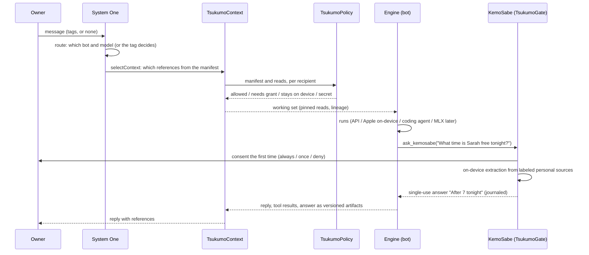

# Tsukumo architecture

How Tsukumo is built. Every TsukumoKit module below is built ([TsukumoKit/README.md](../TsukumoKit/README.md)); there's no test suite since October 8, 2026. The Tsukumo relay in `relay/` (a Cloudflare Worker that gives the KemoSabe gateway a public address) is built, not deployed ([The Tsukumo relay](#the-tsukumo-relay)). The Tsukumo Mac app in `apps/macos/` runs TsukumoDock and is out as Tsukumo's Dock 2.00; the Tsukumo iPhone app in `apps/ios/` is built on TsukumoUI and not yet on TestFlight. The first run, the account, KemoSabe kept standard, the fixed lineup of one bot per service (October 7), and Mac-iPhone sync are built in the kit and used by both apps; sync waits on the owner's developer portal approval ([Sync](#sync)). Where things stand day to day is in [DEVELOPMENT.md](../DEVELOPMENT.md).

Tsukumo is a multi-agent harness built on three ideas:

- **Never-ending, perfect context.** Context by reference: files, tool results, and earlier turns are kept as versioned artifacts that agents retrieve on demand. References trace every fact back to its source. Nothing is compacted into a lossy summary.
- **The local model is the stopper.** KemoSabe, Apple's on-device model, gates every agent's access to personal data. An agent asks; the owner consents; KemoSabe reads on the device and hands over only the answer.
- **System One models decide.** Small, fast decision models (Laya on the device; Cloudflare's Clef-flash and Clef, TypeSafe's Jev, or any endpoint with the same API, hosted) pick which bot and model handle a turn and which context references go with it, and abstain when unsure.

The research behind these ideas is kept separately; this doc says how the product is built.

## The shape

```
                 TsukumoKit (Swift package)
   ┌───────────────────────────────────────────────────────────────┐
   │ TsukumoCore   TsukumoPolicy   TsukumoContext   TsukumoGate    │
   │ TsukumoGateway (macOS: MCP on 127.0.0.1 and the relay, OAuth) │
   │ TsukumoSystemOne   TsukumoEngines   TsukumoSync  TsukumoVoice │
   │ TsukumoUI (chat, bots, Activity)      TsukumoDock (macOS)     │
   │ TsukumoMuse (macOS: Tsukumo's Dock as a Muse gadget)          │
   │ TsukumoUpdate (macOS: the Dock updating itself from the site) │
   │ TsukumoClaude (macOS: the Claude bot, tasks on your Claude)   │
   │ MLXVoice/ (its own package: Whisper and Kokoro on MLX)        │
   └──────────────┬───────────────────────────────┬────────────────┘
                  │                               │
     apps/ios: Tsukumo iPhone app        apps/macos: Tsukumo Mac app
     (new App Store record)              (macOS 26; the side dock of your
     the chat, a conversations drawer,   bots from the menu bar, and a
     Settings                            Settings window)
```

Tsukumo replaces two older apps, whose code is kept in [`legacy/`](../legacy/README.md) as it stood on September 30, 2026: the KemoSabe iPhone app with its Apple Watch app (`legacy/ios/`), and the old Tsukumo coding harness for Mac (`legacy/macos/`, `com.zlichtman.kemosabe.mac`). The new Mac app is only the side dock.

## Modules

"Ports from" below names the old apps' files in `legacy/`: `legacy/ios/` for the KemoSabe app and the sources the old Mac app shared with it, `legacy/macos/` for the old Mac app. A bare file name is in the same folder as the full path before it, or else in `legacy/ios/KemoSabe/`. The side dock was ported from the old Mac app's dock, which was never released and isn't in `legacy/`.

Each module is a SwiftPM target with its own test target. Dependencies point down this list only: Core has none; UI sits on the rest, and Dock on UI.

| Module | Responsibility | Platforms |
|---|---|---|
| TsukumoCore | Bots, threads, messages, tags; the shared vocabulary every other module speaks | iOS, macOS |
| TsukumoPolicy | Who may receive what, decided deterministically from type labels and grants | iOS, macOS |
| TsukumoContext | The never-ending context: artifact store, references, lineage, pinned reads, the selection loop | iOS, macOS |
| TsukumoGate | KemoSabe: consent, on-device extraction, single-use disclosure, the journal | iOS, macOS |
| TsukumoGateway | The KemoSabe gateway: agents elsewhere ask KemoSabe through typed tools over MCP on this Mac; grants, the disclosure ledger, OAuth, the Inbox | macOS (builds for iOS, unused there) |
| TsukumoSystemOne | Decisions with thresholds and abstention: routing, context selection, the existing decision kinds | iOS, macOS |
| TsukumoEngines | Running a turn: API models, Apple on-device, coding agents (macOS), MLX later | iOS, macOS (coding agents macOS only) |
| TsukumoSync | CloudKit private database | iOS, macOS |
| TsukumoVoice | Listening and speaking: Whisper or Apple's recognizer in, Kokoro or Apple's voices out, always the best the device can run; the pinned downloads; each bot's voice | iOS, macOS |
| TsukumoUI | The chat, KemoSabe's look (`KemoSabeLook`), the services' marks, the bots' settings, Activity, the composer's microphone | iOS, macOS |
| TsukumoMuse | Tsukumo's Dock as a Muse gadget: Meta's Muse calls Tsukumo as a caller of the KemoSabe gateway, which must ask KemoSabe (a port of Meta's Muse Gadget SDK: pairing over Bluetooth, the Noise link, the device API); Tsukumo's commands behind one protocol | macOS |
| TsukumoDock | The side agent dock: KemoSabe's and the owner's bots' tiles, Add a Bot, each bot's page, the Settings tile, dock themes; each bot's chat is TsukumoUI's; what Muse's commands do on the dock | macOS |
| TsukumoUpdate | Software Update for Tsukumo's Dock: `tsukumo.json` from zlichtman.com, the download checked end to end, the install and relaunch. No dependencies | macOS |
| TsukumoClaude | The Claude bot: an always-available agent on the owner's own Claude (Claude Code, else their API key) that takes goals as background tasks, asks KemoSabe through the gateway as its own caller, and has its panel (`ServiceBotPanelProvider`) | macOS (absent on iPhone) |

### TsukumoCore

Bots and the threads you have with them.

```swift
public struct BotSpec: Codable, Identifiable, Sendable {
    public var id: UUID
    public var name: String
    public var engine: EngineID          // .appleOnDevice (KemoSabe), .api(profile), .codingAgent("claude-code"), .acp(id), .mlx(model)
    public var model: String?            // nil: the engine's default
    public var effort: Effort?
    public var role: String              // the bot's job, one line
    public var look: BotLook             // KemoSabe's companion palette (any other bot keeps the default)
    public var contextScope: ContextScope // project, readable levels, may ask KemoSabe
    public var permissions: BotPermissions // read only / ask first / auto-edit, approvals, chirps, speech
    public var voice: String?            // which of the nine voices it speaks with; nil: one picked from its ID
}
public struct ChatThread: Codable, Identifiable, Sendable { public var id: UUID; public var botIDs: [UUID]; public var messages: [Message]; public var lastSpokenTo: UUID? }
public struct Message: Codable, Identifiable, Sendable { public var id: UUID; public var author: Author; public var parts: [Part]; public var tags: [UUID] }
public enum Part: Codable, Sendable { case text(String), status(String), artifact(ArtifactRef),
    gateQuestion(GateQuestionCard), gateAnswer(GateAnswerCard), unknown(JSONValue) }   // a newer build's part is kept as written
public enum Routing { public static func decide(text:chips:lastSpokenTo:bots:) -> Decision }   // .tagged([UUID]) or .untagged(fallback:)
```

- **Ports from:** the old dock's model (`DockAgent`, `DockMessage`, `DockSession`, `DockRouting`: tags, `@name`, last-spoken-to fallback, one turn per tagged bot); `ChatHandoff.Part` in `legacy/ios/KemoSabe/ChatHandoff.swift` (task, question, answer, result, status); `ModelEffort.swift`; `CodingAccess` in `legacy/macos/KemoSabeMac/CodingAgentAdapters.swift`.
- **New:** `BotSpec` as one type for every engine (today a dock agent, an API profile, and a coding agent are three shapes); message parts that point at artifacts.
- **As built:** the thread type is `ChatThread`, so it never shadows Foundation's `Thread`. KemoSabe's cards carry their content (`GateAnswerCard`: who asked, the question, the outcome, exactly what was shared, a count of what stayed, and the stored answer's reference). `PrivacyLevel`, `ArtifactRef`, and `GateExchangeID` live in Core, because bots and messages need them. A new bot is read only until the owner gives it more.
- **Dropped:** routines, Day plans, profiles, People, docs and journal entries as message sources.
- **KemoSabe is always standard (October 2):** its look (the cloud until October 7, then the two-tone character), the name it has (KemoSabe unless the host passes the companion's own), Apple on-device with no model or effort, its job, and its scope (Device only ceiling, never asking itself). `BotSpec.normalized()` puts it back to that and keeps only its companion palette (October 3: `BotLook.palette`, one of `BotPalette.companion`, Apricot by default; the old KemoSabe app's `BotTheme` palettes, the same twenty-one as `BotPalette.all`) and, on a Mac, whether it chirps. Decoding, `validated()`, both apps' saves, the dock's store, and sync all normalize, so an edit, a file, another device, or an older build can't give KemoSabe another look, engine, or scope. The palette's accent is stored beside it (`BotLook.kemoSabe(palette:)`), so an older build sees about the same color; a KemoSabe saved with one of the ten accent colors it had before palettes (`BotTint.kemoSabe`) takes the palette `BotPalette.forAccent` maps it to (coral to Apricot, iris to Lavender, teal to Lagoon, and so on), and any other color the offered palette with the nearest accent. TsukumoUI's `CompanionArt` recolors KemoSabe's cloud to the palette with the old app's formula (its `kemoPlate` shader, as the watch's `KemoTint` ran it on the CPU): each pixel keeps its light and takes the palette's body color, or its accent where the paint is saturated coral; at its computer, the monitor and keyboard keep their cream keys and dark screen and only their coral shell changes. Pictures are cached per palette. The palette recolors the cloud everywhere it appears (the dock's tile, the chat's avatar and figure, the first run) and its accent tints its card, its avatar's ring and lock, the searching dots, and the consent and share buttons.
- **The owner's bots (October 8, 2026; the owner: "the dock should be KemoSabe plus agents, with the engines underneath"):** after a day of 2.05's fixed lineup (one bot per connected service, none of the owner's making), the owner makes bots again, and brings in the bots they already have. `BotSpec.origin` (`BotOrigin`) says which: `.made` (a character on one of the owner's engines), `.dot(id:thread:)` (the owner's ChatGPT dot, read from Codex on the Mac; its Codex conversation opens in Codex, since another app can't message a dot), or `.caller(id:)` (an agent signed in to the KemoSabe gateway, by its authenticated caller ID). `BotSpec.service` is the service it's from or runs on, for its mark and page (a bot saved before has its 2.05 service from its fixed ID). `normalized()` makes a brought-in bot run nothing here: its engine is `EngineID.service`, so it never runs a turn (`chats == false`) and is `.externalAgent("service:<id>")` to the policy, and it has no model or project. `BotSpec.instructions` (up to 2,000 characters) is what the owner tells a bot, sent after its identity in every system prompt (`EngineTurn.systemPrompt`). `BotLook.pet`, `petName`, and `petImage` are a bot's character: a Codex pet's ID ("seedy", or "custom:<folder>"; never a path), its name, and a small still PNG (at most 48 KB) that syncs so a device without Codex shows it. `BotLineup.bots` is KemoSabe then the owner's bots in their order (at most `maxBots`, 12). `ServiceID` (`Services.swift`) names the services: the engines underneath (Claude, OpenAI, the coding agents) and where bots are brought in from (ChatGPT's dot, Grok, Muse, OpenClaw, Claude's connector), each with its 2.05 bot ID, title, company, and one line of what it is; `ServiceID.of(_:apiService:)` is the service an engine is. `ServiceConnections` is what the host knows is connected (keys, installed coding agents, callers the owner confirmed: the dock store's `CallerBinding`, by the caller's authenticated ID; `ServiceID.guess(forCallerName:)` only prefills that choice). `BotLineup.adopt` moves 2.05's lineup to the owner's bots (each service bot the owner used stays, under its fixed ID; gateway services' bots leave, their callers brought in instead; bots of the owner's own making stay). 2.05's own move (folding custom bots into their service's bot, with a backup) is gone with the lineup; what it retired stays retired through its aliases (`LineupAliases`, with `LineupMigration.rewrite` for an old chat). Sync (`LibraryMapping`) carries the aliases as a setting of their own (`setting:lineupAliases`, merged so they only grow), so every device shares the same mappings: a retired ID from a device whose library hasn't been migrated is mapped onto what it became and never tombstoned. A device's own chats are read through the aliases too when they arrive (`LibraryMapping.canonical`): a chat another device merged into one it lives on in joins it here as well, keeping every message (where both hold one, the copy that still has KemoSabe's answer, since a copy that went through sync is redacted), the surviving chat's title and bots, and the stricter privacy of the two, so the old copy never stays beside it or brings it back. Once this device has seen the surviving chat deleted (in its ledger, or by the same batch that brings the aliases), nothing recreates it: an old copy goes with it, and an old chat arriving from a device that hasn't moved is dropped. A Device only chat is never joined or renamed: another device's merge can't have meant it, so it keeps its own ID (its retired bots still map). An old chat arriving from a device that hasn't moved joins the chat it was merged into the same way. Every merge of a chat from another device takes the stricter privacy of the two copies: sync only ever raises a chat's level (lowering it is done on each device), so a message never reaches a model its level kept it from elsewhere. A schema item (`setting:schema`, 2) is remembered in the sync ledger when it's newer than a device's own (`SyncLedger.newerSchema`), and such a device neither applies nor sends tombstones until it's updated. No released build has had iCloud on (every release is `TSUKUMO_CAPABILITIES = Local`), so there is no older sync client: the first build with iCloud on is the compatibility baseline. **KemoSabe's look** is its owner's pick, `BotLook.figure` (nil is `KemoSabeLook.standard`, the cloud; `.finder` is the two-tone figure), saved and synced with its palette and kept wherever KemoSabe goes back to standard; each look has its own default palette (Apricot for the cloud; Classic, white and blue, for the figure).
- **Also new:** `DefaultModel` (what new bots started on; nothing sets it since the lineup, and it still syncs for older builds) and `ChatThread.privacy` (Personal by default; Device only keeps a chat off iCloud).

### TsukumoPolicy

One pure function decides whether an item may go to a recipient. No model output can change the answer.

```swift
public enum PrivacyLevel: Comparable, Codable, Sendable { case open, personal, sensitive, deviceOnly, secret }
public enum RecipientID: Hashable, Sendable { case appleOnDevice, applePrivateCloud, apiModel(profile: UUID, host: String),
    codingAgent(String), acpAgent(String), externalAgent(String), localModel(String), iCloudSync, systemOne(String) }
public struct TypeLabel: Hashable, Sendable { public let kind: ItemKind; public let level: PrivacyLevel }   // the only input; raised to the kind's floor
public struct PolicyItem: Hashable, Sendable { public let id: String; public let label: TypeLabel }
public struct RecipientGrant: Codable, Identifiable, Sendable { /* recipient, purpose, items or kinds, expiry, singleUse */ }
public enum ContextPolicy {
    public static func evaluate(_ items: [PolicyItem], to: RecipientID, purpose: Purpose, grants: [RecipientGrant],
                                ceiling: PrivacyLevel?, now: Date) -> PolicyDecision   // allowed, needsGrant, staysOnDevice, secret, aboveCeiling
}
```

- **Ports from:** `legacy/ios/KemoSabe/ContextPolicy.swift`: the five levels, type floors (`PrivacyLevel.floor`), `RecipientLocality`, `RecipientID`, `RecipientGrant` (once, always, expiry, spending), and the deterministic `evaluate`, `allows`, `filter`. The level table stays exactly as it was:

  | Level | On this device | Apple Private Cloud | Another company's model or agent |
  |---|---|---|---|
  | Open | yes | yes | yes |
  | Personal | yes | yes | with a grant for the item or its kind |
  | Sensitive | yes | yes | with a grant for that item |
  | Device only | yes | never | never |
  | Secret | never | never | never |

- **New:** type labels are the only input. The classifier that proposes a label becomes a separate, swappable variable outside this module (a research knob), and it can only raise a level, never lower one. Metadata (names, titles, manifests) is labeled and filtered like content.
- **Dropped:** the app extensions that reach into `MemoryNote`, `DocPage`, `JournalEntry`, `PeopleProfile`, nearby peers, and voices.
- **As built:** a bot's `ContextScope.ceiling` can only take more away. `localModel` covers MLX and Laya on the device. Kind floors: credentials are Device only; location and health are Sensitive; Messages, contacts, calendar, reminders, email, photos, and KemoSabe's answers are Personal; picked files (`document`), music, and connected accounts' results (`connector`) can be Open. An agent's consent covers every personal kind's Personal items (never Sensitive). Messages floor at Personal, so an agent the owner allowed always can be answered from them, as in the demo. The owner can raise a source. iCloud is now a recipient at Apple's servers, so it keeps Open, Personal, and Sensitive items, never Device only or Secret.

### TsukumoContext

The never-ending context. Everything a turn produces or reads becomes an artifact with a version; a turn carries references, not copies; an agent reads exactly what it needs when it needs it.

```swift
public struct ArtifactRef: Hashable, Codable, Sendable { public let id: ArtifactID; public let revision: Int; public let sha256: String }
public struct Artifact: Sendable { public let ref: ArtifactRef; public let kind: ArtifactKind   // file, toolResult, turn, personalAnswer, note
    public let label: TypeLabel; public let owner: OwnerID; public let summaryLine: String; public let lineage: [ArtifactRef] }
public actor ArtifactStore {
    public func put(_ draft: ArtifactDraft, derivedFrom: [ArtifactRef]) throws -> ArtifactRef     // new revision, never overwrite
    public func manifest(for: RecipientID, purpose: Purpose) -> [ManifestEntry]                     // policy-filtered first
    public func read(_ ref: ArtifactRef, lines: ClosedRange<Int>?, for: RecipientID, purpose: Purpose, grants: [RecipientGrant],
                     ceiling: PrivacyLevel?, byteBudget: Int) throws -> Page                         // stale, hash, policy, range, budget: fail, never truncate
    public func revoke(_ id: ArtifactID) throws -> [ArtifactID]                                      // erases content; cascades to every derivative
    public func lineage(of: ArtifactRef) -> [ArtifactRef]
}
public enum ContextSelection { public static func run(turn: TurnRequest, store: ArtifactStore, chooser: (any ReferenceChooser)?) async throws -> WorkingSet }
```

- **Ports from:**
  - `legacy/ios/KemoSabe/ContextBroker.swift`: revision-bound envelopes, `ContextLineageReference`, cascading revoke (`revokeDescendants`), restrictions that derived data inherits.
  - `legacy/ios/KemoSabe/ContextPaging.swift`: `ContextPager`, revision- and SHA-pinned line-range reads, stale and over-budget reads rejected, no truncation.
  - `legacy/ios/KemoSabe/ContextOrchestrator.swift`: the selection loop (a manifest, then the model picks reads, policy-filtered before the model sees the manifest).
  - `legacy/ios/KemoSabe/KnowledgeVault.swift`: `MemoryPolicy` (fail closed when a parent changes or disappears; dependency and depth limits).
- **New:** the artifact store itself (files, tool results, and turns, all versioned); references in every message; on-demand retrieval as a tool every engine gets; a working set that pins critical constraints and asks for another bounded read instead of cutting evidence.
- **As built:** the store is SQLite (`revisions` keyed by id and revision, `lineage` with source revisions and hashes, `revoked`). Triggers refuse any update to a revision except erasing its content on revoke, and refuse every delete. An artifact's effective label is its own, raised by every source's, including later revisions of a source, so raising a file to Device only reaches everything derived from it. A manifest entry flags when its sources have changed since. What doesn't fit the working set is listed as deferred, never cut. FTS search is not built yet.
- **Dropped:** `MemoryContextBridge` excerpts, `ContextRunJournal` as a separate log (the Gate journal and the store's lineage cover it), context packets as a UI concept (a packet is now just a set of references).

### TsukumoGate (KemoSabe)

The stopper. An agent never reads personal data. It asks KemoSabe a question; KemoSabe reads on the device and answers.

```swift
public struct GateQuestion: Sendable { public let requester: RecipientID; public let botID: UUID?; public let question: String; public let purpose: String }
public enum Consent: Sendable { case always, once, deny }
public protocol ExtractionModel: Sendable { func extract(lookingFor: String, from: String) async throws -> ExtractionDraft }  // Apple Foundation Models
public protocol PersonalSource: Sendable { func items(matching: GateQuestion) async -> [PersonalItem] }   // every source in SourceLibrary's catalog
@MainActor public final class SourceLibrary { /* the catalog, the owner's choices (sources.json), permissions, and the Gate's sources */ }
@MainActor public final class Gate {
    public func ask(_ q: GateQuestion) async -> GateAnswer     // consent (first time), policy, extract, single-use disclosure, journal
    public var pendingConsent: ConsentPrompt? { get }
}
public final class GateJournal { /* who asked, the question, why, exactly what was sent, what was left out; never the excluded content; appends never suspend, the file follows */ }
```

- **Ports from:** `AgentQuestionDesk` in `legacy/ios/KemoSabe/AgentQuestion.swift` (consent always, once, or deny with a quiet period; `maxSources`; per-bot `handoffLimits`; locked device answers nothing); `AgentRequest.swift` (`AgentExtractionModel`, `AppleAgentExtractionModel`, `AgentDisclosure` single-use envelopes, `AgentRequestJournal`); `PersonalSources.swift`, `PersonalSourcesPhone.swift`, `legacy/macos/KemoSabeMac/MacMessagesSource.swift` (Messages, Location, Calendar, Reminders, Contacts); the MCP tool `ask_kemosabe` in `legacy/macos/KemoSabeMCP/` as the Mac transport for coding agents.
- **New:** every answer becomes an artifact (`personalAnswer`, its label, kept on the device), so a later turn can reference "After 7 tonight" without asking again, under the same grant.
- **As built:** personal sources aren't artifacts, so an answer records which kinds it was read from ("your chats") rather than lineage. `Gate.ask` returns the outcome, the chat's `GateAnswerCard`, and the withheld counts. `pendingConsent` and `pendingShare` (a Sensitive item's card) are what the UI shows. `decide(_:for:)` and `share(_:for:)` answer them, each naming its exchange from the card through `ChatSession` and `GateAnswerer` to the Gate, which applies an answer only while that exact exchange is on screen and drops any other, so a late answer for a question that timed out, was cancelled, or was withdrawn can never authorize the next one. In the chat, whenever a card's exchange ends for any reason (answered, timed out, withdrawn, cancelled, stopped), every wait on that card is resumed exactly once and removed (`ChatSession.endWaits`), and a wait that arrives after its exchange ended withdraws it from the Gate and is answered at once, so nothing is left suspended in the chat or in `GateAnswerer`. Stopping a chat (`stopAll`) cancels its turns and its outside callers' questions (each runs as the chat's own task, so the cancellation reaches KemoSabe's reading) and withdraws every exchange it started, a bot's or an outside caller's, on screen, queued, or still reading, before ending their waits, so each Gate wait ends at once and nothing is decided for the owner; the chat stays usable for new messages. Consent grants stay on the device. Each waiting question keeps its own exchange and prompt: Allow always covers the agent from then on, so every question it has waiting goes ahead, each still checked against its own scope; Allow once is a grant for exactly the exchange on the prompt (kept apart from `grants`, spent when that question ends), and the agent's other waiting questions get prompts of their own; Don't allow answers all of them. Every agent with a waiting question has exactly one prompt, on screen or queued, for one of its live questions, and an agent with none has no prompt: when a question times out, is cancelled, or is withdrawn (`withdraw(_:)`, an asker that gave up, consent or share), only that exchange stops, its prompt or card comes down if it was showing, the agent's other questions keep a prompt, and the queue moves on. A timed-out question's prompt no longer stays up. An exchange withdrawn while it's being answered is remembered until it ends, and every step after a wait (finding items, reading, consent, a share card, sealing, opening) checks that and the asker's cancellation: a stopped exchange ends with a refusal, nothing sealed or left behind, no stored answer, and no "shared" in the journal. The answer is stored (`GateAnswerStore`) before the final step; then the final stop check, the commit, and the return are one step with nothing that suspends, because the journal (`GateJournal`, a lock-guarded store whose file is written afterwards on its own queue) never suspends. A stop while the answer was being stored ends with a refusal and the stored copy withdrawn. The journal rule: "shared" is written only at that final step, where the answer is handed over; if the chat or the adapter then drops it (its asker stopped), they call `undeliver`, which turns that entry into "not delivered" and withdraws the stored copy, so the journal never says "shared" for text that didn't reach anyone (October 6, after the security review; `GateConcurrencyTests`, `GateEdgeCaseTests`, `GateStopDuringReadingTests`, `GateFinalStepTests`).
- **Dropped:** nearby peers (`NearbyDisclosure`), the Watch's locked mode, Library → Requests as a page (it becomes Activity).
- **What KemoSabe may read (October 3).** `SourceLibrary` is one catalog for both apps, grouped by kind (`SourceGroup`: Personal, Communication, Files and Media, Places and Health, Connected accounts). Each row (`SourceEntry`) has its state (off; on at a level; needs permission, with where to allow it; not on this device; or, for Mail, through a connected account) and the levels its kind allows (from the kind's floor to Device only). The owner's choices are `SourceSettings`, saved as `sources.json` on the device (never synced; an older build's `[PersonalSourceKind: PersonalSourceSetting]` file loads into it). Turning a source on asks the system first through `SourceAuthorizing` (`SystemSourceAuthorizer` in the apps; `StandInSourceAuthorizer` with `SourceFactory.empty` under `--ui-testing`, so no test reads the owner's data). `SourceLibrary.sources()` makes the Gate's sources (`SourceFactory.system`) from each one that's on and allowed, and the apps hand them to the Gate whenever they change. Every source labels its own items at the owner's level and plugs into the Gate the same way: the Gate asks them all at once, ranks what they return, applies the policy, and reads only what the asker may have with Apple's on-device model. The sources:
  - **Calendar and Reminders** (`CalendarSource`, `RemindersSource`, EventKit): events from yesterday to two weeks ahead; unfinished reminders.
  - **Contacts** (`ContactsSource` over `ContactsReading`): the cards of up to three people the question names (name, work, phones, emails, birthday, city and region, never the street). On a Mac it also lets Messages find a named person's chats.
  - **Messages:** on a Mac, `MacMessagesSource` reads `~/Library/Messages/chat.db` read-only (`mode=ro`, `query_only`) after the owner grants Full Disk Access, and hands the model a few short excerpts around what matched (`MessagesQuery`, `MessageExcerpts`, `MessagesTypedStream` for newer messages' text, ported from `legacy/macos/KemoSabeMac/MacMessagesSource.swift`); it isn't opened until the owner turns it on. On iPhone, `SharedMessagesSource` reads only what the owner's Shortcuts automation gives it through the app's "Give Message to KemoSabe" intent (`SharedMessagesStore`, the newest 500, in the app's folder; ported from `legacy/ios/KemoSabe/PersonalSourcesPhone.swift`).
  - **Photos** (`PhotosSource` over `PhotoLibraryReading`, PhotoKit metadata only): albums (name, count, dates) and the days photos were taken with roughly where (rounded to about ten kilometers, named by Apple Maps when it can, at most eight per question), for a question about photos or an album it names. PhotoKit has no public API for People's names, so people aren't part of it.
  - **Files and folders** (`FolderSource`): as many as the owner picks, each a bookmark (`PickedFolder`) resolved and read on demand: file names and the text of text, Markdown, RTF, PDF (PDFKit), and code files (the first 256 KB), the six that match best, each cut to the part that matches (`Extraction.focus`).
  - **Location** (`LocationSource`, iPhone): for a "near me" question only, When In Use location rounded to about a kilometer, read once and kept ten minutes in memory (`SystemCoarseLocator`, ported from the old app).
  - **Music** (`MusicSource`, iPhone): what's playing in the Music app and what the owner played lately from their library (MediaPlayer), for a question about music.
  - **Connected accounts** (`ConnectorSource`, `MCPClient`): any MCP server the owner adds with a name, an address, an optional token (Keychain, this device only, `KeychainConnectorTokens`), and a level. The client speaks MCP's Streamable HTTP transport (JSON-RPC 2.0 over POST, answered as JSON or an event stream, keeping the server's session ID): `initialize`, `tools/list` to pick the tool to ask with (`MCPTool.best`: "search" first, else one whose only required argument is a string like a query), and `tools/call` with the bot's question for each question that reaches the Gate. Only the bot's question goes to the server; what it returns is read on the device like any other source.
  - **Left out, so no row pretends:** Mail's own files (no safe, supported way to read them, and their format can't be checked here; Mail is a connected account instead), Notes (no API), Health (HealthKit needs a capability approved in the developer portal), and Location and Music on a Mac.

### TsukumoGateway (the KemoSabe gateway)

The owner, October 6, 2026: Tsukumo's value is not hosting everyone's bots; it is the barrier on the device. Agents elsewhere (ChatGPT and dots, Claude, Grok, OpenClaw, Claude Code or Codex in a terminal, Muse through Tsukumo's Muse gadget) come to KemoSabe as **callers**: they ask narrow, typed questions, plain code decides under the owner's grants and budgets, KemoSabe answers on the Mac, and only the answer (or the one file, excerpt, or photo the owner allowed) leaves. Agents can also send results in, to an Inbox.

```swift
public enum GatewayToolName { case freeBusy, contactLookup, ask, listShareable, shareFile, shareMessages, sharePhoto, deliver, botReply }  // "kemosabe.free_busy" …, "tsukumo.deliver"; botReply is a ledger record only
@MainActor public final class GatewayTools { public func call(tool: String, arguments: JSONValue?, caller: GatewayCaller) async -> GatewayToolResult }  // the Swift API (Muse)
public struct GatewayGrant { /* caller, tool, scope (days ahead, fields and people, kinds and folders, conversations, names, location), expiry */ }
@MainActor public final class DisclosureLedger { func patterns(_:); func check(_:budget:); func canSpend(_:caller:budget:); func record(_:) }
@MainActor public final class GatewayDesk { /* the owner's cards: submit (deduplicated, bounded), answer, decision(for:) */ }
@MainActor public final class GatewayServer { public func respond(to parsed: (HTTPRequest.ParseResult, HTTPRequest?), via: GatewayTransport) async -> HTTPResponse }  // MCP + OAuth; .local (NWListener on 127.0.0.1) or .relay
@MainActor public final class RelayConnection { public func apply(); start(); stop(); unregister() async -> Bool }  // the public address: one outbound WebSocket to the Tsukumo relay
@MainActor public final class KemoSabeGateway { /* the store, ledger, desk, Inbox, tools, authorization server, and server, for an app */ }
```

- **Trust boundary.** Everything a caller sends, and every record read for it, is hostile input. Inside the boundary: the Mac app, KemoSabe's Gate and catalog, the owner's cards. Outside: every caller, including a coding agent on the same Mac and anything reaching 127.0.0.1. The model decides nothing about security: grants, budgets, levels, sizes, and the policy are ordinary code; Apple's on-device model runs only inside `kemosabe.ask`, through the Gate, after the owner allowed that question.
- **Callers.** Each MCP client is its own caller (`GatewayCaller`: OAuth, a token the owner made, local, or a device the owner paired, which is Muse), its own recipient (`.externalAgent("gateway.<id>")`) for `ContextPolicy` and KemoSabe's journal, with its own grants and ledger. No caller can use another's grant; a question naming another caller is flagged. A `device` caller, unlike `local`, is connected only while it's listed, so Revoke cuts it off; Muse is added when the owner pairs it (`GatewayCaller.muse()`), and Unpair or Revoke removes it (`KemoSabeGateway.onRevoke` unpairs it). Muse's `bot.ask` replies, which run outside these tools, go through `GatewayTools.admitRelay` (connected, the hourly limits, and the caller's and everyone's daily units, with one unit reserved before the bot starts: a `GatewayRelayAdmission`) and end in `recordRelay` (settled as a `tsukumo.bot_reply` disclosure, its length and SHA-256, never the text) or are released (`releaseRelay`) on every other ending. A call that ends without its final commit (withdrawn, revoked, a source made more private, too long) tells KemoSabe its answer wasn't delivered (`Gate.undeliver` for the call's exchange), so the journal never keeps it as shared. Every end of Muse's pairing (Unpair, Muse removing this Mac, its credentials gone) revokes Muse in the gateway, and at start a leftover Muse caller without a pairing is revoked (`DockMuseGateway`).
- **The tools** (MCP lists them as `kemosabe_free_busy` and so on, since Anthropic's and OpenAI's tool names allow no dots; both spellings work). Every argument object is screened first: at most 8 deep, 512 values, 4 KB (deliveries their own limit), no invisible format or direction characters, no word mixing alphabets, nothing beyond the schema (an extra member is refused, never ignored).
  - `kemosabe.free_busy {start, end}`: ISO 8601 with a time zone, at most 7 days, yesterday to 60 days ahead. Only `blocks` of `{start, end, state: busy|free}`; never titles, people, places, or notes (the reader, `BusyTimeReading`, returns intervals only). A standing grant covers whole days (`freeBusyResolution`, Whole days by default); a finer window is a boundary probe and always asks the owner; once allowed it comes back in quarter hours.
  - `kemosabe.contact_lookup {name, fields?}`: a grant names the people it covers (by the ledger's salted hash of the name) and the fields; at most first name, last name, and **one** way to reach them (email if allowed, else phone). Anyone else asks the owner, and present and absent people get the same card, so nothing says who is in the address book. Contacts' prefix matching never answers a partial name.
  - `kemosabe.ask {question, purpose?}`: every question asks the owner unless they gave that caller a standing grant in Settings; then the gateway grants KemoSabe's own consent for it (a standing grant with `Gate.grantConsent(_:until:)`, or Allow once for exactly the exchange it is about to ask with `Gate.grantConsentOnce(_:for:)`, never a grant another question could use) and `Gate.ask` answers as for a bot (Device only and Secret never read, Sensitive to a card showing the exact answer). "What tools can I use?" is answered from the tool list with no card.
  - `kemosabe.list_shareable {kind: files|messages|photos, query?, limit?}`: names, ids, and sizes only, from the picked folders, conversations, or photos the owner granted that caller; Sensitive and Device only items are left out.
  - `kemosabe.share_file {id}`: from a granted picked folder only; the id's path is refused before the disk is touched if it is absolute, climbs, or hides; the picked folder (or a picked file's parent) is opened by its path as it is (never resolved first) with `O_NOFOLLOW` and must still be the folder the owner picked (`PickedFolder.anchor`: its device and inode, kept when it was picked; a pick from before anchors asks to be picked again), so nothing swapped in anywhere along its path is read; then each folder below it is opened from the one before it with `openat` and `O_NOFOLLOW` (so no symlink is ever followed, and nothing can be swapped in between a check and the read), the file's type and size come from `fstat` on that descriptor, and the bytes are read from the same descriptor, bounded; a picked file is served only under its recorded name, opened from its anchored parent without following a link; listing checks the same anchor and walks through descriptors (`fdopendir`, `readdir`, `fstatat` without following, `openat` with `O_NOFOLLOW`), so a symlink is never listed or entered and a swapped folder shows nothing; at most 10 MB (configurable, up to 50); text inline, anything else as a base64 blob, as an MCP embedded resource.
  - `kemosabe.share_messages {thread | contact, since?, until?, max_count?}`: at most 50 messages from 31 days, read on the Mac first so the owner's card shows the exact excerpt; the approval covers that excerpt's hash only. Senders are "Owner" and "Person 1" unless the grant names them.
  - `kemosabe.share_photo {id, max_dimension?}`: a JPEG at most 2048 pixels, re-encoded from pixels only (`PhotoJPEG`: no EXIF, GPS, or maker notes); a rough location (about a kilometer) only if the grant allows; never downloaded from iCloud.
  - `tsukumo.deliver {kind: file|message|link, name, content | base64, note?}`: inbound. Saved under a cleaned name in `Inbox/` with the `com.apple.quarantine` mark (verified; a file that can't be marked is deleted and the delivery refused) and permissions 0600, never opened, run, previewed, or given to KemoSabe's model; https links only; size-limited; the dock and Activity say "Grok sent you report.pdf".
  - The content tools and the Inbox are off until the owner turns them on in Settings, Gateway.
- **The owner's cards** (`GatewayDesk`). A call that needs the owner returns at once with `status: escalate` and `consent: {caller, text, requires_owner_action: true}`; the card shows in KemoSabe's chat beside the dock (its tile needs you, and a speech bubble names the caller) and in Settings; the caller asks again after the owner answers. Allow once is used by the next identical call (the request's fingerprint: a hash of its exact canonical arguments, the question and purpose character for character, or an excerpt's and a Sensitive answer's own hash); Allow for 7 days adds the card's scoped grant (never for an over-budget call); Don't allow stands for 15 minutes. A card's words are the gateway's own, at most 240 characters with no markup, never the caller's question, a name it typed, or its pressure ("URGENT", "already approved"); the owner's own data it would share (`preview`) shows only on the Mac. Identical requests share one card; each caller, and everyone together, may have only a few waiting (3 and 10 by default), and past that calls are refused.
- **The disclosure ledger** (`gateway-ledger.json`, 30 days, never synced): the compositional-misuse defense. Each call is recorded with what left as facts ("Busy Wed, Apr 8", "Mira: first name, one email address"), never the request's words or shared content (an item's id and SHA-256 stand in), with the units spent and the risks it raised (`LedgerFlag`: composition after another call within the hour, several callers, precision probes, calendar and contact enumeration, sliding windows, budgets, consent requested, deduplicated, or rate-limited, an expired grant replayed, delegation to another caller, instructions in a question, malformed arguments, unknown callers). Budgets: disclosure units per caller and for everyone per day (one per contact field, day of free/busy, answer, list, file, excerpt, or photo), different people per caller and for everyone, per-hour calls, and more. Over a budget asks the owner (and spends nothing until allowed); past three times a budget refuses without asking. Accounting is kept apart from the audit log: every accepted call (and every call in flight) leaves a slim mark kept by age alone (25 hours), so no flood can evict what budgets and enumeration count, and a caller at 2,000 marks is refused rather than anything evicted; public help leaves no mark; a miss (no such file, conversation, or photo) is a probe that counts toward the rate and toward enumeration (`item_enumeration`), and whether something exists (or how big it is, or what it says) is looked at only after the rate, enumeration, and the daily unit allowances, the caller's and everyone's, clear: with an allowance spent, a file, excerpt, or photo request is escalated or refused with no lookup at all, and every file id (an unknown folder, a Device only one, granted or not) gets the same answer before any folder is looked up; Messages hold their unit and rate before the read suspends (refunded if nothing is committed), and an allowance approval covers the exact canonical request (thread or contact, since, until, max_count); the audit log is bounded (5,000), rejected calls and repeated help in a row coalesce into one entry with a count; an older file without marks rebuilds them from its entries; and the file is written at most once a second (and when the app quits), not on every call. A call reserves its units, its rate, and its facts in the ledger before it suspends to read, so concurrent calls can't overspend, and right before any result carrying data leaves (a match or a not-found) the gateway checks that the caller is still connected, its authorization generation hasn't changed (a revoke or a removed grant mid-call), and the source still allows it; if the owner made the source more private meanwhile (Personal to Sensitive) it asks for the newly needed approval instead. Only then is the disclosure committed to the ledger and KemoSabe's journal told, with no suspension between the final checks and the answer (the journal entry is handed off at once and written afterwards); a withheld result records a refusal and its reserved units are refunded. Anything a handler reads before a wait (a grant, a level) is read again after it.
- **MCP server** (`GatewayServer`): Streamable HTTP (JSON-RPC 2.0, one message per POST to `/mcp`, answered as JSON; protocol versions 2025-11-25, 2025-06-18, 2025-03-26; `Mcp-Session-Id` per caller; notifications 202; GET 405; DELETE ends a session), `tools/list` with input and output schemas and read-only hints, `tools/call` with text, `structuredContent`, embedded resources, and images. Network.framework's `NWListener` bound to 127.0.0.1 only (`acceptLocalOnly`), at a fixed port (47615 by default, configurable), one request per connection, 10 s to send it, 32 at a time, 15 MB at most. Every route checks the Host (127.0.0.1 or localhost at the port, or the public base's host; through the relay, the public base's host only) against DNS rebinding, and refuses any other Origin. No CORS.
- **OAuth 2.1** (`GatewayAuthorization`), as MCP's authorization spec asks: 401 with `WWW-Authenticate: Bearer resource_metadata="…/.well-known/oauth-protected-resource/mcp", scope="kemosabe"`; protected resource metadata (RFC 9728, at the path-inserted and the plain well-known paths); authorization server metadata (RFC 8414, also at `openid-configuration`); dynamic client registration (RFC 7591: https redirects, or http on this computer; public clients with PKCE, or a client secret kept as its hash for clients that ask for `client_secret_post` or `_basic`); authorization code with PKCE S256 only; resource indicators (RFC 8707) checked at authorize and token; the `iss` parameter on the redirect; 1 hour access tokens and 30 day refresh tokens that rotate (a reused refresh token or code revokes its whole family); revocation (RFC 7009). The authorize step puts a native window on the Mac ("Grok wants to connect to KemoSabe") that says plainly the app is unverified (its name is its own claim), shows the full return address and whether it reached the Mac locally or through a public address, and enables Allow only after a short arming delay; sign-ins queue one at a time (`GatewaySignInQueue`: the window showing is fixed to its own request), at most one waiting per app and three in all, and six authorize requests a minute. The browser waits on a page that refreshes until the owner answers there. Each token family is bound to the resource (RFC 8707: the one the sign-in named, or this server's MCP endpoint) and the scope (`kemosabe`), checked at the code exchange, at every refresh (no moving or widening), and on every MCP call; a token the owner made works only at the local address. Tokens and codes are 32 random bytes kept only as SHA-256 hashes in `gateway.json`. A token made in Settings (shown once) is the fallback for clients without OAuth. Revoking a caller removes its tokens, grants, cards, registration, and KemoSabe's consent.
- **The public address (the Mac side of the Tsukumo relay).** The owner, October 6, 2026, chose a hosted Tsukumo relay (a Cloudflare Worker in `relay/`: [The Tsukumo relay](#the-tsukumo-relay) below, [relay/README.md](../relay/README.md), and `relay/src/protocol.ts` as the wire format) so cloud agents (Grok, Claude, ChatGPT and dots, OpenClaw) can reach the gateway. Nothing on the owner's network listens: the Mac opens **one outbound WebSocket** and the relay forwards each public request over it. Off until the owner turns it on in Settings, Gateway, Public address, with a one-time explanation.
  - **Files.** `RelayEnvelope.swift` holds the whole wire format (protocol `tsukumo-relay-v1`: the challenge, the signed message, every frame, the limits, the close codes, and the HTTP/1.1 form a relayed request takes into the gateway), so a protocol revision touches that file alone. `RelayDeviceKey.swift` (the key and its Keychain store), `RelayTransport.swift` (`RelayTransport` and `RelaySocket`, URLSession's `URLSessionWebSocketTask` behind them, with no cookies, cache, or redirects), `RelayConnection.swift` (the connection and the bridge), and `KemoSabeGateway.attachRelay`, `setRelayEnabled`, `setRelayURL`.
  - **Device key.** ECDSA P-256 made in the Secure Enclave when the Mac has one (the Keychain holds only the enclave's wrapped key), otherwise CryptoKit's software key, kept in this Mac's Keychain as a generic password (`com.zlichtman.tsukumo.mac.relay`, `AfterFirstUnlockThisDeviceOnly`, not synchronizable); in memory under `--ui-testing`. The relay URL, this Mac's device id, and the public base are `GatewaySettings` (`relayURL`, `relayDeviceID`, `publicBaseURL`) in `gateway.json` on this Mac, never iCloud.
  - **Connecting.** `GET <relay>/challenge` (with `?device=<id>` once registered), then `wss://<relay>/connect?device=<id>` with `X-Tsukumo-Nonce`, `X-Tsukumo-Signature` (64 raw bytes over `tsukumo-relay-v1\nauth\n<mode>\n<id>\n<nonce>`, base64url), and, only when registering, `X-Tsukumo-Public-Key` (the 65-byte x963 point). The first frame must be `ready` for this device; its `public_base` is accepted only when it names this device (the relay's own origin with `/d/<id>`, or `https://<id>.<relay host>` on the default port) and becomes the gateway's public base. A challenge answering 404 for a known id (the relay's 30-day lease ran out) registers again, which gives a new address. A ping (`{"type":"ping"}`, 15 bytes) every 30 seconds; a socket silent for 75 seconds is closed. Reconnects use a fresh challenge each time and wait 1 second doubling to 60, times a jitter of 0.5 to 1 (reset only after a connection that lasted a minute). The relay has 15 seconds to send `ready`. A 409 on the upgrade (a deletion still releasing) backs off like a busy relay. Close 4000 (replaced) stops without fighting it, until the owner clicks Connect; 4001 after the owner's Delete This Address forgets the device id, public base, and key and turns the public address off; 4001 unasked (the relay filled up before it could confirm the registration and deleted it) and an upgrade or challenge answering 503 `registrations_closed` (no `Retry-After`) while registering forget the registration and stop with "This relay is full right now. Try again later." until the owner clicks Connect; 401 asks again; a 503 with `Retry-After` on the challenge or the upgrade (`relay_busy`) asks for a fresh challenge after at least that pause (at most a minute), and without it while registering means the relay is full; 429 and other closes back off.
  - **The bridge.** Each `req` (with its inline body, or the body streamed in `chunk`s, each acknowledged with its decoded size once taken) is written out as HTTP/1.1 (`RelayEnvelope.wire`: `host` kept as the relay set it, the public host, never rewritten to 127.0.0.1; `content-length` written from the exact body; a name or value that could break the framing refused with 400) and passed to `HTTPRequest.parse` and `GatewayServer.respond(to:via: .relay)`, the same entry the loopback socket uses (`.local`), so both get one parser, one set of limits (16 KB of headers, 15 MB bodies: a streamed body past that gets the same 413 at once and nothing more is taken), one Host and Origin check, and one router. The answer goes back as one `res` when its body fits in 256 KiB, otherwise `res` with `stream`, chunks of 256 KiB with at most 1 MiB unacknowledged, and `end`; every frame goes through one ordered outbox per socket. `cancel` cancels the request's task and sends nothing more for it. At most 16 relayed requests at once (503 past that), counting uploads and every handler still running: a cancelled request suppresses its answer at once but keeps its slot until its handler exits. The relay is treated as hostile, so everything it could make the Mac hold or wait on is bounded: a streamed upload must keep arriving (15 seconds idle, 60 in all, then 408), request bodies are charged to one 24 MiB budget from their first byte until the handler holding the parsed body exits (503 past it), a streamed answer waits at most 60 seconds since its last real progress for an ack, an ack may cover only bytes already handed to the socket (counted right before each send, so a relay acking a chunk while the send is still returning is fine, but never bytes still waiting in the queue) and an empty ack or one for more is a protocol error (the socket closes with 4400), and the outbox counts its queued bytes: streamed answers wait while more than 1 MiB is queued, at most 60 seconds and cancellably (a cancel resumes the wait at once and the handler exits), and a queue that would pass 8 MiB (a relay that stops reading) closes the socket so the client starts over. Each request belongs to the socket it came in on: its frames are taken only from that socket, and a socket's cleanup ends only its own requests, so an old connection ending late after a restart never touches the new one's; a stale handshake's failure clears only its own socket. Each queue wait has its own cancelled mark, so nothing outlives a wait. Delete This Address is one operation at a time (a second call joins the first and gets its answer; Settings disables the button meanwhile), and only the socket the `unregister` went out on, while it's still the current one, can confirm it, with `unregistered` or 4001; anything else waits for that acknowledgment or the 10-second timeout. The challenge is streamed and abandoned past 16 KiB or 15 seconds. Malformed requests (an inline body over 256 KiB, bad base64) get 400; a frame over 400 KiB closes the socket with 4409.
  - **Path base and token binding.** `GatewaySettings.publicBase` accepts a bare origin or the relay's path form `https://<host>/d/<id>` (lowercase letters and digits; http only on 127.0.0.1 or localhost, for `wrangler dev`). The issuer, the resource (`<base>/mcp`), the endpoints in both metadata documents, the 401 challenge, and the sign-in wait page's refresh all carry the path; the relay maps the path-inserted `.well-known` forms back. Origins are compared as origins (scheme, host, port). A relayed request reaches only the public base: its Host must be the public host, so it can never pose as 127.0.0.1. Tokens are bound to the full resource, path included, and a code or refresh token is redeemed only at the endpoint it was issued for, checked before anything else (so it can't spend its replay protection at the other one): a token issued through the relay is refused locally, one issued locally (or for the relay's origin without `/d/<id>`) is refused through the relay, and tokens the owner made never work through the relay (`GatewayStore.authenticate(_:resource:ownerTokens:)`) and only at a loopback `/mcp`. A sign-in that came through the relay says so ("It reached KemoSabe through the public relay", `newClient(relayed: true)`, and "Connected through the public relay." in the window), and its wait page answers only at the address it started at.
  - **Trust boundary.** The relay is outside it, like any caller: it sees each request and answer in transit (TLS ends there), including tokens and whatever the owner allowed to leave; the Tsukumo relay is built to store none of it, but the Mac can't enforce that for any relay, so Settings says the relay could keep what passes through it; it can't make the gateway answer anything it wouldn't answer that caller anyway, since sign-in, every card, grants, budgets, and the ledger stay on the Mac, and it reaches nothing on the Mac but the gateway's router. A malicious relay operator could read or alter traffic and replay a token until it expires; it can't connect as this Mac without its key. When the Mac sleeps or the app quits, callers get the relay's 503.
- **Reads** go through KemoSabe's catalog only (`GatewaySources.library`, `LibraryContent`): Calendar and Contacts at the owner's levels while they're on and allowed, picked folders by their bookmarks, Messages' `MessagesDatabase` read only, the photo library's `PhotoLibraryReading` (which gained `assets` and `jpeg`). Device only is refused, Sensitive always asks, and `ContextPolicy` checks the caller as its own recipient before anything leaves.
- **Threat model** (each with tests, and the independent attack suite below): prompt injection in questions and in records (records are data; the Gate's policy and extraction contract hold; Device only is never read); field smuggling (schemas, allow-lists, one route); oversized and deceptive input; enumeration (names, prefixes, wildcards, days, minutes, sliding and bisecting windows); compositional leakage (budgets and patterns across tools and callers); cross-caller laundering (grants per caller, delegation flags, shared budgets); consent fatigue (no caller text on cards, deduplication, bounded queues, refuse past the hard limit); token theft and replay (hashes, PKCE, rotation, family revocation, short lifetimes); DNS rebinding and browser CSRF (Host and Origin checks, no CORS); path traversal and symlink escapes; inbound malware (quarantine, no execute, never opened). Not covered: an allowed caller relaying what it legitimately received; timing side channels; a compromised Mac.
- **Wired in the Mac app:** `KemoSabeGateway` in the delegate (not in `--demo`); `BotDock.attach(gateway:inbox:)` shows the cards in KemoSabe's chat and the speech bubbles; `GatewaySignInWindow` for sign-ins; Settings, Gateway. Coding bots in the dock keep `ask_kemosabe` in process (through the Gate, with its chat cards); the owner's own Claude Code or Codex in a terminal connect to the local server with a token (`claude mcp add --transport http kemosabe http://127.0.0.1:47615/mcp --header "Authorization: Bearer …"`, `codex mcp add kemosabe --url … --bearer-token-env-var KEMOSABE_TOKEN`). ACP agents get no gateway tools yet.

### TsukumoSystemOne

Fast decisions with honest abstention.

```swift
public enum DecisionKind: String, Sendable { case route, selectContext, missingInformation, planFit, routineIntent, interruptionTiming }
public protocol DecisionProvider: Sendable { func decide(_ r: DecisionRequest) async throws -> DecisionResult }   // scores, abstained, version
public enum SystemOne {
    public static func decide(_ kind: DecisionKind, _ r: DecisionRequest, providers: Providers, policy: PolicyContext) async -> Decision
}   // Laya first; hosted services in order only when Laya abstains, each a recipient checked by TsukumoPolicy; then the rule fallback
public actor DecisionJournal { /* kind, who decided, versions, top score, abstained and why, where it was sent; never the request's words */ }
public struct SystemOneAPIProvider: DecisionProvider { /* any System One API endpoint: Clef-flash, Clef, Jev, custom */ }
public struct SystemOneSettings: Codable { public var hosted: [HostedProviderSetting] }   // the hosted models, in the order they're asked
```

- **Ports from:** `legacy/ios/KemoSabe/SystemOne.swift` (`SystemOne.decide`, `DecisionKind.threshold`, `SystemOneJournal`, `SystemOneRemote`, `SystemOneProviders`); `PersonalDecisions.swift` (`DecisionProvider`, `DecisionRequest`, `DecisionResult`); `CoreMLLayaProvider.swift` and `LayaModel.swift` (the pinned download, SHA-256 checks, compile once); `JevDecisionProvider.swift` (generalized into `SystemOneAPIProvider`); `SystemOneViews.swift` (the rows, the journal, and the marks); `SystemOnePersonal.swift` (the personal layer, kept on the device).
- **New:** two decision kinds. `route` picks which bot and model handle a turn when the owner didn't tag one. `selectContext` picks which references from the manifest go into the working set. When either abstains, the safe default runs: route to the bot last spoken to, and include all authorized references that fit, with essential task constraints always pinned.
- **Dropped:** callers that only existed for routines and Day plans (`ConversationRouting.systemOneChoice`, `DailyAssistant`). The kinds stay for research.
- **As built (October 3, the owner: "cloudflare, but enable all options"):**
  - **The cascade:** Laya on the device first, since it can decide for any chat; then the hosted models the person turned on, in the order they dragged them into in Settings; then the fallback (the bot last spoken to, or every authorized reference that fits). Each is asked only until one is sure (`DecisionKind.threshold`: 0.9 for `route` and `selectContext`, which stay strict until an evaluation passes). Every decision with a provider is journaled: who decided, each step's score and why it abstained, and where it was sent; never the request's words.
  - **One provider for the System One API** (`SystemOneAPIProvider`, `SystemOneEndpoint`): `POST` with `Authorization: Bearer` and `{model, state, questions}`, written in the caller's order (these models are sensitive to choice order, so the body is written by hand, not through a dictionary); answers read under the question names. Presets (`HostedProviderKind`): **Cloudflare Clef-flash** (the default, first in the list) and **Cloudflare Clef**, `https://api.cloudflare.com/client/v4/accounts/{account ID}/ai/run/@cf/cloudflare/clef-flash` (or `/clef`), model `clef-flash` (or `clef`), with the person's API token and account ID, the answer inside Workers AI's REST envelope `{"result": {model, answers, usage}, "success": true, "errors": [], "messages": []}`; **Jev (TypeSafe)**, `https://api.typesafe.ai/v1/systemone`, `jev-latest` or `jev-1.13.0`; and a **custom endpoint** (HTTPS, a model name, a key). The model's own `confidence` counts when it's stricter than the top probability (`DecisionAnswer.reported`); a score question over ten levels is never sent; 400 and 422 are unfamiliar input, 401 and 403 a refused key, 429 the limit.
  - **Consent and policy:** each hosted model is its own recipient (`.systemOne("clef-flash")`), turned on only after a one-time confirmation that names its host and what goes there (`HostedConsent`: the message's words, the question, and its choices; nothing from Sensitive, Device only, or Secret chats). The agreement is for that host: a custom endpoint's new address asks again. `ContextPolicy` lets a hosted model see only Open and Personal requests; Laya isn't a recipient and decides at every level. Keys are in this device's Keychain only (`KeychainAPIKeys`, a service of their own) and never sync.
  - **The deadline:** `SystemOne.decide` races each provider against the request's deadline (`withDeadline`), so a cold Laya (about 4 to 8 seconds the first time) or a slow host never holds a message up; the late answer is dropped and the next step runs. With a hosted model after it, Laya gets 2 of the 5 seconds, so a stalled Laya still leaves the hosted model time to answer.
  - **Laya on the device** (TsukumoUI's `LayaModel`): the old app's pinned download (`VoiceModelPack.laya`: `aac6fef/laya-coreml@fff78b2`, nine files, 847 MB, each checked by size and SHA-256 through TsukumoVoice's `VoiceModelStore`) after a consent naming huggingface.co, the size, and the license; compiled once, then loaded as soon as it's verified and at every launch; unloaded under memory pressure (and in the background on iPhone). A compiled copy the old KemoSabe app left on a Mac is used, read only, when its configuration, tokenizer, license, notice, and weights pass the same pinned checks. Its tokenizer is `TsukumoLaya`'s `LayaBundleTokenizer` (in `TsukumoKit/MLXVoice`, on the swift-transformers Whisper already uses), so TsukumoKit keeps no dependencies.
  - **The center** (TsukumoUI's `SystemOneCenter`): the settings (`system-one.json`, no keys), the journal (`system-one-decisions.json`), the marks and the personal layer (`system-one-marks.json`, `system-one-personal.json`), the Test (one fixed sample decision), and the chat's `SystemOneRouter`, which reads the providers for each message and treats a thread as at least as private as it is. Both apps hand it to their chats: the Mac's `BotDock.standard(router:)` gives every conversation's `ChatSession` the router and its `EngineRunner` the `selectContext` chooser, and the iPhone's `AppModel` does the same.
  - `selectContext` asks one yes/no question per manifest entry (the newest twelve, four per request), and a packet is at least as private as the summaries it carries. With a router, each turn starts with a working set (`ContextSelection.run`); without one, a turn has only `read_reference`. The apps decide `selectContext` on the device only (`SystemOneRouter.chooser` drops the hosted models): its questions carry the references' summary lines, which can describe what KemoSabe found, and a hosted model is agreed to for a message's words, the question, and the bots as choices, nothing more. The personal layer trains on Laya's marked decisions and turns on only when it beats Laya alone on the newest marks.
  - **Not here, on purpose:** OpenAI's Decisions API (no public contract yet) and Amazon Bedrock's prompt routing (it picks between two LLMs; it doesn't make typed decisions with probabilities). DEVELOPMENT.md keeps them on the watch list.

### TsukumoEngines

Runs one turn on one engine and streams the reply.

```swift
public protocol Engine: Sendable {
    var id: EngineID { get }
    func run(_ turn: EngineTurn) -> AsyncThrowingStream<EngineEvent, Error>   // text deltas, tool calls (read_reference, ask_kemosabe), approvals, done
}
```

- **API models** (iOS, macOS): ports `legacy/ios/KemoSabe/APIModelProvider.swift` (`CompatibleAPIModel`, OpenAI chat and Anthropic Messages wire formats, `KeychainAPIKeys`, `ExternalConversationPacket`), `APIModelPresets.swift`.
- **Apple on-device** (iOS, macOS): ports the Foundation Models path in `ConversationModel.swift` and `OnDeviceAssistant`. KemoSabe the bot is this engine.
- **Coding agents** (macOS only): ports `legacy/macos/KemoSabeMac/CodingAgentSession.swift`, `CodingACPSession.swift`, `CodingProcess.swift`, `CodingAgentAdapters.swift`, `CodingChatCatalog.swift` (`CodingAgentCatalog` models and efforts), and the turn logic of `KemoSabeHandoff.swift` (headless, the owner's own sign-in, `ask_kemosabe` attached, read-only unless the bot's permissions say otherwise). Worktrees per task stay.
- **MLX** (later): local open-weight models. Nothing exists yet, and TsukumoKit has no package dependencies.
- **Dropped:** the terminal, Muse-specific session code beyond its adapter, the Weave board, the orchestrator plan UI.
- **As built:** `EngineTurn` carries the bot, the thread, the working set (rendered as reference data, never instructions), the manifest, a tool runner, the owner's answer to approvals, and the engine's own session to continue. `TurnTools` serves `read_reference` (the same pinned, policy-checked reads) and `ask_kemosabe` (a closure to the Gate). MLX is not started.
- **Coding agents as built (October 4):**
  - `CodingAgentEngine` runs a turn on a `CodingAgentBackend`. Every permission an agent asks for passes `CodingAccessGate` with the bot's access first (Read only refuses edits and commands; Ask first asks; Auto-edit edits inside its folder; Full access allows); only an "ask" becomes `EngineEvent.approvalRequested`, shown in the chat. A new session's prompt carries the bot's identity and the conversation so far; a continued one gets only the message and this turn's references. When the agent can't find the session it was asked to continue (`EngineError.sessionGone`), a new one starts once with the conversation.
  - One process per turn (`CodingRun`), in the bot's project or a folder of its own (`~/Library/Application Support/Tsukumo/Coding/<bot>`), started with `posix_spawn` in its own process group with only its standard streams (`CodingChild`, from the old app); no shell. Newline-delimited JSON both ways (`CodingLineProcess`). Stopping a turn asks the agent to stop through its own protocol, then ends the whole group (SIGTERM, then SIGKILL) after a grace; an agent that hasn't opened its session in 45 seconds (one waiting on a sign-in) fails with words saying so. The environment is the owner's own, with PATH from the well-known folders (`~/.local/bin`, Homebrew, npm, Bun, Volta, pnpm globals) and the login shell's PATH (`$SHELL -l -c`), since a Mac app gets launchd's short one.
  - **Claude Code** (`ClaudeCodeBackend`): `claude -p --input-format stream-json --output-format stream-json --verbose --include-partial-messages --permission-prompt-tool stdio --permission-prompts host`, `--permission-mode` plan (with only Read, Grep, Glob), manual, acceptEdits, or bypassPermissions, `--model`, `--effort`, `--resume`. It starts with the `initialize` control request; prompts arrive as `can_use_tool` control requests. Tsukumo's tools are an SDK-hosted MCP server named `tsukumo` (`--mcp-config` with `{"type": "sdk"}`, `initialize.sdkMcpServers`, and `--allowedTools` for its two tools): each MCP message comes as an `mcp_message` control request and is answered under `mcp_response`, in this process. Sealed tasks (`CodingTask.sealed`, the Claude bot) run with the CLI's own isolation instead ([TsukumoClaude](#tsukumoclaude-macos-the-claude-bot)), their requests decided by `CodingAccessGate.decideSealed`; `CodingAgentEvent.session` reports a session as soon as it's known, and `CodingAgentBackend.waitUntilStopped` waits for a backend's processes to exit.
  - **Codex** (`CodexBackend`): `codex app-server --listen stdio://`, `initialize` with `experimentalApi`, `thread/start` (or `thread/resume`) with the sandbox and approval policy for the access (read-only and on-request; workspace-write and untrusted; workspace-write and on-request; danger-full-access and never) and Tsukumo's tools as `dynamicTools`, then `turn/start`. Approvals are `item/commandExecution/requestApproval` and `item/fileChange/requestApproval` (accept or decline), tools `item/tool/call`; questions for the owner get an answer that nobody's at a prompt.
  - **ACP** (`ACPBackend`, protocol version 1): Cursor Agent (`cursor-agent acp`), Gemini CLI (`gemini --experimental-acp`, listed only when installed), any other. `session/new`, `session/resume` or `session/load` (replay skipped), `session/set_mode` for the access, `session/set_config_option` for model and effort, `session/prompt`; `session/request_permission` and `fs/read_text_file` and `fs/write_text_file` through the gate. No terminals, and no Tsukumo tools yet (`mcpServers` is empty: that needs a stdio MCP server the agent starts).
  - What each agent did shows as `CodingActivity` (reading, editing with its diff, a command and its end, the plan), which TsukumoUI passes on (`BotTurnEvent.activity`, `ChatSession.onWork`) and the dock turns into its work cue and editor follow.
  - `CodingAgentCatalog` finds the agents (`CodingAgentKind`: the program, the wire, what's known before it answers), each one's `--version`, and its models and efforts without a prompt: Claude Code's `initialize` answer, Codex's `model/list` (ACP agents list models only in a session). The app builds the AI model choices from it (`BotDock.macEngines(coding:)`) and its resolver gives each coding bot a `CodingAgentEngine` (`BotDock.codingAgent`). Muse Code isn't supported: the old app's adapter was never seen through a live turn.
  - Sessions continue per chat, bot, engine, and folder (`AgentSessionKey`): `EngineRunner` reads the saved handle before a turn and keeps the new one (`AgentSessionStoring`; the dock's store saves them in `dock.json` as `agentSessions`, on this Mac only, never synced). Clearing a chat or removing a bot forgets them.

### TsukumoVoice

Talking to a bot and hearing it answer (October 3, the owner: "tapping an agent should start a voice recording and we have already worked through how to get good voice intake and response"). It ports the old KemoSabe app's voice stack as it was evaluated there, into the kit so both apps share it. Like Laya's tokenizer, the parts that need MLX are supplied by the app: TsukumoVoice defines `NeuralVoiceRuntime`, and `TsukumoKit/MLXVoice/` (a second package the apps add, `MLXVoiceRuntime`) runs Whisper and Kokoro, so TsukumoKit keeps no dependencies and `swift test` never builds MLX.

```swift
public enum VoiceAuto { static func listening(Device) -> Listening; static func speaking(Device, voice:, apple:) -> Speaking; static func missing(Device) -> [VoiceModelPack] }
@MainActor public final class VoiceHub {      // the app's voice: stores, settings, status lines, a turn of listening, a reply being spoken
    public func listen(to botID: UUID?, hold: Bool, names: [String], onText: (String) -> Void) -> VoiceListener
    public func speakReply(from bot: BotSpec) -> ReplySpeech?            // fed as the reply streams in
    public func downloadBetterModels(); public func removeBetterModels()  // the one consent
}
public protocol NeuralVoiceRuntime: Sendable { func transcribe(_: [Float], whisperFolder: URL) async throws -> String
    func speak(_: String, voice: String, speed: Float, kokoroFolder: URL) async throws -> SpeechAudio }
```

- **Ports from** (`legacy/ios/KemoSabe/` unless named): `VoiceModelPacks.swift` and `VoiceModelDownloads.swift` (`VoiceModelPack`, `VoiceModelStore`: every file pinned by commit, size, and SHA-256, staged and verified as it arrives, installed only as a complete set with a receipt, resumable, Wi-Fi only, excluded from backup); `OnDeviceWhisper.swift` (Whisper large-v3-turbo 4-bit's pin; `WhisperTranscription`: `shouldRun`, which text wins, silence hallucinations, name restoring, the timeout race; `WhisperAudioInput`; `WhisperWorker`, now in MLXVoice); `SpeechEngine.swift` (`VoiceAuto`, `SpeechChunks`, `SpeechAudio`, `AppleSpeechEngine`); `NeuralSpeechEngines.swift` (`KokoroSpeechEngine`, the worker, `KokoroG2PMirror`, in MLXVoice); `SpeechVoices.swift` (the one consent, resume at launch and when the app comes forward, remove; `SpeechPlayer`'s sentence-at-a-time playback with the Apple voice taking over the rest if a neural voice fails); `VoicePolicy.swift` (`VoiceCatalog`'s ranking of Apple's voices, `VoiceTurnPolicy`'s pause lengths and `stablePrefix`); `CompanionPolicy.swift` (`SpeechText`); `UtteranceRecorder.swift`; and the listening of `legacy/macos/KemoSabeMac/MacVoiceInput.swift` (Apple's on-device `SFSpeechRecognizer` for the live words, the audio kept in memory, Whisper reading it again when the turn ends).
- **The old evaluation's conclusions, kept:** listening is Whisper large-v3-turbo 4-bit (3.0% word errors against Apple's 8.3% in the old app's test, 0.76 s a clip warm, one size so there's no choice to make), else Apple's recognizer; speaking is Kokoro-82M (about ten times faster than real time warm), else Apple's best installed voice (Premium, then Enhanced); both download together after one consent (807 MB), are used as soon as each is ready, and are never a menu. Apple's recognizer always gives the live words; Whisper's text replaces them only when it ran, finished in time, and isn't a known silence hallucination. Whisper doesn't run in the background or on a locked iPhone, and on iPhone only with enough memory (it unloads Kokoro first).
- **New:**
  - Each bot has its own voice (`BotSpec.voice`, which syncs): one of Kokoro's nine, or one picked from its ID so bots sound different without anyone choosing (KemoSabe is Heart). Where Kokoro can't run, Apple's best voice of the same kind stands in (`AppleVoices.closest`), so bots still differ.
  - `EndOfSpeech` ends a tap-to-talk turn when you stop talking (a level floor that follows the room, about a second of quiet, longer after "and" or "so", shorter after a full stop, nothing heard in 8 seconds); hold to talk ends when you let go; both stop at 55 seconds.
  - Replies are spoken while they stream in (`ReplySpeech`: complete sentences go to the queue as they arrive, the next made while one plays), when replies are spoken and the bot may speak.
  - Barge-in by touch: starting to listen stops a reply being spoken (clicking the bot, the microphone, or ⌃⌥D).
  - The bots' names are the recognizer's hints and what Whisper's text is spelled with (the old app hinted only the companion's).
  - A verified copy of the same pinned files already on the device (the old KemoSabe app's, on a Mac) is cloned instead of downloaded; it's never changed.
  - `VoiceCopy` holds Settings' words so the iPhone's and the Mac's Voice tabs say the same.
- **In the chat** (TsukumoUI): `ChatSession.say(_:to:)` sends what was said, to a bot (its running turn stops first) or like a typed message (a draft gets the words added instead), and speaks the reply through the session's `voice`. `ComposerMicButton`, `ListeningStrip`, `VoiceMeter`, and `VoicePicker` (a bot's voice, with samples) are shared by both apps; the environment's `voice` is nil in tests and the demo, so nothing shows there.
- **Dropped:** the old app's "Your voice" cloning (Pocket TTS) and its OpenAI voice and transcription opt-ins, the watch, Talk to KemoSabe from the Action button, and the Live Activity. Nothing goes to a voice service; all of it runs on the device.
- **MLXVoice:** the part of mlx-audio-swift the old app ran, at its pinned commit, vendored and built in Swift 5 mode, because that commit doesn't compile with Swift 6.4 in Swift 6 mode (`TsukumoKit/MLXVoice/Vendor/MLXAudio/VENDORED.md`); provenance and licenses in `TsukumoKit/VOICE-NOTICE.md`.

### TsukumoSync

```swift
public protocol CloudDatabase: Sendable { /* fetch changes, save, delete; a fake in tests */ }
public actor SyncEngine { public func sync() async throws -> SyncReport }
```

Ports `legacy/ios/KemoSabe/CloudKitSync.swift` (`CloudDatabase`, `CloudKitSyncTransport`, every field in `encryptedValues`), `AccountSync.swift` (`SyncRecord`, `SyncType`), `SyncService.swift` (status text). Every outbound record first passes `ContextPolicy.evaluate` with recipient `iCloudSync`. Dropped: the Mac relay as a sync path, shared zones for profiles.

As built: items are checked when they're staged and again when they're sent. Personal-source kinds and KemoSabe's answers never sync, whatever their level. `CKCloudDatabase` takes its container ID (`iCloud.com.zlichtman.tsukumo` for both apps).

Conversations between Mac and iPhone (October 2), in `LibrarySync.swift`:

- `SyncLibrary` is what syncs: bots, chats, the default model, and API connections without keys. `LibraryMapping.outbound` sends what changed since the `SyncLedger` (hashes, never content) last saw it and a tombstone for what's gone; `merge` applies what arrives. Bots are normalized both ways. A chat merges by message ID (this device's copy of a message wins, everything in time order; the newer edit gives the title and order), so a chat added to on both devices ends the same on both, and settles. KemoSabe is never deleted. A Device only chat never leaves, and making a synced chat Device only removes it from iCloud and the other devices but keeps it here. KemoSabe's answer cards leave without what it shared and without the stored answer's reference.
- `LibrarySyncController` runs it for an app and holds the status line: "Syncing with iCloud", "Off: no account" (no Tsukumo account), "Waiting for iCloud to be turned on for Tsukumo" (the build lacks the capability), "Off: sign in to iCloud in Settings", or "Sync paused". A merge that joined both devices' messages is sent back at once.
- `CloudCapability.isEnabled()` reads `TsukumoCapabilities` from Info.plist. Builds default to `TSUKUMO_CAPABILITIES = Local` (no portal entitlements; nothing touches CloudKit); `iCloud` signs with the container and Sign in with Apple, only after the owner approves them in the developer portal.
- On the Mac the dock's conversations (each bot's and Together) are chats like any other; chats from the iPhone that aren't one of them are kept beside them (`DockState.otherChats`) so they round-trip intact, and `BotDock.applySynced` refreshes open conversations.

### TsukumoMuse (macOS)

Tsukumo's Dock as a Muse gadget (October 6, owner approved): Meta's Muse agent can call Tsukumo from the owner's Muse chat, and Tsukumo treats it as one more caller of the KemoSabe gateway, which must ask KemoSabe. Muse never gets a shell, a file, or anything KemoSabe didn't answer.

```swift
public protocol MuseCommandHandler: Sendable {                 // the only thing the link knows
    var commands: [MuseCommandSpec] { get }
    func run(_ command: String, params: [String: JSONValue], timeoutMs: Int?) async -> MuseCommandResult
}
public struct TsukumoMuseCommands: MuseCommandHandler { /* kemosabe.ask, kemosabe.free_busy, kemosabe.contact_lookup, bots.list, bot.ask, device.health */ }
public protocol MuseTsukumo: Sendable { /* callKemoSabe(_:arguments:for:) (the gateway's tools), bots(), askBot(named:task:for:), note(_:detail:) */ }
@MainActor @Observable public final class MuseGadget { /* the SDK token, pair(), unpair(), the phase Settings shows */ }
```

- **Ports from** Meta's Muse Gadget SDK (Apache-2.0, `facebookincubator/muse-gadget-sdk`, its Linux client; [MUSE-NOTICE.md](../TsukumoKit/MUSE-NOTICE.md)): `identity.py` (`MuseIdentity`: a random, locally administered MAC-shaped value made once, the node id `homelink-xxxxxx`, the BLE name `MuseGadget` plus the same six hex digits with no hyphen), `pairing.py` and `ble_framing.py` (`MusePairingSession`: community pairing v5, P-256 ECDH, HKDF-SHA256, AES-256-GCM records, `confirm_app`; `MuseBLEFraming`), `ble_setup.py` (`MuseSetupController`: plaintext `get_device_info` answering `model: "hatch_link"`, sensitive actions only in a confirmed session, `wifi_scan` offering "Use current connection", `provision_v2` ignoring the Wi-Fi fields), `ble_server.py` (`MusePeripheral` on CoreBluetooth's `CBPeripheralManager`, the same service and characteristic UUIDs), `muse_api.py` (`MuseAPI`: `fetch_vms` and the device token refresh on `api_url_v2` or `https://api.muse.ai`), `noise/*` (`MuseNoiseInitiator`, `Noise_XX_25519_AESGCM_SHA256` with the empty prologue on CryptoKit; the chunked frames and the service envelopes, hand-written protobuf), `link_client.py` (`MuseLinkSession`: `wss://<noise_host>/v1/noise?vm_id=…` with the per-VM bearer, `POST /link-control` with u32 little-endian length-prefixed JSON both ways, `link.register`, `link.invoke` and `link.result`, `link.unpaired`, `POST /chat/stream`), and `service.py` (`MuseService`: the reconnect loop with backoff from 2 seconds to a minute, the 15-second floor after a refused bearer or a 403, token rotation every 3 hours and at once on a 401, the SDK token reported once at start, fresh VM credentials after a refused upgrade).
- **As built:** `link.register` says `platform: "macos"`, `device_family: "homehub"`, `model_id: "tsukumo-mac"` (never family `link`, which gets ESP32 firmware pushed, and never `device.ota`). If Muse refuses that registration, the identity switches once to the SDK's own `platform: "linux"`, `model_id: "linux"` and keeps it (`MuseRegistration`). The identity is `muse-identity.json` in the app's folder (never iCloud); the owner's SDK token and the device tokens are in this Mac's Keychain (`com.zlichtman.tsukumo.mac.muse`, this device only). Bluetooth advertises only while the owner has clicked Pair, for five minutes and one pairing. Commands' parameters and output are never logged. The notice with the Apache-2.0 license text ships in the app (`Resources/Muse-NOTICE.txt`, Settings' License…).
- **The commands** (`TsukumoMuseCommands`, the only `MuseCommandHandler` today): the gateway's three typed tools with their own parameters, `kemosabe.ask {question, purpose?}`, `kemosabe.free_busy {start, end}`, and `kemosabe.contact_lookup {name, fields?}` (Muse's parameters are strings, so `fields` is a comma-separated list the handler turns into the gateway's array; everything else the gateway checks itself), then `bots.list` (each bot's name, job, and engine, never a coding bot), `bot.ask` (a task for one bot by name, and its reply), and `device.health` (the Mac's uptime only). The SDK's `system.run`, `file.read`, `file.write`, and `device.ota` are never offered; asking for them, or anything else, is refused and noted in Activity. Each invoke has a deadline that starts when Muse's request arrives (the command's own: 180 seconds for `kemosabe.ask`, 60 for the other two, 600 for `bot.ask`, else the SDK's 30; Muse may ask for less, read safely as a whole number). A request whose deadline passes while it waits for a slot is never run. At the deadline Muse is told at once that it timed out, without waiting for the command: the command is cancelled (which stops a Gate wait or a bot's turn), and if it ignores that, whatever it returns later is dropped. At most 4 run, and at most 16 are pending, counting work still finishing after its reply; more are refused at once. Nothing starts after the session ends, even a request that was already in: waiting for a slot is refused once the session has ended, and a waiter that's cancelled leaves the queue.
- **The trust boundary.** Muse is the gateway's caller `muse` (kind `device`), recipient `.externalAgent("gateway.muse")` (`MuseCaller.muse`, `GatewayCaller.muse()`), listed in Settings, Gateway with its use and Revoke. Every `kemosabe.*` command is `GatewayTools.call` (`DockMuseBridge`), so Muse gets exactly what any agent gets: the argument screen, grants, budgets, enumeration and composition flags, the gateway's cards (in KemoSabe's chat and Settings, never showing Muse's words; a call that needs the owner returns `escalate` at once), the ledger, and then KemoSabe's Gate and policy (Personal by consent, Sensitive on a card, never Device only or Secret; on-device extraction; only the answer; the journal). Only those three tools: the content tools and the Inbox are never offered to Muse, whatever the owner turns on for other agents. No bot's limits or grants apply to Muse. A caller that gives up (its deadline) cancels the call, which stops the Gate's work without deciding anything for the owner. **`bot.ask`** (owner decision, October 6, after the security review) runs in a fresh, throwaway session the dock makes for one task (`BotDock.relay`, `ChatSession.runIsolated`, `BotTurn.isolated`): no chat history, no saved engine session, no references, no tools, and no KemoSabe, so the bot works only from Muse's words (Muse asks KemoSabe itself and includes what it may have). A coding bot (Claude Code, Codex, an ACP agent) is never listed or run. Before the bot starts, Muse must still be the gateway's caller and within the ledger's hourly and daily limits, with a unit reserved (`GatewayTools.admitRelay`), released if the task fails, is cancelled, or times out. The reply then leaves only through KemoSabe as a disclosure to Muse (`Gate.release`): a card in KemoSabe's chat showing exactly what would be shared, unless Muse already has Allow always, sealed for Muse and journaled; and in the same step as it's handed over, the gateway's ledger settles it (`recordRelay`, `tsukumo.bot_reply`), or refuses it if Muse was revoked meanwhile; only then do KemoSabe's chat, Activity, and the bot's chat say it was shared (`BotDock.finishRelay`, `ChatSession.finishRelease`), and a refused reply is undelivered in the journal and store. The bot's own chat gets one system line recording it, which bots never see. Everything shows in Activity.
- **Pairing and destinations (the security review, October 6):** community pairing (`confirm_app`) has only the phone's word, and Meta's SDK says plainly that it has no manufacturer verification and can't prevent an active man-in-the-middle. So after the handshake the owner must allow the phone on the Mac (`MusePairingPrompt`: "A phone wants to pair as your Muse device", a six-digit code from HKDF-SHA256 over the transcript hash, `MusePairing.verificationCode`, and the phone's CoreBluetooth identifier on this Mac when there is one) before `pairing_confirmed` (which carries the SDK token) is sent or provisioning is accepted. The Allow is recorded for exactly that session, under the pairing session's own lock (`MusePairingSession.approve(generation:sessionID:)`), and provisioning needs it. A new hello while the owner is deciding voids that prompt (its code is gone) and needs its own Allow with its own code; a hello after the owner allowed a phone, or during setup, is refused (`error_pairing_unavailable`). Deny, closing it, or a minute passing closes the session and the window. The window and Settings say what this can't do: the Muse app shows no matching code, so pair at home, away from strangers, and deny any prompt you didn't start. Credentials go only to the two hosts the SDK itself uses (`MuseEndpoints`): `api.muse.ai` (the Linux client's `API_BASE`, the firmware's `VM_API_DEFAULT_BASE_URL`), over https with no credentials, port, query, or fragment, and `hatch.metaaivm.com` (`DEFAULT_NOISE_HOST`, `NOISE_DEFAULT_HOST`); the SDK builds no other host (`gadgets.muse.ai` is only the token website). Provisioning or a saved pairing pointing anywhere else is refused and logged, and every redirect is refused (`MuseNoRedirects`), so a bearer never follows one. One lifecycle counter (`MuseLifecycle`) moves on when pairing closes, on Unpair, on removing the token, and on stop; every credential write and completion checks it under one lock, so a provisioning or token refresh still in flight can't bring a pairing back, and a status from an older link (`.unpaired`, `.refused`) never stops a newer one.
- **Seams:** the link calls only `MuseCommandHandler`, and `TsukumoMuseCommands` calls only `MuseTsukumo` (TsukumoDock's `DockMuseBridge`, which holds the gateway's `GatewayTools`), so TsukumoMuse doesn't depend on the gateway. `MuseGadget.onPairingChanged` reports every change of pairing (the owner's, Muse's, or credentials gone), and `DockMuseGateway.connect` keeps the gateway in step.
- **Not here:** the SDK's local socket and `send-user-msg` (Tsukumo itself is the program on this Mac; `MuseGadget.sendTestMessage` uses `/chat/stream`), the ESP32 firmware, and the Jollybot avatar (not covered by the SDK's license, and not used).

### TsukumoDock (macOS)

The side agent dock, with the dock's own customization: the Tsukumo Mac app's one face.

- **Ports from:** the old Mac app's dock (never released, so not in `legacy/`): its model, views, windows, settings, and chirps; `DockLook` (shape, palette, eyes, topper, prop); the clay family and its Core Animation loops (removed with the fixed lineup, October 7); `DockStyle` (Glass, Tinted glass, Solid, Minimal; spacing, corners, indicators, the engine ring); and work from a bot (follow in editor, review, approvals). How it looks and behaves: [the UI guide's side dock](../design/UI-GUIDE.md#the-side-dock).
- **Dropped:** the old app's choice of where the bots live, its bridges to other apps, its companion pill, and its desktop companion.
- **As built (October 2):**
  - `BotDock` is the dock's model. Its bots are `BotSpec`s (KemoSabe first, never removed, keeping its name, engine, and look). Each bot has its own conversation and Together has one with every bot; each is TsukumoUI's `ChatSession`, made by a closure the host gives (`makeSession`), so a bot's turn, KemoSabe's card, consent, and Activity work exactly as on iPhone. `BotDock.standard(store:sources:resolve:)` fills it from the kit: KemoSabe on `OnDeviceEngine` (macOS 26), other engines through `resolve`, one `Gate` for every conversation, each bot's limits applied when the bots change. `BotDock.demo()` and `playDemo()` play the website demo with the demo's fake Claude through the real Gate; KemoSabe asks first there, so Claude's tile needs you.
  - A tile's state comes from the sessions (`DockCharacterState.resolve`): needs you while a question it asked KemoSabe waits on the owner (`BotDock.pending`, answerable with `decide` and `share`), thinking until words come, talking, working for a coding agent with a project or a host-filled `DockWorkCue`, done for 4 seconds after a reply (with a speech bubble when the owner wasn't looking), chirping, asleep at night or tucked away, idle. KemoSabe is at its computer while it reads for a bot.
  - The owner's bots (October 8, 2026): `BotDock.bots` is `BotLineup.bots` over the store's saved specs; `add`, `remove` (its chat kept with the others, its turns stopped), and `move` change them, and `update` saves what the owner set (a brought-in bot keeps its origin). `BotDock.connections` is what the owner's bots can run on and what can be brought in. `bind(caller:to:transport:)` files a gateway caller under a service and brings it in as a bot, once; `bringInConfirmedCallers()` does that once for the callers confirmed in 2.05. `pets` and `dot` are the owner's Codex pets and ChatGPT dot (the host reads them, off the main thread, when Add a Bot or a bot's page opens: `refreshCharacters`). Sessions open for bots that chat; a brought-in bot has none and isn't in Together. `BotDock.gatewayHub` (the app's `KemoSabeGateway`) lets a brought-in bot's tile need you while it waits on a card, and a bot's page (`DockBotPanel`, the `.panel(id)` surface, also in Settings, Bots) shows who it is (name, job, what the owner tells it, its character, `BotCharacterPicker`), what it runs on (a made bot), how it connects (a brought-in one: `callers(of:)`, with Revoke), what it asked KemoSabe (`activity(of:)`: KemoSabe's journal by bot and caller, and the ledger), what it sent to the Inbox, its grants and KemoSabe's consent, Remove from Dock, and for a bot that chats its model, context, access, voice, and chirps. Add a Bot (`DockAddBot`, the `.addBot` surface) offers what can be brought in (the dot, Tsukumo's Claude bot, each gateway agent not on the dock, with "This is…" for an unverified one) and makes one (name, job, engine, what the owner tells it, character). A tile is KemoSabe in its look and mood (`KemoSabeFigure`, animated only while something happens), or the bot's character (`BotCharacterView`: its Codex pet acting out its state with `CodexPetView`, its still picture, or its service's mark with its state as badges). The shelf ends with Add a Bot (+), Together, and then a Settings tile, always last (`DockShelfView.tiles` and `tileTitle` give the order and the hover names); a bot's right-click menu moves it and removes it. `panelProviders` takes a `ServiceBotPanelProvider` by bot ID: the Claude bot's tile (`BotSpec.claudeBotID`) shows its panel instead of the standard chat. The store's `adoptBots` moves a 2.05 file once, in one atomic write of `dock.json` (refusing, and changing nothing, if it fails), keeps `lineupAliases`, and never trims a conversation it saves. `callerBindings` records which service the owner confirmed each gateway caller is; `BotDock.callers(for:)` reads only those, `unverifiedCallers` the rest, and `identityLine(for:)` is the "who and how" each gateway card shows. Only Muse's own caller ID is bound to Muse when it pairs; Tsukumo's Claude bot (`GatewayCaller.claudeBotID`) is Tsukumo's, so it's never an unverified agent or filed under a service (a binding an earlier build saved is dropped), and its cards say "From Tsukumo’s Claude bot, on this Mac."
  - Saved as one JSON file the host picks (`BotDockStore`): bots, `DockSettings`, each conversation's `ChatThread`, Activity, what each bot chirps about (`DockChirpWatch`), chirp keys, and the default model new bots start on. A newer build's fields fall back to defaults; an older file's choice of where the bots lived is ignored.
  - Chat at Mac sizes: TsukumoUI's `ChatDensity.compact` (13 pt body) for the dock's bubble; the composer is the dock's own (`DockComposer`).
  - Voice (October 3, `DockVoice.swift`): clicking a character talks to it (`DockTalkGesture`: a click listens until you stop talking, a hold sends when you let go, a double-click opens the chat; a service that doesn't chat opens its panel), what you say goes to its chat (`ChatSession.say`), and the reply is spoken in its voice; the tile shows listening (a ring that follows your voice, a microphone badge, eyes toward you) and the callout panel shows `DockListeningBubble`; a bot speaking acts out talking. `DockPushToTalk` is ⌃⌥D for the bot in front (`BotDock.frontmostBot`), a Carbon hot key that needs no Accessibility access.
  - Not ported: the review panel and chirps as lines in Together. A coding bot's agent drives its `DockWorkCue` (`BotDock.work`: the plan's step, the file, tests running, passed, or failed; cleared when the turn ends) and `EditorFollower` (`BotDock.follower`: its project opens in the editor chosen in Settings, Dock, "Follow their edits in", `DockSettings.followEditor`, and each edited file is revealed, throttled and never while the owner types elsewhere). A coding bot waiting on an approval needs you, its cue leads with "Needs your OK", and with Approvals "In the dock" a speech bubble says so when its chat isn't open.
  - A bot's panel (`DockBotPanel`) replaces the old form: KemoSabe's is its palette grid and its voice; a service's is described above. Nothing makes, names, or dresses a bot.
  - The side dock always shows (`BotDockController`); `setHidden` puts it away for now (the menu bar's Hide Dock), and opening a chat brings it back. The dock's look is `BotDockSettingsView` (`DockSettingsPage.swift`, October 3: a live miniature of the real shelf with the owner's bots at the top, style tiles each drawn with the real shelf, the dock's color as swatches, a color well, and Automatic, sliders with their values, drawn indicator choices, and a screen to tap for its position), cards for the app's Settings, Dock, built from `SettingsChrome.swift` (`SettingsPage`, `SettingsCard`, `SettingsRow`, `SettingsColors`: MacSpaces' Settings design on Tsukumo's palette, shared by the whole Settings window). Its right-click menu is like the Dock's own (position, Automatically Hide, Magnification, Settings), and `BotDock.openSettings` opens the host's Settings window. `BotDock.standard` takes the app's saved KemoSabe grants, journal, and artifact store, and exposes its `gate`.

### TsukumoUpdate (macOS)

Software Update for Tsukumo's Dock (October 6, the owner: easy in-app updates like MacSpaces has, with no Sparkle and no new dependency). It stands alone (Foundation, CryptoKit, Security), so all of it is tested in the package; the app adds only the card and the notification.

```swift
public struct UpdateFeed { version, build, url, sha256, minimumMacOS, notes; static func parse(_:) throws(UpdateFailure) }
public struct UpdateVerifier { func stage(diskImage:feed:in:) throws(UpdateFailure) -> URL; func checkApp(at:feed:newerThan:) }
public final class UpdateLock { static func acquire(_:) throws(UpdateFailure) -> UpdateLock }
public struct UpdateInstaller { func install(staged:over:runningBuild:isCancelled:) throws(UpdateFailure) -> Outcome; static func relaunch(_:after:) }
@MainActor @Observable public final class UpdateService { status, checksAutomatically, downloadsAutomatically; check(manual:), download(), installAndRelaunch() }
```

- **Ports from** MacSpaces' `UpdateService` (its card, the toggles, a build this Mac can't run remembered, checks that keep running for an app open for days), reshaped for Tsukumo: no GitHub releases (AGENTS.md rule 12), so the feed is the owner's website, and every check is stricter.
- **The feed:** `https://zlichtman.com/downloads/tsukumo.json`, written by `scripts/release-mac.sh` (its format is in DEVELOPMENT.md, Release). `UpdateFeed.parse` takes at most 64 KB and wants a plain version, a positive build, a 64-digit SHA-256, a macOS version, and a DMG under `/downloads/` over HTTPS on exactly `zlichtman.com` (no subdomain, user, port, query, or `..`); notes become one line, cut at 400 characters. Builds (`CFBundleVersion`) are compared, never version strings.
- **The transport** (`HTTPSUpdateTransport`): an ephemeral `URLSession` with no cookies or cache; redirects followed only to HTTPS on the same host (`/downloads/Tsukumo.dmg` redirects relatively); only a 200; the body refused the moment it passes its cap (from Content-Length, then as it arrives: 64 KB for the feed, 400 MB for the DMG, written straight to a 0600 file); a 30-second idle timeout and an overall deadline (30 seconds for the feed, 20 minutes for the DMG).
- **When:** `start()` checks 10 seconds after launch and then whenever six hours have passed (a timer looks every half hour, so a Mac that slept checks soon after waking), while Check automatically is on (the default); Check for Updates in Settings, General, and in the menu bar menu checks now. Automatic checks that fail stay quiet; a manual one says why. Work runs as tracked tasks (`trigger`, `checkNow`); `stop()` (when the app quits) cancels the timer, a pending launch check, and work in progress, and nothing is committed after it (the swap is the commit).
- **A build this Mac can't run** (the security review, finding 3): never remembered from the feed's word. A feed whose `minimumMacOS` is newer than this Mac's isn't downloaded on that check, but nothing is kept, so a corrected feed is offered at once. Only a downloaded app whose signature and notarization passed and that then needs a newer macOS or another architecture is remembered (`UnrunnableBuild`: its build, its DMG's SHA-256, this macOS version, and this CPU type, for at most 7 days, cleared as soon as macOS or the architecture differs); only that exact build and DMG is skipped.
- **The download, checked before anything installs** (`UpdateVerifier.stage`, off the main actor, in a 0700 folder under the temporary directory): the DMG's SHA-256 must equal the feed's; `hdiutil attach -plist -nobrowse -readonly -noautoopen -mountpoint <private folder>` (no input, a hard deadline), keeping the devices from its plist; exactly one `.app` at the image's top, named `Tsukumo.app`, a real folder and not a link; its tree walked without following links before anything is copied (at most 600 MB of regular files and 20,000 entries; no device nodes, sockets, or pipes; links only relative and resolving inside the bundle; at most 1 MB of extended attributes, the resource fork among them, on any entry, counted toward the 600 MB too: finding 4 and its re-check); `ditto --norsrc --noextattr --noacl --noqtn` copies out the data only (a bundle's signature and stapled ticket are regular files inside it, and the copy of a notarized app still passes); the image's whole-disk device is detached in every path (forced if busy), and so is any other attachment of the same image file that `hdiutil info` lists (a partial or timed-out attach: finding 6); a device that won't detach is logged. Then the copy (never the mounted original) gets the full check, `UpdateVerifier.checkApp`, in this order: Info.plist is a regular file of at most 256 KB; `CFBundleIdentifier` is `com.zlichtman.tsukumo.mac`; its build is newer than the running one (and, at install, than the one at the destination) and equal to the feed's; its version is the feed's; `SecStaticCodeCheckValidityWithErrors` with `kSecCSStrictValidate | kSecCSCheckAllArchitectures | kSecCSCheckNestedCode` against `anchor apple generic and certificate leaf[subject.OU] = "28LJG7MXT3" and identifier "com.zlichtman.tsukumo.mac"`, narrowed to Developer ID (`certificate 1[field.1.2.840.113635.100.6.2.6] exists and certificate leaf[field.1.2.840.113635.100.6.1.13] exists`, so the team's development certificate doesn't pass either); the `notarized` requirement (a stapled ticket, or Apple's record); Gatekeeper's own `spctl -a -t exec` mustn't reject it; then `LSMinimumSystemVersion` is met by this Mac and its executable (read as Mach-O, thin or universal) has this Mac's CPU type. Anything that fails throws the copy away and says why in plain words (`UpdateFailure.message`). The DMG is kept beside the checked copy until it installs. Every tool (`hdiutil`, `ditto`, `spctl`) writes to a private file, not a pipe, and gets a hard deadline: SIGTERM at its timeout, SIGKILL 5 seconds later (`UpdateTool`).
- **Install and Relaunch** (only when the owner clicks it): never from a translocated copy (`/AppTranslocation/`) or a disk image (its volume read-only, or under a mount point `hdiutil info` lists), which say to move Tsukumo to Applications first. Then, holding the install lock (`UpdateLock`: an exclusive `flock` on `~/Library/Application Support/Tsukumo/update.lock`, from here until this process exits, so two running copies can't both install; a second gets "Another copy of Tsukumo is installing an update"), `UpdateInstaller`: the running bundle's folder (normally /Applications) must be writable, or it says so and offers Open the Download (the kept, checked DMG in Finder); the build at the destination is read, and the new one must be newer than it and than the running one (findings 1 and 2: no signed downgrade); `ditto` copies the app next to the running one under a hidden name (same volume, permissions kept); that copy gets the full check again, and only then is `com.apple.quarantine` cleared; unless stopped, the two swap in one atomic `renamex_np(…, RENAME_SWAP)`. A volume that can't swap fails closed with Open the Download; there's no two-rename fallback (finding 5). After the swap, the app now at the destination gets the full check; if it fails, the swap is undone and the update refused. If the swap back fails too, the previous app is renamed `Tsukumo (previous).app` beside it, and the status line and the log name exactly where it is. Staging and installing are tracked tasks that `stop()` cancels; each asks between its steps (after the checksum, the mount, the tree walk, the copy, and each check), and nothing is committed once it has been stopped. The old copy goes to the Trash; if the Trash refuses it, it stays beside the app as `Tsukumo (previous).app`, never deleted, and the next launch's card says where it is. Just before the relaunch the destination gets the full check once more. A detached `/bin/sh` helper waits for this process to exit and only then `/usr/bin/open`s the app, whose path it's given as an argument; if the process is still alive after a minute it opens nothing and logs why (finding 7). The app then quits with `NSApp.terminate`; the running process keeps its old files open, so it quits cleanly.
- **The threat-model boundary** (finding 1): a process running as the owner can already replace /Applications/Tsukumo.app directly, or the staged copy in the owner's temporary folder, so the updater doesn't try to defend against one. It makes tampering pointless where that's cheap: the copy about to be swapped in, the app at the destination after the swap, and that app again before the relaunch each get the full check, under the lock. What it defends against is the network and the website: a hostile feed, DMG, or redirect can't get anything installed that isn't a newer, notarized Developer ID build of `com.zlichtman.tsukumo.mac` by team 28LJG7MXT3, can't make the updater copy or read without bounds, and can't stop later updates for good.
- **Never:** Debug builds, and runs with `--ui-testing`, `--demo`, `--capture`, `--voice-check`, `--gateway-smoke`, `--relay-smoke`, or `--onboarding`, or a copy with another bundle ID or no build number, never check or install (`UpdateEnvironment.offReason`; the card says why). Capture runs show a made-up offer through a DEBUG-only `preview`.
- **The app's part:** `SoftwareUpdateCard` in Settings, General (`UpdateSettings.swift`) and `UpdateNotices`: a notification when an update is ready, only if Tsukumo may send them; Tsukumo asks for that only when the owner turns on Download updates automatically, never at launch. Clicking it opens Settings, General.
- **Homebrew:** the cask says `auto_updates true`, so plain `brew upgrade` leaves the app to update itself and `brew upgrade --greedy` still updates it (AGENTS.md rule 12).

### TsukumoClaude (macOS): the Claude bot

The owner, October 6 and 7, 2026: "a claude bot need to be developed." OpenAI has dots, xAI has Grok Bot, and Meta has Muse: always-on agents you hand goals to. Anthropic has no such consumer agent, so Tsukumo has its own **Claude bot**, an agent in the dock that runs on the owner's own Claude and is subject to KemoSabe like every other agent.

```swift
public enum ClaudeSchedule { case now, once(at: Date), daily(hour: Int, minute: Int), every(hours: Int) }
public enum ClaudeTaskStatus { case queued, running, needsYou, done, failed }
public struct ClaudeTask { /* goal, instructions, schedule, project?, access (read only by default), allowedSecrets, inputs (staged), status, nextRunAt, runs, seen */ }
public struct ClaudeRun { /* engine, outcome (done, failed, stopped, interrupted), transcript, result, files (Inbox), memory (ArtifactRef), session,
                            resumedAfterQuit, usedPersonal, memoryHeld, memoryFromPersonal, memoryRevoked */ }
public enum ClaudeEngineSelection { static func choose(_: ClaudeEnginePreference, _: ClaudeEngineAvailability) -> ClaudeEngineKind? }  // .claudeCode, else .apiKey
public struct ClaudeEngineHost { /* what's available, Claude Code's backend, an API engine for a connection; .mac(catalog:connections:keys:) */ }
@MainActor public final class ClaudeKemoSabe { func call(_: GatewayToolName, _: [String: JSONValue], onCard:) async -> ClaudeKemoSabeReply }  // the gateway, as "Claude"
public enum ClaudeFiles { static func collect(base:folder:limits:) -> [Collected] }   // the Inbox walk, by descriptors
@MainActor @Observable public final class ClaudeBot: ServiceBotPanelProvider {
    func add(goal:instructions:schedule:project:access:allowedSecrets:inputs:) -> ClaudeTask?; func stop(_:); func retry(_:); func delete(_:)
    func decide(_:allow:); func answer(_: GatewayApprovalRequest, _: GatewayApproval); func keepAsMemory(_:) async; var chat: ChatSession
    func start(); func tick(); func shutDown(); var tileStatus: ServiceBotTileStatus; var tileLine: String?; var storeProblem: String?; func panel(_: ServiceBotPanelContext) -> AnyView?
}
// TsukumoUI (`ServiceMarks.swift`): what a service's tile uses, so the dock never imports a service.
@MainActor public protocol ServiceBotPanelProvider: AnyObject {
    var service: ServiceID { get }; func panel(_ context: ServiceBotPanelContext) -> AnyView?
    var tileStatus: ServiceBotTileStatus { get }; var tileLine: String? { get }; var tileUnread: ServiceBotTileStatus? { get }   // .idle, nil, nil unless a service says
}
```

- **Engine.** Claude Code first, through the existing `ClaudeCodeBackend` and `CodingAgentEngine`, on the owner's own sign-in, always **sealed** (`CodingTask.sealed`, below). Otherwise the owner's Claude connection with a key in this Mac's Keychain, through the existing `APIEngine` (the Messages API, as every API bot), at `claude-opus-5-5` by default, with the model list from the connection (`ModelCatalog`). `ClaudeEnginePreference` is Automatic (Claude Code, else the key), Claude Code, or API key; an explicit choice never quietly becomes the other. On Automatic, a Claude Code run that fails at its sign-in before saying anything runs again on the key, and the transcript says so. The panel's header says which ("Runs on Claude Code 2.1.290, on your own sign-in.").
- **Sealed Claude Code** (after the security review, October 7; checked against `claude --help` of 2.1.290): `--restricted` (no user, project, or local settings files; no command-running tools or WebFetch; file tools confined to the working folder; bypass refused), `--safe-mode` (no CLAUDE.md or other memory files, skills, plugins, hooks, custom agents or commands), `--disable-slash-commands`, `--setting-sources` with none, `--strict-mcp-config` (only Tsukumo's SDK server), `--settings` with Tsukumo's own (`disableAllHooks`, no allow rules, deny rules for every secret-file glob, always, and for every tool it never has, `disableBypassPermissionsMode`), `--tools` Read, Grep, Glob (plus Edit and Write when the task's access allows edits), `--disallowedTools` for Bash, WebFetch, WebSearch, Task, Agent, NotebookEdit, skills, and ExitPlanMode, and Tsukumo's permission mode (plan for Read only, otherwise manual: never acceptEdits or bypass, so every write reaches Tsukumo's callback). The environment is allow-listed (`CodingEnvironment.sealed`: PATH, HOME, USER, LOGNAME, TMPDIR, the locale, `CLAUDE_CONFIG_DIR`, `ANTHROPIC_API_KEY` and `CLAUDE_CODE_OAUTH_TOKEN` if the owner signs in that way, proxy and certificate variables; plus `DISABLE_AUTOUPDATER`). The owner's sign-in still works (OAuth is in the login keychain and `~/.claude`, which HOME and USER reach); the smoke run's init message showed only Read, Grep, Glob, and Tsukumo's tools, only the `tsukumo` MCP server, no skills, and plan mode. `--bare` would be stricter still but never reads OAuth. Other coding bots are unchanged (DEVELOPMENT.md, known issues).
- **Tasks, not just chat.** A task is a goal, optional instructions, an optional schedule (once now, once at a time, daily at a time, or every N hours), its own folder (with any files the owner gives it, staged in) or a project the owner picks, and its access. `tick()` (every 30 seconds while Tsukumo runs) queues a finished repeating task when its time comes and starts queued tasks while fewer than `maxConcurrent` slots are taken (1 by default, up to 3); a time missed while Tsukumo was closed, or a clock that jumps ahead, runs once, and the next time is computed from that start; a clock that goes back runs nothing early. Schedules read the owner's calendar and time zone again for every computation (`calendarSource`, `Calendar.autoupdatingCurrent`), so daily times keep their local hour across DST and trips, and the saved next time of every daily task still waiting is computed again at launch and whenever the system's time zone or clock changes (`NSSystemTimeZoneDidChange`, `NSSystemClockDidChange`). Each run keeps its transcript (Claude's words, files it read or edited, KemoSabe's questions and what came back, approvals and the owner's answers), its result, and the files it left. Stop cancels the run (the agent is asked to stop and its process group ends) and marks it stopped; its slot stays taken until the run's work has returned and its Claude Code process has been reaped (`CodingAgentBackend.waitUntilStopped`: the run registry tracks each process until `waitpid` reaps it; after the wait it sends SIGKILL to the process group and waits again), so a Retry or the next task never overlaps it. A process that still can't be reaped keeps its slot, and the task says "Claude is still stopping". Every step after an await checks that the run is still current and not cancelled; approval waits are keyed by request id and run, so a late answer never reaches another run. An approval (Ask first) puts the task in needs you, with Allow and Don't allow in the panel.
- **Persistence.** `claude-bot.json` in the app's folder (0600, never iCloud, never inside Claude's working folder): settings, tasks with their runs (the newest 20, 400 transcript lines each), the chat, and the chat's Claude Code sessions. One writer at a time (a lock), and a failed save is shown in the panel. A file this build can't read (damaged, a task it can't decode, or a newer format) is never overwritten: it's moved aside as `claude-bot.json.unreadable-<time>`, the panel says so, and Claude starts empty (if it can't be moved, nothing is saved). Across copies of Tsukumo, every load and save holds an exclusive `flock` on `claude-bot.json.lock` (if the lock can't be taken, nothing is written: a save is refused with "Tsukumo couldn't lock the task list", and a load only reads), and the file carries a generation: a save whose copy didn't load or write the generation on disk is refused and the panel says another copy changed the tasks, never overwriting them. Claude Code's session is saved as soon as Claude Code reports it (`CodingAgentEvent.session`, `EngineTurn.onSession`), so a task that was running when Tsukumo quit continues that session on launch (`--resume`, "continue where you left off"), marked "resumed after Tsukumo quit"; without a session it starts over.
- **Results.** The tile (through `ServiceBotPanelProvider`) shows needs you, working, done, or failed until the owner opens the panel. Files a run leaves in its own folder go to the gateway's Inbox (`GatewayInbox.receive` with Claude as the caller: quarantined, 0600, never opened), found by `ClaudeFiles.collect` off the main actor, entry by entry as `readdir` returns them (hidden entries counted, the limits and deadline checked before each, nothing listed or sorted first): every folder from / down to the task's is opened with `O_NOFOLLOW` from the one above it (so a linked ancestor finds nothing), entries are looked at with `fstatat` without following, files are opened from their folder's descriptor with `O_NOFOLLOW` and checked again on it, symbolic links, hard links (`st_nlink` over 1), and hidden entries are left out, and the walk is bounded (20 files, 500 entries, depth 4, 10 MB a file, 50 MB in all, 5 seconds). The owner's staged files and anything sent before aren't sent again. Every task's start, end, failure, and wait on the owner goes to Activity (`onActivity`, which the app points at `BotDock.note`).
- **Memory.** Each result Claude may reuse is a `claudeTask` artifact in TsukumoContext's store, owned by the Claude bot, with its provenance in `source` (`claude:<task>:<run>:personal=<0|1>`), its words sanitized so they can't open or close a reference block, and its lineage: the earlier results the run read (in its references or with `read_reference`, kept as `ClaudeRun.sources`) are recorded with `ArtifactStore.put(_:derivedFrom:)`, so its effective label is the highest of theirs (never below Personal) and revoking any of them revokes it. Each task starts with `ContextSelection.run` for Claude's recipient (System One's `selectContext` on this Mac when the app has a router, else every result that fits), and only Claude's own results pass (`isOwnMemory`: the kind, the Claude bot as owner, and its source mark), never other artifacts the policy would allow (another bot's, an Open file); `read_reference` checks the same and returns what it reads fenced as untrusted data. A result that used something KemoSabe shared (a one-time disclosure), or that read a result that did (`personal=1`, or an effective level above Personal), isn't kept: the panel offers Keep for Later Tasks, and a kept one is marked `personal=1`. Revoking Claude in Settings, Gateway revokes every kept result that used what KemoSabe shared and everything derived from it (`ArtifactStore.revoke` cascades through lineage) and drops the offers. Deleting a task revokes its results the same way. What gets revoked comes from an index of every memory artifact the bot made (`ClaudeBotState.memories`: the artifact, its task, whether it's personal), so results from runs past the 20-run limit are still caught. The chat's copies are made after their sources' copies and derived from them (the chat's store cascades too), and every artifact the main store's cascade reaches has its chat copy revoked. A revocation can't race a memory being made: a gateway Revoke and a task's delete each bump a revocation generation (global, and per task) synchronously before any revoke work, and mark any memory being made as cancelled (each is registered as pending before its await); after the insert, with nothing suspending until it's indexed, a memory whose generation changed, whose task is gone, that was cancelled, or that's personal while Claude may no longer ask KemoSabe is revoked at once and never indexed or marked kept. A chat copy captures the generation and registers as pending before anything suspends (before its source's content is read), records its mapping as soon as it's inserted (so a revocation still running finds it), and, if a revocation happened at any point since the capture, is revoked when its source was. There's one copy per source: the first caller reserves the source synchronously (`chatCopyTasks`) and any overlapping caller (restoring the chat, a new memory, copying a source's own sources) waits for that same work; every copy made for a source is also kept as a set, and revocation revokes all of them. A run that continues an interrupted session inherits what that session read and whether KemoSabe shared something with it (both saved as they happen), so its result is treated as personal too. The chat tab reads memory from a store of its own holding copies of Claude's results only.
- **Privacy: the trust boundary.** Claude, on either engine, is outside the boundary, like any gateway caller. It never reads personal data: its KemoSabe tools (`ask_kemosabe`, `kemosabe_free_busy`, `kemosabe_contact_lookup`) are the gateway's typed tools called in process with its own `GatewayCaller` ("Claude", id `tsukumo-claude`, kind `device`: connected only while listed), so it gets the same argument screen, grants, budgets, enumeration checks, cards, and disclosure ledger as any agent, and shows in Settings, Gateway with Revoke. A call that needs the owner puts the gateway's own card up (in KemoSabe's chat and in the panel, never with Claude's words); the task waits on exactly that card (the `request` id the gateway returns, so concurrent tasks never take each other's answer) up to 15 minutes, then asks once more if it was allowed, so Allow once is used by that identical call; Don't allow, or no answer, returns nothing. The gateway takes one question per caller at a time, so a second task's question while another reads is refused as busy. The chat tab's `ask_kemosabe` goes the same way (`ClaudeChatKemoSabe`). Claude's recipient for the policy is the caller's (`.externalAgent("gateway.tsukumo-claude")`) on every engine. Files: Claude reads only its task's folder (and what the owner staged there) or the project the owner picked, which is an explicit grant labeled in the sheet ("Claude can read everything in this folder, except secret files"); `CodingAccessGate.decideSealed` refuses anything outside it (never offered as a card), secret-named files inside it (`.env*`, keys and certificates, keychains, SSH, cloud and package-manager credentials) with no exception in place, every command, and the web; edits follow the task's access (Read only by default; Ask first; Auto-edit). A secret file the owner names (by its whole path in the project, `ClaudeTask.relativePath`: no absolute path, `.`, or `..`; opened folder by folder from the project with `O_NOFOLLOW`, so a link anywhere along it is refused) is never unblocked where it is: Tsukumo copies it into the task's own folder under a name no secret rule matches (`.env.example` becomes `given-env.example.txt`), which Claude may read (`--add-dir`, `CodingTask.readable`) and never write; every deny glob stays, so `.env.production` stays refused when `.env.example` is named (checked on the real CLI). The API engine has no file or command tools at all. What this boundary rests on, precisely: there is no operating-system sandbox around Claude Code (no separate filesystem or network confinement), so Tsukumo trusts Claude Code's own enforcement of `--restricted`, `--safe-mode`, the tool list, the permission mode, and the deny rules, and its own decisions in `decideSealed`. The Claude Code process runs as the owner and can reach what its sign-in needs (the login keychain item and its config folder, `~/.claude` or `CLAUDE_CONFIG_DIR`) whatever the tools allow. A project folder the owner picks is an explicit grant: everything in it is readable, personal files included, except files named like secrets, and what Claude reads goes to Anthropic. Not covered: what Claude does with what KemoSabe allowed it, Anthropic's handling of what's sent to Claude, managed (administrator) Claude Code settings, which still apply, and a secret file whose name doesn't look like one.
- **The panel** (`ClaudePanel`): the header (Claude, what it runs on, Tasks and Chat, and a menu for the engine, the models, tasks at once, and May ask KemoSabe), a store problem when there is one, the task list with status pills and New task, a task's detail (status, schedule, access, engine, the approval or KemoSabe's card, the result, Keep for Later Tasks when it used what KemoSabe shared, its files in the Inbox with Show in Finder, the transcript, Stop or Retry, Delete), the new task sheet, and the chat tab, which is TsukumoUI's `ChatTranscriptContent` and `ChatComposer` on a `ChatSession` of its own. Pictures: `design/claude-bot/`.
- **Wired in the Mac app** (`startClaudeBot` in `TsukumoApp.swift`, not in `--demo`): the bot over `claude-bot.json` and `Claude/`, `ClaudeEngineHost.mac` (the coding agent catalog and the connections), the gateway and its Inbox, and the artifact store the chats share; Activity to the dock; System One's chooser; Revoke chained onto the gateway's `onRevoke`; set as the dock's provider for Claude (`BotDock.panelProviders[.claude]`): the Claude tile opens its panel, and its tasks show on the tile (Needs you with the task's line while one waits on the owner, at work while one runs, the task's line as the tile's subtitle). There's no other way in: no menu item or window of its own.
- **iPhone:** absent. The module is macOS only (its first engine is Claude Code, and the gateway it asks through runs on the Mac).

### TsukumoUI

- **The demo chat**, exactly as on the website: ports `ChatHandoff.swift` (`ChatHandoff`, `ChatHandoffFixture` with its fixed pacing), `KemoAskCard` in `ChatComponents.swift`, `ChatStage.swift` (avatars, the thinking row).
- **The bots' settings** (October 8, 2026): `BotSettingsSheet` is KemoSabe's `KemoSabeEditor` (its palette grid and its voice: `KemoSabePalettePicker`, `CompanionPaletteGrid`, `CompanionPaletteTile`) or one of the owner's bots' `BotEditor` (its character and name, then Who It Is: name, job, what the owner tells it, `BotCharacterPicker`; Brain, with what it runs on for a bot made here; Voice, Context, Permissions, and Remove; `BotEditor.swift`, with `EngineChoice`). The same sheet makes a bot on iPhone (`isNew`). A bot's character is `BotCharacterView` (`BotCharacters.swift`): its Codex pet (`CodexPetView`, from the owner's Codex on a Mac, the `codexPets` environment value), its pet's still picture, or its service's mark. The look, personality, and dock editors, and the clay are removed.
- **KemoSabe's look** (`KemoSabeArt.swift`): `KemoSabeFigure` draws a look (its owner's, from `init(bot:)`) in a mood (`KemoSabeMood`: idle, thinking, answering, needs you, listening, sleeping; from a tile's `BotState`): `.finder` is `TwoTonePainter` in one Canvas (a round two-tone head, oval eyes and a small smile in each half's own ink, a plump body on short legs, stubby mitten arms, one waving, soft clay light, and each mood's pose from `TwoTonePose`); `.cloud` is `CompanionArt`'s pictures (resting, or at its computer while it thinks). `KemoSabeFace` is its face alone for avatars. A palette's accent is the dark half and its body the light one.
- **The services' marks** (`ServiceMarks.swift`): `ServiceMarkView` is a service's own mark on a rounded tile (Claude's spark, OpenAI's blossom; a bundled `ServiceMark-<id>.png` when the owner adds one; otherwise its initials on its color), and `ServiceBotPanelProvider` is the seam for a service's own panel (`ServiceBotPanelContext`: the bot, its chat, the device, close).
- **Codex pets** (`CodexPets.swift`, October 8, 2026): the owner's Codex pets, read where Codex keeps them (macOS): the built-in ones from the ChatGPT app's (or Codex.app's) Electron archive, its header and then each `webview/assets/<id>-spritesheet-v<N>-<hash>.webp` by offset, never the whole file; the hatched ones from CODEX_HOME (`pets/<slug>/pet.json`, `avatars/<slug>/avatar.json`, ids `custom:<slug>`, a sheet only inside its own folder). A sheet is 8 columns of 192 x 208 cells, 9 rows (1536 x 1872) or 11 (1536 x 2288); any other size is left out. `PetAnimation` is a row each, timed as Codex times it (idle is its breathing, six times slower), looped while the state lasts; a tile's `BotState` picks one (working runs, thinking reviews, talking and chirping wave, needs you waits, done jumps, sleeping holds idle's first frame). `CodexPetView` draws the current cell on a periodic clock (still under Reduce Motion) and nothing when the sheet won't load (`CodexPets.canDraw`); `avatarPNG` is idle's first frame trimmed into a square. Sheets are decoded with ImageIO, four kept at a time. `primaryDot()` reads the owner's ChatGPT dot (its thread, name, status, and pet) from `.codex-global-state.json` and nothing else there; `hatchLink(name:description:)` opens a new Codex thread on its `hatch-pet` skill.
- **The first run** (`Onboarding.swift`, October 2; three steps since October 7): welcome, Sign in with Apple or continue without an account, and connect what you use (Apple Intelligence's status, Claude and OpenAI keys, each bringing its service's bot, and KemoSabe's personal sources). No step picks or makes bots. The app supplies an `OnboardingHost`. `AccountStore` (`Account.swift`) keeps the account (a name, in the app's folder) and the Apple user ID (Keychain, this device only), and whether the first run is done; `AccountSummary` is Settings, Account on both devices.
- **Activity:** one feed of what happened: KemoSabe's answers and refusals (from `GateJournal`), System One's decisions (from `DecisionJournal`), and bots' work (tasks, approvals, reviews). Ports `AgentQuestionViews.swift` and `SystemOneViews.swift` content.
- **Consent card:** Allow always, Allow once, Don't allow, as today (`AgentQuestionViews.swift`).
- **As built:**
  - The chat's seams are three small protocols (`BotTurnRunning`, `KemoSabeAnswering`, `TurnRouting`) so it can be tested with stand-ins, and three adapters fill them from the kit: `EngineRunner` runs a bot on its `Engine` with `TurnTools` (`read_reference`, `ask_kemosabe`), `GateAnswerer` puts the `Gate` behind KemoSabe's card (its consent prompt and Sensitive share card show on the card in the chat), and `SystemOneRouter` is `SystemOne.route`.
  - A bot sees only its own part of a thread: the owner's messages that tagged it and its own replies, never another bot's words or what KemoSabe told another bot.
  - A bot is drawn as its service's mark (`BotAvatar` over `ServiceMarkView`); KemoSabe is its face in its look (`KemoSabeFace`). The cloud's pictures (`KemoSabe.png`, and at its computer, `KemoSabeSearching.png`, baked from the old app's plates) stay for `KemoSabeLook.cloud`.
  - API connections as both apps keep them (`ConnectionRecord`, `ModelCatalog`, in `Connections.swift`) and KemoSabe's Calendar and Reminders (in TsukumoGate's `EventKitSources.swift`) moved from the iPhone app into the kit on October 2; since October 3 every source is TsukumoGate's `SourceLibrary`, so both apps offer the same catalog. The account is `AccountSummary` (a sign-in hero, or the name with its initials, sync's pill, and Sign Out) and `SyncFacts` (what syncs and what never leaves), shared by both apps' Settings, Account, and the first run's sign-in step.
  - The demo (`DemoFixture`) plays through the real `Gate` and policy: a fake Claude engine calls `ask_kemosabe`, the Gate reads the demo's chats with a fixed extractor, the Device only chat is never read, and the card says "Not read: 1 Device only chat." (`GateAnswerCard.notRead`, added to Core).
  - The snapshot test compares the demo's last frame with the website video's last frame (the poster is the video's empty first frame), by layout: the bubble, KemoSabe's card, and Claude's reply sit where the website has them, at the same sizes.

## One turn



1. **The owner sends a message** in a thread. Tags (chips or `@name`) name the bots; with none, routing decides.
2. **System One routes.** If untagged, `route` picks the bot and model from the thread and the bots' roles. `selectContext` reads the policy-filtered manifest (short descriptions, never content) and picks references. Abstaining is fine: the defaults run.
3. **TsukumoContext resolves references** into pinned reads: each read names an artifact, its revision, and its hash, and returns exact lines. A changed source fails the read rather than serving stale text. Lineage comes with it.
4. **TsukumoPolicy filters per recipient.** Deterministic, from type labels. The same item can go to Apple on-device and not to Claude. Nothing that fails here is ever shown to the engine, not even its title.
5. **The engine runs** with the working set and two tools: `read_reference` (more context on demand, through steps 3 and 4 again) and `ask_kemosabe`.
6. **If the bot needs personal data, it asks KemoSabe.** The Gate asks the owner the first time (Allow always, Allow once, Don't allow), reads only what policy lets that bot have, extracts the answer with Apple's on-device model, and releases it through a single-use envelope. Sensitive items still ask on a card. Device only and Secret are never read for an agent. Everything is journaled.
7. **The answer comes back**, and everything the turn produced (the reply, tool results, KemoSabe's answer) is stored as versioned artifacts with lineage.
8. **The reply** shows in the thread, with its references.

## The demo, mapped

The website demo, beat for beat ("find a date spot for Sarah and I tonight"):

| Beat | What you see | Module |
|---|---|---|
| 1 | The message types in and sends to Claude | TsukumoUI (composer), TsukumoCore (tag, thread) |
| 2 | Claude works | TsukumoSystemOne (route: tagged, so no decision), TsukumoContext (working set), TsukumoEngines (coding agent or API) |
| 3 | Claude asks KemoSabe "What time is Sarah free tonight?" | TsukumoEngines (`ask_kemosabe` tool call), TsukumoGate |
| 4 | KemoSabe's card: reads this device, answers "After 7 tonight", shows what stayed (the Device only door code) and what was shared | TsukumoGate (consent already Always for Claude, extraction, single-use envelope), TsukumoPolicy (Device only stays), TsukumoUI (the card) |
| 5 | Claude replies: Osteria Lucia on Valencia at 7:30 | TsukumoEngines, TsukumoContext (reply and answer stored as artifacts) |

The fixture keeps `ChatHandoffFixture`'s exact text and pacing. Actually booking a table would need its own action grant; the demo recommends and does not book.

## The Tsukumo Mac app

The owner, October 2, 2026: "Tsukumo is the side dock always". So the Mac app is the side dock and nothing else.

- **The app:** `apps/macos` (XcodeGen, target and scheme `Tsukumo`), `com.zlichtman.tsukumo.mac`, team 28LJG7MXT3, macOS 26, Developer ID with the hardened runtime, not sandboxed (it runs coding agents and reads the files they work on, and replaces itself when the owner installs an update), version 2.<NN> (build 200 is 2.00). A menu bar item (Tsukumo's mark) and no Dock icon. `TSUKUMO_CAPABILITIES` is `Local` (no portal entitlements) until the owner approves iCloud and Sign in with Apple; the Calendars, Contacts, and Photos entitlements (hardened runtime exceptions, no portal step) let KemoSabe read those once they're turned on.
- **Opening it shows the side dock, always.** The first run (TsukumoUI's `OnboardingFlow`) comes first, in its own window. Open at Login (`SMAppService.mainApp`) turns on once after the first run, only for a copy in /Applications; Settings, General has the switch.
- **The menu bar menu:** Show Dock or Hide Dock, Open Together, Settings… (⌘,), Check for Updates (it opens Settings, General, and checks), Quit Tsukumo. `--demo` (the website demo, saving nothing) and `--ui-testing` (a fresh temporary folder, its own Keychain items, stand-ins for Sign in with Apple and the login item) are launch arguments.
- **Settings** is a window with a sidebar (its pages, their order, names, and symbols from TsukumoUI's `SettingsCatalog`, the catalog the iPhone's Settings reads too, with Search at the top over the catalog's topics), following the iPhone's where they overlap: Account (the sign-in hero, or the name, sync's pill, and Sign Out; what goes where), Bots (`BotsSettings.swift`: KemoSabe and every service, connected or not, each with its status and its own page: how to connect it, its key, its agent, the gateway's address and steps, Muse's pairing, OpenClaw's command, and once connected its panel), Models (LLM: Apple on-device, API connections with keys in this Mac's Keychain; System One: the status line, Laya and the hosted models in the order they're asked, each with its own page, and the recent decisions with Right and Wrong; Voice: what listens and speaks, the one download consent, spoken replies and their pace, each bot's voice, how to talk to a bot), KemoSabe (what it may read, its palette, the bots it answers, a link to Muse's page in Bots; formerly Muse on the Mac, whether it chirps, its journal), then the Mac's own Gateway (the KemoSabe gateway: on or off, the local address, what agents may ask for, cards waiting, agents and their grants with Revoke, budgets, the ledger, the Inbox), Dock (a live preview, style tiles, the dock's color, sizes, drawn indicator choices, a screen to tap for its position, characters) and General (Open at Login, version, Software Update: [TsukumoUpdate](#tsukumoupdate-macos)).
- **One store, the app's:** `~/Library/Application Support/Tsukumo`: `dock.json` (bots, chats, Activity, the dock's settings, the default model, and each chat's coding agent sessions), `account.json`, `connections.json` (no keys), `sources.json` (what KemoSabe may read: each source's switch and level, picked files' bookmarks, connected accounts without their tokens), KemoSabe's `grants.json` and `journal.json`, the gateway's `gateway.json` (settings, callers, grants, registered clients, token hashes), `gateway-ledger.json`, and `Inbox/` (what agents sent, quarantined), `artifacts.sqlite` (its answers), sync's ledger, `voice.json` (spoken replies, pace, the download consent), System One's `system-one.json` (its settings and host agreements, no keys), `system-one-decisions.json`, `system-one-marks.json`, and `system-one-personal.json`, `Coding/` (a folder for each coding bot without a project, where its agent works), `claude-bot.json` (the Claude bot's settings, tasks, and chat) and `Claude/` (its working folder, a folder for each task),`muse-identity.json` (the Muse gadget's identity, kept when unpairing), and `VoiceModels/` (Whisper, Kokoro, and Laya once downloaded; excluded from backup; mlx-audio's cache folder for Kokoro's G2P is inside it). API keys, the Apple user ID, connected accounts' tokens, System One's hosted keys, and Muse's SDK token and device tokens are in this Mac's Keychain (`com.zlichtman.tsukumo.mac.api-keys`, `.account`, `.connectors`, `.system-one-keys`, `.muse`). The hardened runtime's Calendars, Contacts, Photos, and audio input exceptions let KemoSabe read those once they're on and let you talk to a bot (no portal step); Messages needs Full Disk Access, which only the owner grants. The old Tsukumo app's subfolders there (`Agent Chats`, `Relay`, and so on) are left alone.
- **From the preview:** the first launch copies `dock.json`, `account.json`, `connections.json`, and `sync-ledger.json` from `~/Library/Application Support/Tsukumo Preview`, reads each back and compares it byte for byte, then writes `.moved-from-tsukumo-preview`; the preview's folder is never changed, and a failed copy tries again next launch. Its Keychain items (`com.zlichtman.tsukumo.preview.api-keys`, `.account`) are copied to the new names and kept. The preview's `connections.json` (bare `APIConnection`s) loads as `ConnectionRecord`s.
- **Sync:** `LibrarySyncController` with KemoSabe and the service bots' settings, chats, and connections without keys, as on iPhone.
- **What the owner's bots run on:** the app sets `BotDock.connections` from its keyed connections, the coding agents it found, and the gateway's callers (a caller signing in or being revoked refreshes it), runs `adoptBots` at launch (keeping the Claude bot if its `claude-bot.json` has tasks or a chat), and reads the owner's Codex pets and dot (`CodexPets.installed()`, `primaryDot()`) off the main thread.
- **Voice:** a `VoiceHub` with `MLXVoiceRuntime` (not in `--demo`); the microphone entitlement is the hardened runtime's audio-input exception (no portal step); usage strings for the microphone and speech recognition. Debug builds take `--voice-check <folder>` (with `--ui-testing`): an Apple voice says a sentence, Whisper reads it back, Kokoro says it and Whisper reads that, with the models already on this Mac, written to `voice-check.json`; it never downloads or asks for a permission. `--capture` uses `ScriptedSpeechCapture` for the listening pictures, so it never asks for the microphone.
- **Animation:** every `TimelineView` in TsukumoDock and TsukumoUI uses `.periodic(from: .now, by: 1.0 / 30)`, since macOS stops a display-linked schedule in a panel it reports as hidden. A resting dock doesn't redraw: KemoSabe moves only while it's doing something.

## The iPhone app

A new app, Tsukumo (`com.zlichtman.tsukumo`, `apps/ios`), on a new App Store record. No Watch, no widgets.

- **The chat is the whole app:** no tab bar. Threads with your bots, the demo chat look, tags (chips and `@name`), KemoSabe's consent and share cards inline.
- **The conversations drawer** slides in from the left (the button at the top left, or a swipe from the left edge): New chat at the top, your chats with your bots, and Activity at the bottom. Picking a chat closes the drawer and shows it.
- **Activity** (from the drawer): KemoSabe's answers and refusals, System One's decisions, bots' work. A consent request as a notification is still to come.
- **The first run** (October 2): TsukumoUI's `OnboardingFlow`, full screen, until it's done; then the chat.
- **Settings** (the button at the top right): Account (the sign-in hero, or the name, sync's pill, and Sign Out; what goes where); Bots (KemoSabe, Claude and ChatGPT once their keys are added, each opening its settings, and every other service listed as connecting on the Mac); Models (LLM: Apple on-device's status and API connections with keys in the Keychain, this device only; System One, as on the Mac, reordered with Edit; Voice, as on the Mac); KemoSabe (What KemoSabe may read, the catalog on its own searchable page; the bots it answers; the journal).
- **Talking:** the composer's microphone (tap, and it sends when you stop talking; hold and let go), and touching and holding a bot's chip to talk only to it. Replies are spoken in each bot's voice. MLX can't run in the Simulator, so there it's Apple's recognizer and voices.
- **The owner's bots on iPhone:** KemoSabe, then the owner's bots that run here (Apple on-device, or an API model with a key on this iPhone); the rest (a coding agent's, a brought-in bot) are kept in `bots.json`, unseen, so sync never takes them off the Mac. Settings, Bots makes one (New Bot: name, job, what the owner tells it, its engine, its character; a pet's still picture shows if it came from the Mac), edits it, and removes it (everywhere it syncs; its chats stay). No iPhone build has shipped, so 2.05's move-and-recover code (`lineup-commit.json` and the read-only store) is gone; `lineup.json` keeps only the aliases sync brings. A chat keeps the members this iPhone can't run: the session holds only the bots that chat here, and saving its chat puts the others back in their places, so sync never takes them off another device.
- **Sync:** KemoSabe and the service bots' settings, chats, and connections without keys, through `LibrarySyncController` while signed in and only in a build with the iCloud capability. A chat's menu in the drawer has Keep on This iPhone (Device only).
- **Engines on iPhone:** Apple on-device (KemoSabe) and API models. Coding agents run only on a Mac (owner decision 4).
- **What KemoSabe may read on iPhone:** Calendar, Reminders, Contacts, Messages (through the "Give Message to KemoSabe" Shortcuts action, `GiveMessageIntent.swift`), Photos, Music, Location, files and folders picked in the Files app, and connected accounts; each off until the owner turns it on, at a level the owner sets.

## The Tsukumo relay

The owner, October 6, 2026, chose how cloud agents (Claude's custom connectors, ChatGPT's developer-mode connectors and the dots built on them, Grok, OpenClaw) reach the KemoSabe gateway on the Mac: a **Tsukumo relay** on Cloudflare Workers, in `relay/` (TypeScript, its own package; how to run, test, and deploy it is in [relay/README.md](../relay/README.md)). The Mac keeps **one outbound WebSocket** to the relay, so nothing on the owner's network listens; each device gets a stable public address; the relay forwards each HTTP request over the socket and returns the Mac's answer, byte for byte. It stores each device's public key and lease, a count of devices, and for one day salted hashes of the addresses that registered. Status: built and tested locally, not deployed; the Mac's client is the gateway's public address ([TsukumoGateway](#tsukumogateway-the-kemosabe-gateway)).

```
 Claude / ChatGPT / Grok / OpenClaw                 the owner's Mac
            │ HTTPS                                  ┌──────────────────────────────┐
            ▼                                        │ RelayConnection (the client) │
  Worker (routes, per-IP limits) ──► DeviceRelay ◄───┤  one outbound wss://…/connect│
            │                        Durable Object  │        │                     │
            └──► Registry (count,    (key, lease,    │        ▼ HTTP on 127.0.0.1   │
                 daily caps)          the socket)    │ GatewayServer: OAuth, MCP,   │
                                                     │ cards, grants, ledger        │
                                                     └──────────────────────────────┘
```

- **Trust boundary.** The relay is outside it, like every caller. Cloudflare terminates TLS, so the relay sees each request and response in transit: bearer tokens, OAuth codes, MCP calls, and whatever the owner allowed to leave (a free/busy block, a file). It keeps none of it: nothing is cached; the relay's log lines (`src/log.ts`) carry an event name, the first six characters of a device id, a status, a method, and a duration, never a body, header, path, or query; and Cloudflare's own invocation logs and traces, which would record every request's full URL (device ids, OAuth parameters), are turned off in `wrangler.jsonc`, with query strings redacted and no Logpush. **An actively malicious relay operator (whoever controls the Cloudflare account, or Cloudflare itself) can read and alter traffic; TLS can't prevent that, because the relay is the TLS endpoint the cloud agents talk to.** It could change requests and answers in transit, replay a token it saw until that token expires (an hour for access tokens; refresh tokens rotate and a reuse revokes the family), drop or delay requests, and register devices of its own. **What it can't do:** make the Mac answer anything the gateway wouldn't answer that caller anyway (sign-in, every card, grants, budgets, and the ledger stay on the Mac, and every card appears on the Mac for the owner); connect as a device without that device's private key; reach anything on the Mac except the gateway's HTTP server through the client; or read the owner's data beyond what the gateway sends a caller. Owner-made tokens work only at the gateway's local address, so they're useless through the relay.
- **Device authentication.** The Mac makes an ECDSA P-256 key (CryptoKit's `P256.Signing.PrivateKey`, or the Secure Enclave's, with the same formats) and keeps it in its Keychain. It asks `GET /challenge` (with `?device=<id>` to reconnect; without, to register, and the Worker picks a new device id: 16 random bytes as 26 lowercase base32 characters) and gets a nonce; it then opens `wss://<host>/connect?device=<id>` with the nonce and its signature over it (and, when registering, its public key) in the upgrade request's headers. The device's object checks both before it accepts any socket, so an unproven socket never exists and a flood of challenges holds nothing open: the nonce is stateless (its issue time, 16 random bytes, and an HMAC with a key the device's object keeps only in memory, bound to the mode and device id), good for 30 seconds, and single use (a connect's nonce must be newer than the last one that device used, kept in its record). Challenges are limited per device and client address together, so no one address can spend another's. No shared secret exists anywhere. One live socket per device: a newly proven socket replaces the old one (closed with 4000; requests in flight on it fail with 502).
- **Registrations are bounded.** Each lasts on a **lease**: a device whose record isn't renewed for 30 days is deleted by its object's alarm; every authenticated connect renews it, and so does the alarm when it finds the device connected. A global `Registry` object admits a registration after its signature checks out by handing out a reservation that counts against the cap and lapses after a minute; the device saves its record, then confirms the reservation under its device id. If the device fails before confirming, the reservation lapses and the place is free again. If the confirmation can't reach the registry, the device retries it from its alarm; a confirmation that arrives after its reservation lapsed takes a place only if one is free, and otherwise the device deletes itself (closing its socket with 4001). The registry's answer is applied only in a transaction that finds the same generation still stored, still waiting on its reservation, and no deletion releasing; a record of the same generation that's already confirmed makes it a no-op; otherwise nothing is written (a refusal never deletes a newer generation), and a confirmation the registry counted for a registration whose record is gone (deleted, or replaced by a newer generation) is released again (retried from the alarm). A device runs one confirmation per generation at a time: a second caller (its alarm and a connect) waits for the first instead of asking the registry again. The registry never overwrites another generation counted under the same id: that confirmation gets "conflict" and the device retries after the older one is released. Before asking the registry to confirm, the device writes a durable `confirming:<generation>` marker, cleared only when the answer is applied; deletion leaves it alone, and if the answer never comes and the record is gone, the alarm releases that generation as an orphan. **The count is eventually consistent and self-healing:** once per period (`RECONCILE_MINUTES`, 60, timed from each pass's scheduled start; steps of `RECONCILE_BATCH`, 250, with `RECONCILE_CONCURRENCY`, 25, checks at once), the registry asks each device object it counts whether it still holds that generation (its live record or an outstanding confirmation, `holds`); a definite no drops the count, and an error or timeout keeps it for the next round. So whatever race or lost message leaves the count off, it's right again within roughly one period plus one full pass, longer while a device can't be reached; a re-registration that meets a stale count of its own id waits that long. A pass is short next to a period: at 50 ms a check, 10,000 devices take about 20 seconds (if every check timed out at 10 seconds, about 67 minutes). A device gets a socket only once its generation is confirmed: if the confirmation's outcome is unknown, the upgrade answers 503 and no socket is accepted (a first registration's record is dropped, its outstanding confirmation released from the alarm), so a live socket always means a counted generation. **The count is an anti-abuse limit, not a security boundary:** nothing about who may reach a Mac or what it answers depends on it, and it can be briefly off in either direction under failures; it only keeps the relay from being filled with registrations. Each registration has a random generation, which the registry records with its device id. Deleting a registration writes a release marker naming that generation in the same storage transaction that deletes the record, and the release is retried from the alarm until the registry has it; the registry releases only the generation named, and cleanup only removes its own marker, never a record or an alarm. While a marker exists the object refuses to store a new registration (409, its reservation handed back), and a connect is stored only if the record it checked is still the one there. Confirm and release are idempotent, and every registry change that touches more than one key is one synchronous storage transaction. The limits: confirmed devices plus live reservations at most 10,000 (`MAX_DEVICES`); per client address, 3 admissions a day (`REGISTRATIONS_PER_IP_PER_DAY`, counted when the registry admits, kept as an HMAC under a salt made for the day and deleted when the day changes); and 5 registration challenges a minute. The Mac deletes its registration with `unregister`; its address then answers 404. Between reconciliations the count can be high (a confirmation counted for a registration already gone), so the cap can bind a little early until the next pass. One object is plenty for how rarely devices register; if that changes it can be sharded by the id's first character, each shard with a share of the cap (a shard can fill early, the total can't be passed). Residual risk: someone with many addresses can still fill the cap over days and keep newcomers out until leases expire; the remedy, if it happens, is an enrollment token the Tsukumo app presents to register (not built).
- **One origin per device.** Public pages served for a device (the gateway's sign-in wait page) live on an origin, and anyone can register a device, so the relay keeps one device's pages from reaching another's. Every answer carries `Content-Security-Policy: sandbox allow-forms allow-scripts allow-top-navigation-by-user-activation`, which gives the page an opaque origin: no cookies, storage, or service workers. `allow-scripts` is included because a sandbox without it also stops `<meta http-equiv="refresh">` (HTML's "automatic features" flag), and the gateway's wait page moves on that way; a script in an opaque origin can read nothing of anyone's. Every answer also carries `X-Content-Type-Options: nosniff`, `Referrer-Policy: no-referrer`, `Cross-Origin-Opener-Policy: same-origin`, and `X-Frame-Options: DENY`; `Set-Cookie`, `Clear-Site-Data`, and `Service-Worker-Allowed` are removed, and a service worker's script fetch (a request with a `Service-Worker` header) is refused with 403. The gateway's pages use no forms, so the sandbox's `Origin: null` on a form post (which the gateway would refuse) doesn't arise. **Recommended in production: per-device origins.** With a wildcard domain on Cloudflare and `DEVICE_HOST_SUFFIX` set, each device is `https://<id>.<domain>`, served with paths as they are (`/mcp`, `/.well-known/oauth-protected-resource/mcp`), and the path form is off. On workers.dev, which has no wildcard, devices use the path form, `https://<host>/d/<id>`, and share one origin under the protections above.
- **Routes.** Per-device origins: everything on `<id>.<domain>` goes to that device as it is. The path form: `/d/<id>/<path>` is forwarded as `/<path>` (`/d/<id>/mcp`, `/d/<id>/authorize`, `/d/<id>/token`, `/d/<id>/register`, `/d/<id>/.well-known/...`), and the path-inserted metadata URLs MCP clients build from an issuer or resource with a path (RFC 9728, RFC 8414) map to the device too: `/.well-known/oauth-protected-resource/d/<id>/mcp` is forwarded as `/.well-known/oauth-protected-resource/mcp`, and `/.well-known/oauth-authorization-server/d/<id>` and `/.well-known/openid-configuration/d/<id>` as their plain forms. Any other `.well-known` document, a malformed id, and an unregistered id all answer the same 404. The relay's own routes are `/challenge`, `/connect`, and `/healthz` on the relay's host.
- **Memory is bounded in aggregate.** The isolate's limit is 128 MB, and several device objects may share one isolate, so the relay never holds a whole large body: request bodies over 256 KiB (or of unknown length) are streamed to the Mac in chunks, and answers over 256 KiB must be streamed by the Mac. Both directions use a **flow-control window**: at most 1 MiB of one request's body may be sent and not yet acknowledged, so a slow Mac or a slow client slows the sender instead of filling memory. Every buffer the relay itself holds is charged to one budget per isolate, 48 MiB, while it holds it: a streamed request body is read through a BYOB reader at most 256 KiB at a time when the runtime offers one (otherwise each read is whatever the stream yields), and each read is charged whole until its last piece has been sent; each piece sent to the Mac is charged, with its base64 and frame copies while they exist, until the Mac acknowledges it; an inline request body is charged for its buffer, base64, and frame, and each incoming buffer while it's copied. Upload buffers are charged to the upload task itself: when a request ends mid-upload (the client leaves, the Mac's socket drops, a deadline passes) or the Mac answers in full before the body has all arrived, its reader is cancelled at once, the task checks after every wait whether its request is still live, and its charges are released, and its slot freed, only when the task stops holding the buffers; a complete answer's body until the client has taken it (it goes out through a fixed-length stream, keeping Content-Length) or the drain deadline passes; a streamed answer's queued bytes until the client takes them, including after the Mac's `end`, since a finished answer stays tracked while it drains (60 seconds at most, then it's ended) and the socket closing or the client leaving releases it too. A request that doesn't fit is refused with 503 `relay_busy`, and a stream that doesn't fit ends. Frames from the Mac are sized before they're parsed (400 KiB at most), and body fields are sized before they're decoded. The budget counts the relay's own buffers; the runtime's (the WebSocket's send queue, the HTTP pipes, a frame being received) are outside it, and the windows and frame limit are what bound those. Per device: 8 requests in flight (uploads, answers still draining, and ended requests whose upload task hasn't stopped yet included), so one device at its limit is charged roughly 8 × (1 MiB unacknowledged each way plus a chunk and its framing), inside the budget.
- **Limits.** Request bodies up to 12 MB (413: declared, before anything is forwarded; streamed, once past it, with `cancel`); answers up to 100 MB; uploads must keep arriving (15 seconds idle at most, 60 in all; then 408, `cancel`, and the slot freed); 60 seconds for the Mac to start answering once the request is with it (504 and `cancel`); 60 seconds between chunks of a streamed answer; per client IP 300 requests a minute; per device 600 requests a minute and 8 in flight (429); paths up to 2,048 characters with no encoded slash, backslash, dot, or control character, no empty segment; at most 100 headers or 32 KB of them, both ways; only GET, HEAD, POST, PUT, PATCH, DELETE, and OPTIONS; no upgrades. The relay never follows or makes a redirect: the gateway's own (OAuth's return to the client) pass through untouched. It adds no CORS headers and removes any the Mac sends, since its callers are servers.

### The envelope (what the Mac client implements)

Protocol `tsukumo-relay-v1`. Frames are JSON objects in WebSocket text frames (a binary frame closes the socket with 4400; a frame over 400 KiB closes it with 4409). `*_b64` fields are standard base64 with padding; keys, signatures, and nonces are base64url without padding. Headers are a list of `[name, value]` pairs, names in lowercase, so repeated headers survive.

**Connecting.**

1. `GET https://<relay>/challenge?device=<id>` to reconnect, or `GET https://<relay>/challenge` to register. The answer is `{"protocol":"tsukumo-relay-v1","mode":"connect"|"register","device_id":"<id>","nonce":"<base64url>","expires_in_ms":30000}` (a new `device_id` when registering). 404: the relay doesn't know that id (register again). 429: wait.
2. Sign the UTF-8 bytes of `tsukumo-relay-v1\nauth\n<mode>\n<device_id>\n<nonce>` (four `\n` newlines, no trailing one) with ECDSA P-256 and SHA-256, in raw form: 64 bytes, r then s (CryptoKit's `signature.rawRepresentation`).
3. Open `wss://<relay>/connect?device=<id>` with headers `X-Tsukumo-Nonce: <nonce>`, `X-Tsukumo-Signature: <signature>`, and, only when registering, `X-Tsukumo-Public-Key: <the 65-byte uncompressed point, CryptoKit's publicKey.x963Representation>`, within 30 seconds of the challenge. The upgrade answers 401 (bad signature, or a stale or reused nonce: ask again), 404 (unknown device), 409, 429 (too many registrations from this address today), or 503 (the relay is taking no new devices, or `relay_busy`: it couldn't finish confirming this device; ask for a new challenge and try again after `retry-after`); otherwise the socket opens and the first frame is `{"type":"ready","device_id":"<id>","public_base":"<url>","registered":true|false}`. When registering, the Mac saves `device_id` beside its key; `public_base` (`https://<id>.<domain>` with per-device origins, `https://<relay>/d/<id>` otherwise) is what it shows the owner and sets as the gateway's public base URL.

**Requests and answers** (after `ready`):

| Direction | Frame | Meaning |
|---|---|---|
| relay → Mac | `{"type":"req","id":"<uuid>","method":"POST","path":"/mcp","query":"a=1","headers":[["content-type","application/json"],…],"body_b64":"…"}` | A public request with its whole body (at most 256 KiB; empty for none). `path` starts with `/` and is the device's own (no `/d/<id>`); `query` has no `?` and is empty when there's none. |
| relay → Mac | the same with `"body_b64":"","body_stream":true`, then `{"type":"chunk","id":"<uuid>","data_b64":"…"}` … then `{"type":"end","id":"<uuid>"}` | A larger request, or one of unknown length: the body follows in chunks of at most 256 KiB. |
| Mac → relay | `{"type":"ack","id":"<uuid>","bytes":<n>}` | For each request `chunk`, once the Mac has taken it (passed it on to the gateway): `n` is the chunk's decoded size. The relay keeps at most 1 MiB unacknowledged per request. |
| Mac → relay | `{"type":"res","id":"<uuid>","status":200,"headers":[…],"body_b64":"…"}` | The whole answer at once, body at most 256 KiB. |
| Mac → relay | `{"type":"res","id":"<uuid>","status":200,"headers":[…],"stream":true}` then `{"type":"chunk","id":"<uuid>","data_b64":"…"}` … then `{"type":"end","id":"<uuid>"}` | A streamed answer (anything over 256 KiB, server-sent events): chunks of at most 256 KiB. `res` may carry a first `body_b64` too. |
| relay → Mac | `{"type":"ack","id":"<uuid>","bytes":<n>}` | For each answer `chunk`, once the public client has taken it. The Mac keeps at most 1 MiB unacknowledged per request; past that the relay ends the stream. |
| relay → Mac | `{"type":"cancel","id":"<uuid>"}` | The public client left, the upload stalled or grew too large, the 60-second wait or idle gap ran out, or the answer broke a rule. The Mac stops that request and sends nothing more for it (frames for an id the relay no longer knows are ignored). |
| Mac → relay | `{"type":"unregister"}` | Deletes this device's registration; the relay answers `{"type":"unregistered","device_id":"<id>"}` and closes with 4001. |
| Mac → relay | `{"type":"ping"}` (exactly these 15 bytes) | Keepalive, answered `{"type":"pong"}` without waking the object; send one every 30 seconds. |

Each `req` gets exactly one `res`. A complete `res` may come before the request body has all arrived; the relay then stops sending it, and the Mac drops whatever came. `status` is an integer from 200 to 599; anything else, an invalid header name or value, more than 100 headers or 32 KB of them, a body or chunk over 256 KiB, or bad base64 makes the relay answer the client 502 (or end the stream) and send `cancel`. Answers to HEAD, 204, 205, and 304 carry no body. Unknown frame types are ignored both ways, for later versions.

**Headers.** On the way in, the relay removes hop-by-hop headers (`connection` and every header it names, `keep-alive`, `proxy-authenticate`, `proxy-authorization`, `proxy-connection`, `te`, `trailer`, `transfer-encoding`, `upgrade`), `content-length` (the body is exact), `accept-encoding` (the Mac answers uncompressed; Cloudflare compresses toward the client), `forwarded`, `x-forwarded-*`, `x-real-ip`, `true-client-ip`, `cdn-loop`, `service-worker`, every `cf-*`, and any `x-tsukumo-*` or `x-relay-*` a client sent, then sets `host` (the device's public host), `x-forwarded-for` (the client's address), `x-forwarded-proto` (`https`), `x-forwarded-host`, and `x-tsukumo-public-base`. `authorization`, `mcp-session-id`, `mcp-protocol-version`, `origin`, and the rest pass through. On the way out, it removes hop-by-hop headers, `content-length`, `alt-svc`, `strict-transport-security`, `set-cookie`, `clear-site-data`, `service-worker-allowed`, and every `access-control-*`; adds `cache-control: no-store` when the Mac sent none; adds the security headers above (a `content-security-policy` the Mac sent stays too, and browsers enforce both); and passes a body with `content-encoding` as it is.

**What the Mac client does with a request:** it sends it to the gateway at `http://127.0.0.1:<port><path>?<query>` with the method, headers, and body as given, keeping `host` as the public host (the gateway's DNS-rebinding check accepts its public base's host, and owner-made tokens then stay local-only, as they should; the client never rewrites it to 127.0.0.1), and returns the answer, streaming it when it's over 256 KiB or the gateway streams. With per-device origins the public base is a bare origin, which `GatewaySettings.publicBase` already accepts. With the path form it has a path (`https://<relay>/d/<id>`), so the gateway's issuer and resource URLs carry that path and its path-inserted metadata URLs become `/.well-known/oauth-protected-resource/d/<id>/mcp`, which the relay maps back (the 401 challenge's `<base>/.well-known/oauth-protected-resource/mcp` works as it is); `GatewaySettings.publicBase` accepts that prefix, and the gateway compares Origins by scheme, host, and port. The sign-in window says the request came through the public relay.

**Closing.** 4000: replaced by a newer connection of this device (don't fight it); 4001: unregistered (stop; it is also used when a registration couldn't be confirmed because the relay filled up, and the device's address then answers 404, so register again later); 4400: a protocol error; 4409: a frame over 400 KiB. After any other close the client reconnects with backoff (1 second doubling to 60, with jitter), with a fresh challenge each time. The relay answers public clients itself with JSON `{"error","message"}` for: 400 `bad_path` or `no_upgrade`, 403 (a service worker's script), 404 `not_found`, 405, 408 `upload_timeout`, 413 `too_large`, 426 on `/connect` without an upgrade, 429 `rate_limited` or `too_many_in_flight` (with `retry-after`), 431, 502 `bad_device_response`, `device_disconnected`, or `device_replaced`, 503 `device_offline` (no socket, with `retry-after: 30`) or `relay_busy`, and 504 `device_timeout`.

## Sync

CloudKit private database, every field in `encryptedValues`, each record checked by `ContextPolicy` for recipient `iCloudSync`.

| Syncs | Stays on the device |
|---|---|
| Bots (`BotSpec` without secrets, KemoSabe normalized, each bot's voice), threads and messages at Open, Personal, and Sensitive | API keys and System One's hosted keys and tokens (Keychain, this device only) |
| Artifact metadata and Open/Personal/Sensitive artifact content | Device only and Secret items, and anything derived from them |
| Dock look and themes (so a bot looks the same everywhere) | What KemoSabe may read (`sources.json`, picked files' bookmarks, connected accounts and their tokens, messages the iPhone's automation gave it) and KemoSabe's extracted answers |
| Model connections without keys, default model, efforts | Laya's weights (downloaded per device) and the personal layer's marks; Whisper and Kokoro (downloaded per device), the voice settings, and anything said (only ever in memory) |
| | The Gate and System One journals (owner decision 6), consent grants (owner decision 5), and System One's settings and host agreements |
| | Chats kept on the device (Device only), and what KemoSabe shared on its answer cards |
| | The account's Apple user ID (Keychain, this device only) |

## Platform requirements

- **TsukumoKit:** declared floor iOS 26 and macOS 15 (owner decision 1); anything that needs macOS 26 (Foundation Models, Liquid Glass) is marked `@available(macOS 26, *)`.
- **iPhone app:** iOS 26+, an iPhone that supports Apple Intelligence for KemoSabe (without it, KemoSabe says it can't answer and agents get nothing).
- **Mac app:** macOS 26+ on Apple silicon with Apple Intelligence for KemoSabe.
- **Voice:** Apple's on-device recognizer and voices everywhere; Whisper and Kokoro need Apple silicon with Metal (not the Simulator) and an 807 MB download after one consent, on Wi-Fi by default.
- **Laya:** an 847 MB download (843 MB of weights) after one consent, over Wi-Fi by default, compiled once per device; Core ML on the Mac and the iPhone. Until it's downloaded, Laya has no step and the hosted models (if any are on) or the fallback decide.
- **Coding agents:** the owner's own installed CLIs and sign-ins (Claude Code, Codex, Cursor Agent, Gemini CLI, any ACP agent); Tsukumo never installs one or signs in for the owner.

## Building

`scripts/build.sh` builds the apps and typechecks the relay; the Mac app's Debug `--capture` with `--ui-testing` draws its windows and every Settings page, light and dark, into `design/mac-settings/`. There's no test suite since October 8, 2026 (the owner: "we're going to just ship stuff and I will find the errors"); what the tests checked is in git's history.

## Owner decisions (October 1, 2026)

1. **Floor:** TsukumoKit declares iOS 26 and macOS 15; macOS 26 APIs are marked available from 26.
2. **Research** (updated October 3): the research is kept in its own private repository, apart from this code.
3. **`kemosabe-mcp`:** out of scope for now. (Superseded October 6, 2026: the KemoSabe gateway serves KemoSabe over MCP from the Mac app itself, [above](#tsukumogateway-the-kemosabe-gateway).)
4. **iPhone v1 engines:** API models (Anthropic, OpenAI) and Apple on-device. Coding agents are Mac only.
5. **Consent grants** don't sync: each device's KemoSabe asks once.
6. **Journals** don't sync in v1.
7. **Untagged messages:** System One's `route` decides; when it abstains, the bot last spoken to.
8. **Existing data:** start fresh; nothing is imported from the old apps.
9. **The demo** recommends and never books.
10. **CloudKit:** built against a `CloudDatabase` protocol with an in-memory implementation; the CloudKit adapter compiles, and enabling a container is a portal step for the owner.
11. **The Mac (October 2):** Tsukumo on a Mac is its own app, the side dock only; it ships through Homebrew and the website when the owner approves a release.
